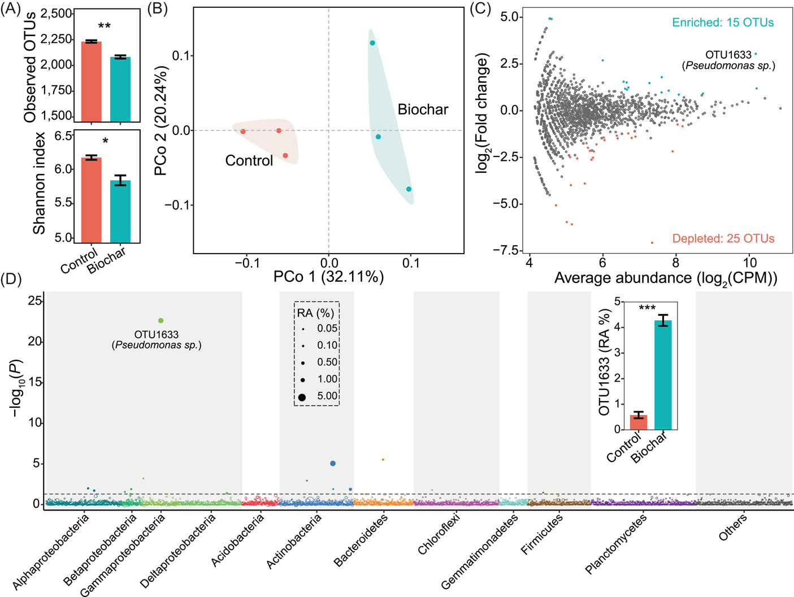
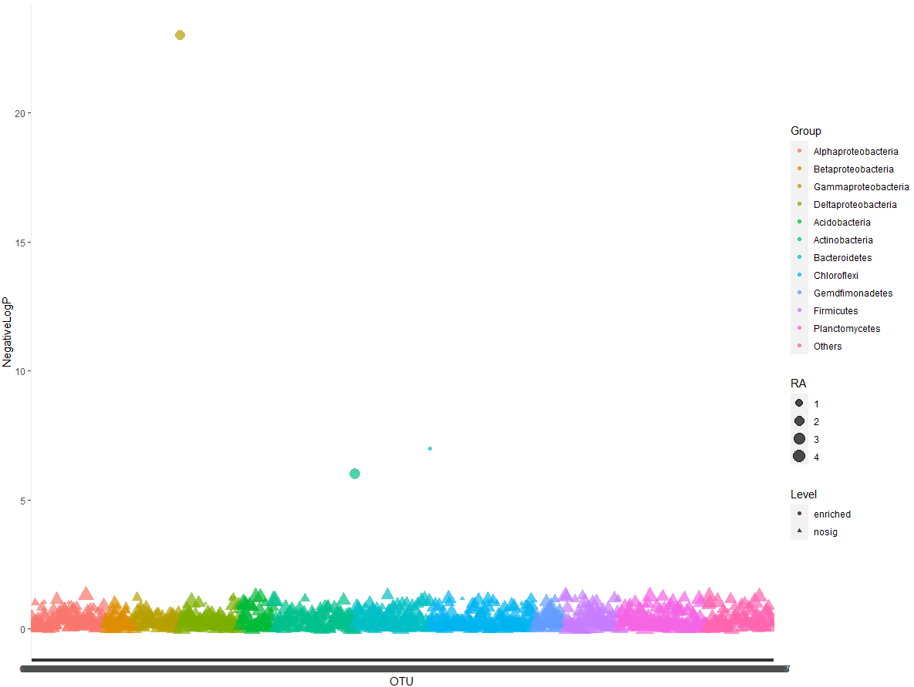
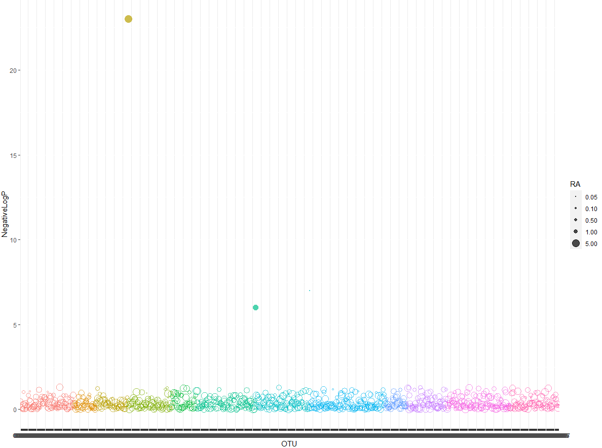
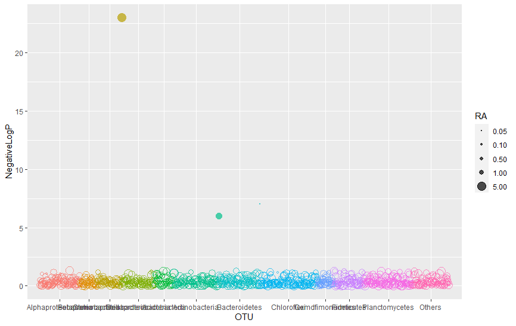
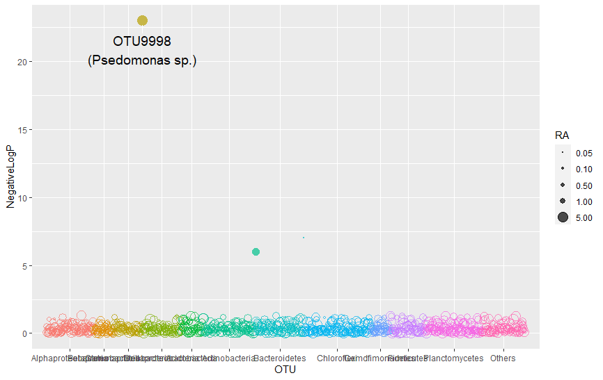
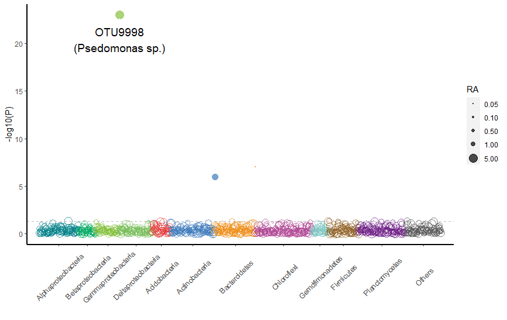
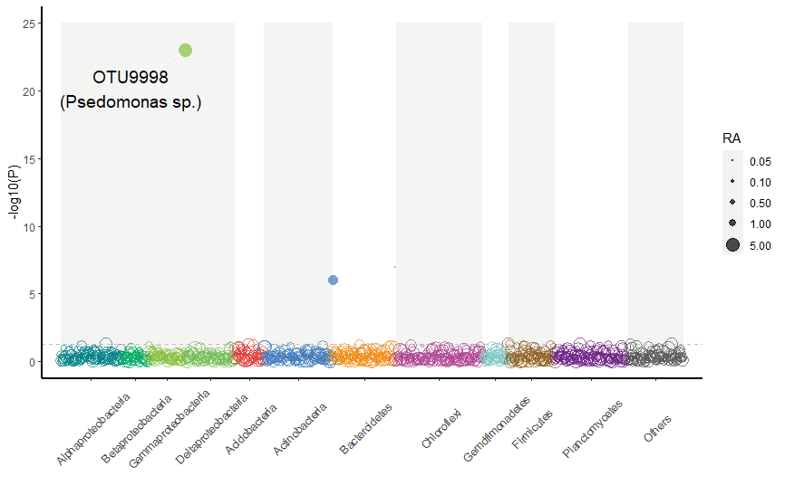
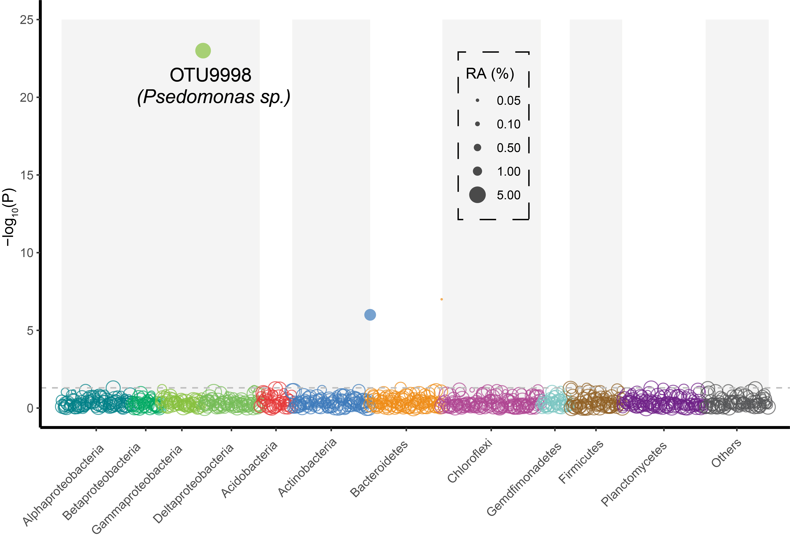

```{r setup, include=FALSE}
knitr::opts_chunk$set(
  collapse = T, echo=T, comment="#>", message=F, warning=F,
	fig.align="center", fig.width=5, fig.height=3, dpi=150)
```

**代码编写及注释：农心生信工作室**<br />

**曼哈顿图 (Manhattan Plot)** 是散点图的一种，在微生物组研究中通常用于表示微生物差异丰度的结果，是微生物组分析中常用的展示方式。本期我们挑选2022年6月23日刊登在**iMeta**上的[Biochar stimulates tomato roots to recruit a bacterial assemblage contributing to disease resistance against Fusarium wilt](https://onlinelibrary.wiley.com/doi/10.1002/imt2.37)- [iMeta | 东农吴凤芝/南农韦中等揭示生物炭抑制作物土传病害机理](https://view.officeapps.live.com/op/view.aspx?src=http%3A%2F%2Fwww.imeta.science%2FiMeta%2FPapers%2F9Chinese%2Fimt2.37.docx&wdOrigin=BROWSELINK)，选择文章的Figure 2D进行复现，降解和探讨曼哈顿图的绘制方法，先上原图：<br />


接下来，我们将通过详尽的代码逐步拆解曼哈顿图，最终实现对原图的复现。

### R包检测和安装
1. 安装核心R包ggplot2以及一些功能辅助性R包，并载入所有R包
```{r}
if (!require("ggplot2"))
  install.packages('ggplot2') 
if (!require("dplyr"))
  install.packages('dplyr') 
if (!require("ggrepel"))
  install.packages('ggrepel') 
# 加载包
library(ggplot2)
library(dplyr)
library(ggrepel)
```
2. 由于并未找到原文图片对应的数据，在这里我们生成测试数据。测试数据应为差异丰度分析后产生的数据框。设置随机种子并生成**df**
```{r}
# 设置随机数种子，确保数据可重复
set.seed(123)
# 根据图片，推测至少需要以下几列关键数据
# OTU的ID：字符串，每一个OTU的ID名
# P值：0-1之间的随机数，为了更接近原图，先生成绝大多数0.05-1间的随机数，在根据图像生成一些特定数值
# RA值：这里选择0.05-5之间的随机数
# group：字符串，标明OTU分别属于哪些属
# level：字符串，标注该OTU是否显著富集
# 本例中生成1000 OTUs
df = data.frame(OTU=c(paste("OTU",seq(1,997),sep = "")),
                 P=as.matrix(runif(997,min=0.05,max=1)),
                    RA=as.matrix(runif(997,min=0.05,max=5)),
                 Group=c(rep("Alphaproteobacteria",100),
                         rep("Betaproteobacteria",40),rep("Gammaproteobacteria",60),
                         rep("Deltaproteobacteria",80),rep("Acidobacteria",45),
                         rep("Actinobacteria",110),rep("Bacteroidetes",100),
                         rep("Chloroflexi",140),rep("Gemdfimonadetes",40),
                         rep("Firmicutes",75),rep("Planctomycetes",117),
                         rep("Others",90))
) %>% rbind(data.frame(OTU=c("OTU9998","OTU9999","OTU10000"),P=c(1e-23,1e-6,1e-7),RA=c(5,2.5,0.05),Group=c("Gammaproteobacteria","Actinobacteria","Bacteroidetes")))
#通过ifelse函数，基于P值给df添加新的一列Level，P小于0.05的属于"enriched",其他属于"nosig"
df$Level=ifelse(df$P<0.05,"enriched","nosig")
#给df添加新的一列NegativeLogP，即为P值的以10为底的逆对数
df$NegativeLogP=-log10(df$P)
#观察原图，发现x轴坐标刻度名称是固定的，基于OTU的属分组，因此在这里我们通过factor函数固定属分组顺序，并按属分组对df排序
df$Group=factor(df$Group,levels = c("Alphaproteobacteria","Betaproteobacteria","Gammaproteobacteria","Deltaproteobacteria","Acidobacteria","Actinobacteria","Bacteroidetes","Chloroflexi","Gemdfimonadetes","Firmicutes","Planctomycetes","Others"))#固定属分组顺序
df=arrange(df,Group)#dplyr包的arrange函数对df排序
df$OTU=factor(df$OTU,levels = df$OTU)#固定OTU名顺序

# 可选 从文件读取矩阵
# write.table(df, file="data.txt", sep="\t", quote=F, row.names=T, col.names=T)
# df = read.table(("data.txt"), header=T, row.names=1, sep="\t", comment.char="")
```
### 曼哈顿图绘制
3. 使用**_ggplot2_**包绘制一个最简单的曼哈顿图（这时只是一张简单的散点图），x轴为OTU名，y轴为NegativeLogP值，颜色映射到属分组，散点大小映射RA值，散点形状映射Level：
```{r}
p<-ggplot(df, aes(x=OTU, y=NegativeLogP, color=Group, size=RA, shape=Level)) +
  geom_point(alpha=.7)
```

4. 设置散点的形状以及尺寸,并隐藏color和shape对应的图例
```{r}
p<-ggplot(df, aes(x=OTU, y=NegativeLogP, color=Group, size=RA, shape=Level)) +
  geom_point(alpha=.7)+
  scale_shape_manual(values=c(16,1))+ #选择形状，nosig对应空心圆，enrich对应实心圆
  scale_size_continuous(range = c(0.5,5),
                        breaks = c(0.05, 0.10,0.50,1.00,5.00),
                        labels = c('0.05', '0.10','0.50','1.00','5.00'))+ #设置散点尺寸
  guides(color="none",shape="none")#隐藏图例
```

5. 观察预览图，我们发现x轴刻度标签初显示是一条粗黑线，其实是1000个OTU名同时显示导致的，我们观察原图，发现原图是以属分组的属名作为x轴刻度标签，刻度线是属分组中位的OTU。为了获得作为刻度的每个属中位OTU，我们编写并运行函数getBreak()来实现：
```{r}
getBreak<-function(x,y){
  freq<-as.vector(table(y))  #table()计算频数
  half_freq<-freq%/%2
  for (i in seq(2,length(freq))){
    new_num<-freq[i]+freq[i-1]
    freq[i]=new_num}
  pos<-freq-half_freq
  break_point<-as.vector(x[pos])
  return(break_point)
}
```
运行函数getBreak()后，修改x轴刻度及标签，并增加x轴左右的空白：
```{r}
p<-ggplot(df, aes(x=OTU, y=NegativeLogP, color=Group, size=RA, shape=Level)) +
  geom_point(alpha=.7)+
  scale_shape_manual(values=c(16,1))+ #选择形状，nosig对应空心圆，enrich对应实心圆
  scale_size_continuous(range = c(0.5,5),
                        breaks = c(0.05, 0.10,0.50,1.00,5.00),
                        labels = c('0.05', '0.10','0.50','1.00','5.00'))+ #设置散点尺寸
  guides(color="none",shape="none")+#隐藏图例
  scale_x_discrete(breaks=getBreak(df$OTU,df$Group),
                   labels=c("Alphaproteobacteria","Betaproteobacteria","Gammaproteobacteria","Deltaproteobacteria","Acidobacteria","Actinobacteria","Bacteroidetes","Chloroflexi","Gemdfimonadetes","Firmicutes","Planctomycetes","Others"),
                   expand = expansion(mult = 0.03))#expansion函数的参数mult: 百分比间距，可以接受一个向量
```

5 给散点添加文字标签，本例中需要添加标签的是OTU9998，通过**ggrepel**包的**geom_text_repel**函数来添加文字标签：
```{r}
gtext<-filter(df,df$OTU=="OTU9998")

p<-ggplot(df, aes(x=OTU, y=NegativeLogP, color=Group, size=RA, shape=Level)) +
  geom_point(alpha=.7,key_glyph="point")+
  scale_shape_manual(values=c(16,1))+ #选择形状，nosig对应空心圆，enrich对应实心圆
  scale_size_continuous(range = c(0.5,5),
                        breaks = c(0.05, 0.10,0.50,1.00,5.00),
                        labels = c('0.05', '0.10','0.50','1.00','5.00'))+ #设置散点尺寸
  guides(color="none",shape="none")+#隐藏图例
  scale_x_discrete(breaks=getBreak(df$OTU,df$Group),
                   labels=c("Alphaproteobacteria","Betaproteobacteria","Gammaproteobacteria","Deltaproteobacteria","Acidobacteria","Actinobacteria","Bacteroidetes","Chloroflexi","Gemdfimonadetes","Firmicutes","Planctomycetes","Others"),
                   expand = expansion(mult = 0.03))+#expansion函数的参数mult: 百分比间距，可以接受一个向量
  geom_text_repel(aes(OTU,NegativeLogP,label="OTU9998\n(Psedomonas sp.)"),gtext,colour='black', size =5,box.padding = 1, 
                           point.padding = 0.8, 
                           segment.color = "white",
                           show.legend = F)#添加文字标签
```

6 添加表示阈值的虚线，阈值为p=0.05：
```{r}
threshold<--log10(0.05)

p<-ggplot(df, aes(x=OTU, y=NegativeLogP, color=Group, size=RA, shape=Level)) +
  geom_point(alpha=.7,key_glyph="point")+
  scale_shape_manual(values=c(16,1))+ #选择形状，nosig对应空心圆，enrich对应实心圆
  scale_size_continuous(range = c(0.5,5),
                        breaks = c(0.05, 0.10,0.50,1.00,5.00),
                        labels = c('0.05', '0.10','0.50','1.00','5.00'))+ #设置散点尺寸
  guides(color="none",shape="none")+#隐藏图例
  scale_x_discrete(breaks=getBreak(df$OTU,df$Group),
                   labels=c("Alphaproteobacteria","Betaproteobacteria","Gammaproteobacteria","Deltaproteobacteria","Acidobacteria","Actinobacteria","Bacteroidetes","Chloroflexi","Gemdfimonadetes","Firmicutes","Planctomycetes","Others"),
                   expand = expansion(mult = 0.03))+#expansion函数的参数mult: 百分比间距，可以接受一个向量
  geom_text_repel(aes(OTU,NegativeLogP,label="OTU9998\n(Psedomonas sp.)"),gtext,colour='black', size =5,box.padding = 1, 
                           point.padding = 0.8, 
                           segment.color = "white",
                           show.legend = F)+#添加文字标签
  geom_hline(yintercept=threshold, linetype=2, color="grey")
```

7 改变分组颜色，优化背景，修改轴标题，倾斜x轴刻度标签：
```{r}
#设置分组颜色
mycol<-c("#008087","#00A962","#86C03D","#74BC56",
         "#E53636","#3D7ABB","#EE8B15","#AF4592",
         "#7AC5C1","#906024","#6E1F86","#545556")

p<-ggplot(df, aes(x=OTU, y=NegativeLogP, color=Group, size=RA, shape=Level)) +
  geom_point(alpha=.7,key_glyph="point")+
  scale_shape_manual(values=c(16,1))+ #选择形状，nosig对应空心圆，enrich对应实心圆
  scale_size_continuous(range = c(0.5,5),
                        breaks = c(0.05, 0.10,0.50,1.00,5.00),
                        labels = c('0.05', '0.10','0.50','1.00','5.00'))+ #设置散点尺寸
  guides(color="none",shape="none")+#隐藏图例
  scale_x_discrete(breaks=getBreak(df$OTU,df$Group),
                   labels=c("Alphaproteobacteria","Betaproteobacteria","Gammaproteobacteria","Deltaproteobacteria","Acidobacteria","Actinobacteria","Bacteroidetes","Chloroflexi","Gemdfimonadetes","Firmicutes","Planctomycetes","Others"),
                   expand = expansion(mult = 0.03))+#expansion函数的参数mult: 百分比间距，可以接受一个向量
  geom_text_repel(aes(OTU,NegativeLogP,label="OTU9998\n(Psedomonas sp.)"),gtext,colour='black', size =5,box.padding = 1, 
                  point.padding = 0.8, 
                  segment.color = "white",
                  show.legend = F)+#添加文字标签
  geom_hline(yintercept=threshold, linetype=2, color="grey")+
  labs(x="", y="-log10(P)")+ #设置坐标轴标题
  scale_color_manual(values = mycol)+ #改变分组颜色
  theme(axis.line = element_line(size = 1),panel.grid=element_blank(),
        panel.background = element_rect(fill = 'white'),
        axis.text.x = element_text(angle = 45, hjust = 0.5, vjust = 0.5))
```

8 我们注意到原图不同区块有不同的背景色，我们可以通过annotate()函数来实现，使图形背景在不同区域颜色不同，注意，因为是改变图形背景色，因此图层应在整个图形的底层：
```{r}
p<-ggplot(df, aes(x=OTU, y=NegativeLogP, color=Group, size=RA, shape=Level)) +
  annotate("rect",xmin = 1, xmax = 281,
           ymin = 0, ymax = 25,
           fill="#F4F4F3")+
  annotate("rect",xmin = 327, xmax = 437,
           ymin = 0, ymax = 25,
           fill="#F4F4F3")+
  annotate("rect",xmin = 539, xmax = 678,
           ymin = 0, ymax = 25,
           fill="#F4F4F3")+
  annotate("rect",xmin = 719, xmax = 793,
           ymin = 0, ymax = 25,
           fill="#F4F4F3")+
  annotate("rect",xmin = 911, xmax = 1000,
           ymin = 0, ymax = 25,
           fill="#F4F4F3")+
  geom_point(alpha=.7,key_glyph="point")+
  scale_shape_manual(values=c(16,1))+ #选择形状，nosig对应空心圆，enrich对应实心圆
  scale_size_continuous(range = c(0.5,5),
                        breaks = c(0.05, 0.10,0.50,1.00,5.00),
                        labels = c('0.05', '0.10','0.50','1.00','5.00'))+ #设置散点尺寸
  guides(color="none",shape="none")+#隐藏图例
  scale_x_discrete(breaks=getBreak(df$OTU,df$Group),
                   labels=c("Alphaproteobacteria","Betaproteobacteria","Gammaproteobacteria","Deltaproteobacteria","Acidobacteria","Actinobacteria","Bacteroidetes","Chloroflexi","Gemdfimonadetes","Firmicutes","Planctomycetes","Others"),
                   expand = expansion(mult = 0.03))+#expansion函数的参数mult: 百分比间距，可以接受一个向量
  geom_text_repel(aes(OTU,NegativeLogP,label="OTU9998\n(Psedomonas sp.)"),gtext,colour='black', size =5,box.padding = 1, 
                  point.padding = 0.8, 
                  segment.color = "#F4F4F3",
                  show.legend = F)+#添加文字标签
  geom_hline(yintercept=threshold, linetype=2, color="grey")+
  labs(x="", y="-log10(P)")+
  scale_color_manual(values = mycol)+
  theme(axis.line = element_line(size = 1),panel.grid=element_blank(),
        panel.background = element_rect(fill = 'white'),
        axis.text.x = element_text(angle = 45, hjust = 0.5, vjust = 0.5))
ggsave("Figure2D.pdf", p, height = 5,width = 10) # 保存图为PDF，指定宽和高
```

9 最后，我们通过Adobe Illustrator（AI）来美化一下图片，成品图如下：


### 附.完整代码
```{r}
library(ggplot2)
library(dplyr)
library(ggrepel)

# 设置随机数种子，确保数据可重复
set.seed(123)
# 根据图片，推测至少需要以下几列关键数据
# OTU的ID：字符串，每一个OTU的ID名
# P值：0-1之间的随机数，为了更接近原图，先生成绝大多数0.05-1间的随机数，在根据图像生成一些特定数值
# RA值：这里选择0.05-5之间的随机数
# group：字符串，标明OTU分别属于哪些属
# level：字符串，标注该OTU是否显著富集
# 本例中生成1000 OTUs
df = data.frame(OTU=c(paste("OTU",seq(1,997),sep = "")),
                P=as.matrix(runif(997,min=0.05,max=1)),
                RA=as.matrix(runif(997,min=0.05,max=5)),
                Group=c(rep("Alphaproteobacteria",100),
                        rep("Betaproteobacteria",40),rep("Gammaproteobacteria",60),
                        rep("Deltaproteobacteria",80),rep("Acidobacteria",45),
                        rep("Actinobacteria",110),rep("Bacteroidetes",100),
                        rep("Chloroflexi",140),rep("Gemdfimonadetes",40),
                        rep("Firmicutes",75),rep("Planctomycetes",117),
                        rep("Others",90))
) %>% rbind(data.frame(OTU=c("OTU9998","OTU9999","OTU10000"),P=c(1e-23,1e-6,1e-7),RA=c(5,2.5,0.05),Group=c("Gammaproteobacteria","Actinobacteria","Bacteroidetes")))
#通过ifelse函数，基于P值给df添加新的一列Level，P小于0.05的属于"enriched",其他属于"nosig"
df$Level=ifelse(df$P<0.05,"enriched","nosig")
#给df添加新的一列NegativeLogP，即为P值的以10为底的逆对数
df$NegativeLogP=-log10(df$P)
#观察原图，发现x轴坐标刻度名称是固定的，基于OTU的属分组，因此在这里我们通过factor函数固定属分组顺序，并按属分组对df排序
df$Group=factor(df$Group,levels = c("Alphaproteobacteria","Betaproteobacteria","Gammaproteobacteria","Deltaproteobacteria","Acidobacteria","Actinobacteria","Bacteroidetes","Chloroflexi","Gemdfimonadetes","Firmicutes","Planctomycetes","Others"))#固定属分组顺序
df=arrange(df,Group)#dplyr包的arrange函数对df排序
df$OTU=factor(df$OTU,levels = df$OTU)#固定OTU名顺序


getBreak<-function(x,y){
  freq<-as.vector(table(y))  #table()计算频数
  half_freq<-freq%/%2
  for (i in seq(2,length(freq))){
    new_num<-freq[i]+freq[i-1]
    freq[i]=new_num}
  pos<-freq-half_freq
  break_point<-as.vector(x[pos])
  return(break_point)
}

gtext<-filter(df,df$OTU=="OTU9998")
threshold<--log10(0.05)
#设置分组颜色
mycol<-c("#008087","#00A962","#86C03D","#74BC56",
         "#E53636","#3D7ABB","#EE8B15","#AF4592",
         "#7AC5C1","#906024","#6E1F86","#545556")


p<-ggplot(df, aes(x=OTU, y=NegativeLogP, color=Group, size=RA, shape=Level)) +
  annotate("rect",xmin = 1, xmax = 281,
           ymin = 0, ymax = 25,
           fill="#F4F4F3")+
  annotate("rect",xmin = 327, xmax = 437,
           ymin = 0, ymax = 25,
           fill="#F4F4F3")+
  annotate("rect",xmin = 539, xmax = 678,
           ymin = 0, ymax = 25,
           fill="#F4F4F3")+
  annotate("rect",xmin = 719, xmax = 793,
           ymin = 0, ymax = 25,
           fill="#F4F4F3")+
  annotate("rect",xmin = 911, xmax = 1000,
           ymin = 0, ymax = 25,
           fill="#F4F4F3")+
  geom_point(alpha=.7,key_glyph="point")+
  scale_shape_manual(values=c(16,1))+ #选择形状，nosig对应空心圆，enrich对应实心圆
  scale_size_continuous(range = c(0.5,5),
                        breaks = c(0.05, 0.10,0.50,1.00,5.00),
                        labels = c('0.05', '0.10','0.50','1.00','5.00'))+ #设置散点尺寸
  guides(color="none",shape="none")+#隐藏图例
  scale_x_discrete(breaks=getBreak(df$OTU,df$Group),
                   labels=c("Alphaproteobacteria","Betaproteobacteria","Gammaproteobacteria","Deltaproteobacteria","Acidobacteria","Actinobacteria","Bacteroidetes","Chloroflexi","Gemdfimonadetes","Firmicutes","Planctomycetes","Others"),
                   expand = expansion(mult = 0.03))+#expansion函数的参数mult: 百分比间距，可以接受一个向量
  geom_text_repel(aes(OTU,NegativeLogP,label="OTU9998\n(Psedomonas sp.)"),gtext,colour='black', size =5,box.padding = 1, 
                  point.padding = 0.8, 
                  segment.color = "#F4F4F3",
                  show.legend = F)+#添加文字标签
  geom_hline(yintercept=threshold, linetype=2, color="grey")+
  labs(x="", y="-log10(P)")+
  scale_color_manual(values = mycol)+
  theme(axis.line = element_line(size = 1),panel.grid=element_blank(),
        panel.background = element_rect(fill = 'white'),
        axis.text.x = element_text(angle = 45, hjust = 0.5, vjust = 0.5))

ggsave("Figure2D.pdf", p, height = 5,width = 10) # 保存图为PDF，指定宽和高
```
