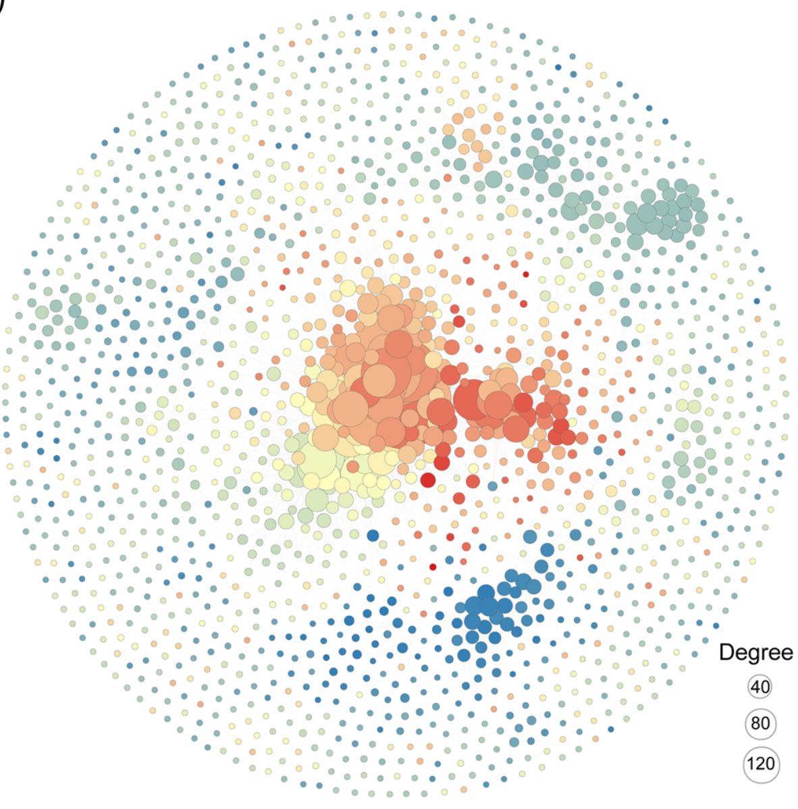
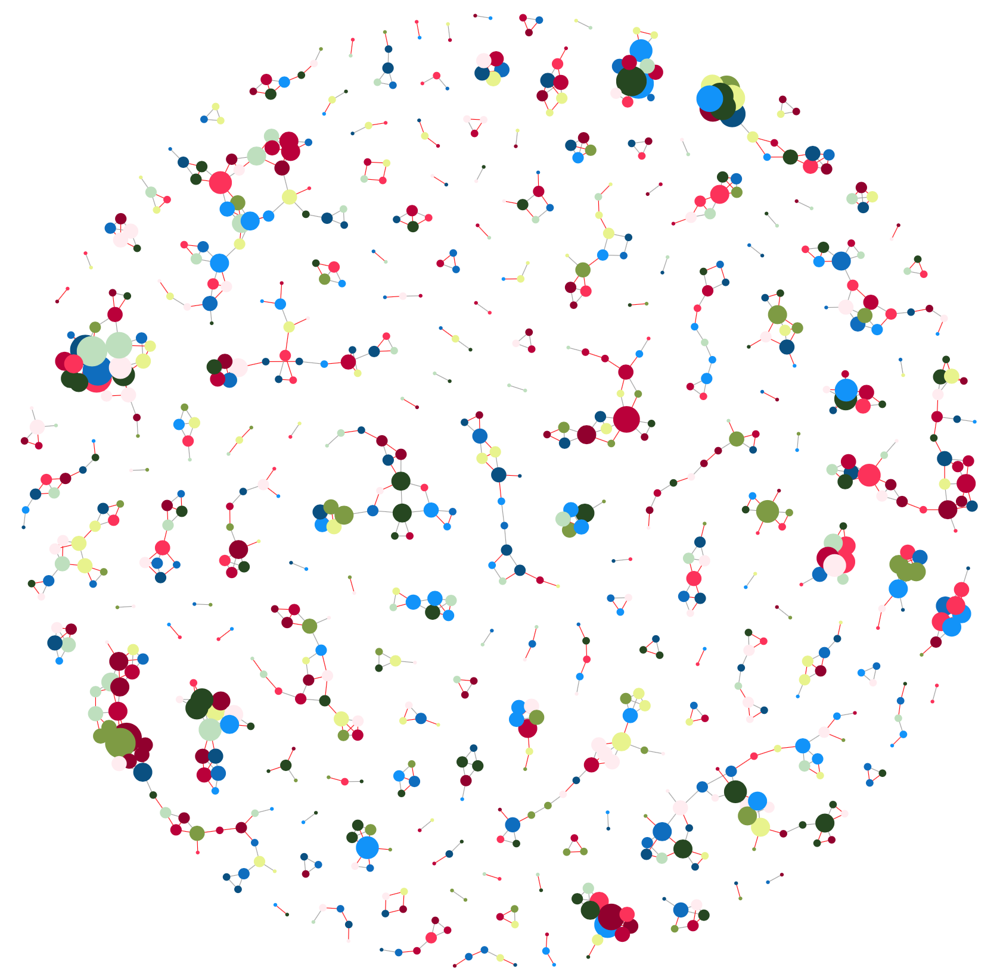

```{r setup, include = FALSE}
knitr::opts_chunk$set(
  collapse = T, echo=T, comment="#>", message=F, warning=F,
	fig.align="center", fig.width=5, fig.height=3, dpi=150)
```

**代码编写及注释：农心生信工作室**<br />

图（Graph）是一种从数据中抽象出节点（Node）并用边（Edge）展示各节点之间关系的数据结构,共现网络（Co-occurrence network）是一种特殊的图。目前生态学领域用到的网络图大多基于群落数据的相关性构建。本文将以西北农林科技大学焦硕教授在iMeta上发表的论文[Linking soil fungi to bacterial community assemblyin arid ecosystems](https://onlinelibrary.wiley.com/doi/10.1002/imt2.2)中Figure1 C为例，使用R语言逐步剖析共现网络图的绘制方法

- [iMeta：西农韦革宏团队焦硕等-土壤真菌驱动细菌群落的构建(全文翻译/PPT/视频解读)](https://mp.weixin.qq.com/s/Tw3JYcANGhfMqiELLf5D8Q)


先上原图：
<br /><br />

### R包检测和安装

1. 先安装软件包及其依赖并将所有包载入

```{r}
# 检查网络图构建包igraph，如没有则安装
if (!require("igraph"))
  install.packages("igraph")
# 加载网络图构建包igraph
library(igraph)

# 手动安装WGCNA的两个依赖
if (!require("impute"))
  install.packages("impute")
if (!require("preprocessCore"))
  install.packages("preprocessCore")

# 用于计算OTU/ASV之间的相关性
if (!require("WGCNA"))
  install.packages("WGCNA") 
library(WGCNA)

```

### 生成测试数据

2. 设置随机种子并生成1000个ASV的丰度表

```{r}
# 设置随机数种子，确保数据可重复
set.seed(123)
# 生成A、B两个样本各三个重复，共1000个ASV的丰度表
otu <- data.frame(replicate(6, sample.int(10, 1000, replace = T))) 
rownames(otu) <- paste0('ASV_', 1:nrow(otu))   # 行命名
colnames(otu) <- c('A1', 'A2', 'A3', 'B1', 'B2', 'B3')   # 列命名
dim(otu) #查看数据维度

# 可选 从文件读取矩阵
# write.table(otu, file="otu.txt", sep="\t", quote=F, row.names=T, col.names=T)
# otu = read.table(("otu.txt"), header=T, row.names=1, sep="\t", comment.char="")
```

### 计算相关系数矩阵

3. 计算ASV/OTU之间的相关系数矩阵

使用WGCNA包计算ASV/OTU之间的spearman相关系数矩阵，并对结果进行筛选，筛选标准与原文中保持一致，为了方便绘图，先定义一个函数**CorrDF**整理ASV之间的连接关系
```{r}
CorrDF <- function(cormat, pmat) {
  ut <- upper.tri(cormat) # 由于相关性矩阵是对称的，取上三角矩阵计算即可
  data.frame(
    from = rownames(cormat)[col(cormat)[ut]],
    to = rownames(cormat)[row(cormat)[ut]],
    cor = (cormat)[ut],
    p = pmat[ut]
  )
}

occor <- corAndPvalue(t(otu), use='pairwise', method='spearman') # 计算ASV/OTU之间的spearman相关性
cor_df <- CorrDF(occor$cor , occor$p) # 整理ASV之间的连接关系

cor_df <- cor_df[which(abs(cor_df$cor) >= 0.6),] # 保留spearman相关性绝对值>0.6的边
cor_df <- cor_df[which(cor_df$p < 0.001),] # 保留p-value < 0.001的边
```

### 构建网络图

4. 使用**igraph**构建网络图
```{r}
igraph <- graph_from_data_frame(cor_df, direct=F) 
length(V(igraph)) # 查看节点数
length(E(igraph)) # 查看边数
```

5. 根据原文的方法，网络图中节点的大小与节点的度成正比，正相关的节点其边为深灰色，负相关的节点其边为红色，边的粗细与相关系数成正比，需要注意的是，原文中的节点颜色是根据ASV/OTU对干旱的偏好上着色的，这里简化为随机颜色。
```{r}
V(igraph)$size <- degree(igraph)*0.8 # 节点的大小与节点的度成正比，进行0.8倍放缩
# 生成一些随机颜色
cols <- c('#00A6FB', '#0582CA', '#fff0f3', '#006494', '#c9e4ca', '#31572c', '#90a955', '#ecf39e', '#a4133c', '#c9184a', '#ff4d6d')
V(igraph)$color <- sample(cols, length(V(igraph)), replace = T) # 从随机颜色中采样给节点上色
E(igraph)$color[E(igraph)$cor >= 0.6] <- "darkgray"	 # 正相关则边为深灰色
E(igraph)$color[E(igraph)$cor <= -0.6] <- "red"	 # 负相关则边为红色
E(igraph)$width <-  abs(E(igraph)$cor)*0.5 # 边的粗细与相关系数成正比，进行0.5倍放缩
```

### 网络图可视化

6. 最后就是调整布局算法并生成好看的网络图了，igraph提供多种布局算法可供选择，当节点较多时构建布局比较慢，大家需要耐心等待

```{r}
coords <- layout_with_fr(igraph, niter=9999,grid="nogrid") # 生成布局

pdf("Figure1C.pdf", height = 10, width = 10) # 保存图为PDF，指定宽和高
plot(igraph, layout=coords, vertex.label = NA, vertex.frame.color=NA) # 画图
dev.off()
```

<br /><br />

### 附.完整代码

```{r}
# 加载包
library(igraph)
library(WGCNA)

# 设置随机数种子，确保数据可重复
set.seed(123)
# 生成A、B两个样本各三个重复，共1000个ASV的丰度表
otu <- data.frame(replicate(6, sample.int(10, 1000, replace = T))) 
rownames(otu) <- paste0('ASV_', 1:nrow(otu))   # 行命名
colnames(otu) <- c('A1', 'A2', 'A3', 'B1', 'B2', 'B3')   # 列命名
dim(otu) #查看数据维度

CorrDF <- function(cormat, pmat) {
  ut <- upper.tri(cormat) # 由于相关性矩阵是对称的，取上三角矩阵计算即可
  data.frame(
    from = rownames(cormat)[col(cormat)[ut]],
    to = rownames(cormat)[row(cormat)[ut]],
    cor = (cormat)[ut],
    p = pmat[ut]
  )
}

occor <- corAndPvalue(t(otu), use='pairwise', method='spearman') # 计算OTU/ASV之间的spearman相关性
cor_df <- CorrDF(occor$cor , occor$p) # 整理ASV之间的连接关系

cor_df <- cor_df[which(abs(cor_df$cor) >= 0.6),] # 保留spearman相关性绝对值>0.6的边
cor_df <- cor_df[which(cor_df$p < 0.001),] # 保留p-value < 0.001的边

igraph <- graph_from_data_frame(cor_df, direct=F) 
length(V(igraph)) # 查看节点数
length(E(igraph)) # 查看边数

V(igraph)$size <- degree(igraph)*0.8 # 节点的大小与节点的度成正比，进行0.8倍放缩
# 生成一些随机颜色
cols <- c('#00A6FB', '#0582CA', '#fff0f3', '#006494', '#c9e4ca', '#31572c', '#90a955', '#ecf39e', '#a4133c', '#c9184a', '#ff4d6d')
V(igraph)$color <- sample(cols, length(V(igraph)), replace = T) # 从随机颜色中采样给节点上色
E(igraph)$color[E(igraph)$cor >= 0.6] <- "darkgray"	 # 正相关则边为深灰色
E(igraph)$color[E(igraph)$cor <= -0.6] <- "red"	 # 负相关则边为红色
E(igraph)$width <-  abs(E(igraph)$cor)*0.5 # 边的粗细与相关系数成正比，进行0.5倍放缩

coords <- layout_with_fr(igraph, niter=9999,grid="nogrid") # 生成布局
pdf("Figure1C.pdf", height = 10,width = 10) # 保存图为PDF，指定宽和高
plot(igraph, layout=coords, vertex.label = NA, vertex.frame.color=NA) # 画图
dev.off()
```

以上数据和代码仅供大家参考，如有不完善之处，欢迎大家指正！
