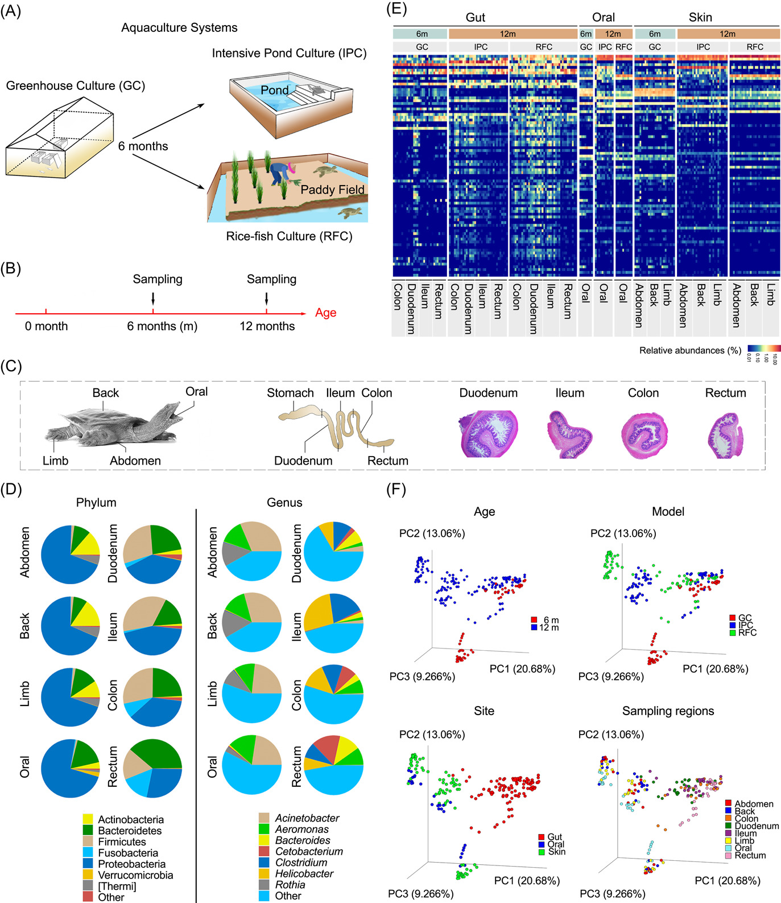
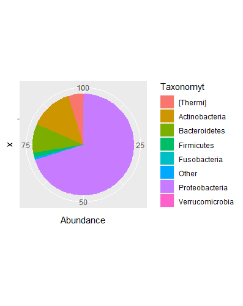
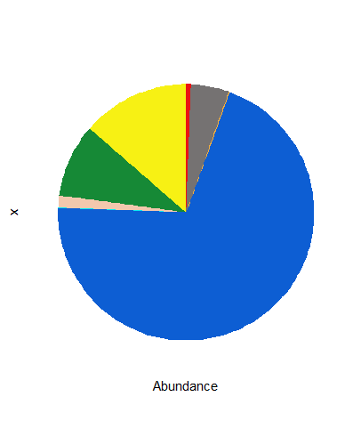
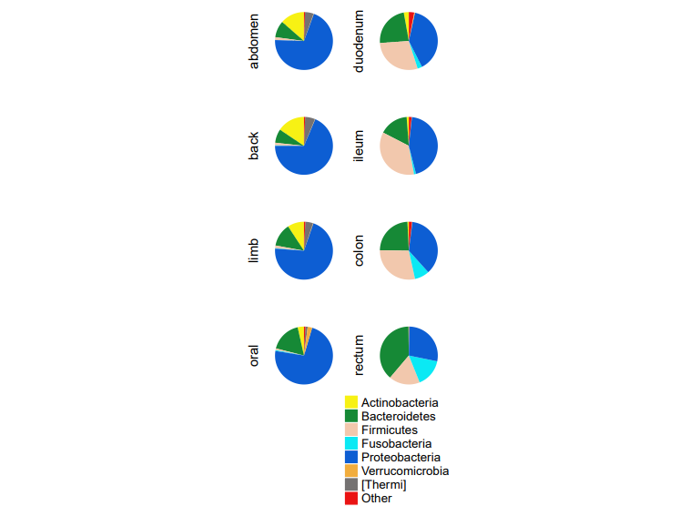

```{r setup, include=FALSE}
knitr::opts_chunk$set(
  collapse = T, echo=T, comment="#>", message=F, warning=F,
	fig.align="center", fig.width=5, fig.height=3, dpi=150)
```

**代码编写及注释：农心生信工作室**<br />

**饼图 (Pie Plot)** 在微生物组研究中可以用来展示菌群物种组成，可以起到与堆叠柱状图相同的展示效果。本期我们挑选2022年4月5日刊登在**iMeta**上的[The impact of aquaculture system on the microbiome and gut metabolome of juvenile Chinese softshell turtle (Pelodiscus sinensis)](https://onlinelibrary.wiley.com/doi/10.1002/imt2.17)- [iMeta | 南昌大学丁霞等-水产养殖模式对水产动物皮肤、口腔和肠道微生物群落组装及宿主适应性的影响](http://www.imeta.science/iMeta/Papers/9Chinese/imt2.17.pdf)，选择文章的Figure 1D进行复现，讲解和探讨简单饼图以及同一图片中呈现多个饼图的方法，先上原图：<br />

接下来，我们将通过详尽的代码逐步拆解原图，最终实现对原图的复现。

### R包检测和安装
1. 安装核心R包ggplot2以及一些功能辅助性R包，并载入所有R包
```{r}
if (!require("ggplot2"))
  install.packages('ggplot2') 
if (!require("dplyr"))
  install.packages('dplyr') 
if (!require("ComplexHeatmap"))
  install.packages('ComplexHeatmap')
# 加载包
library(ggplot2)
library(dplyr)
library(ComplexHeatmap)
library(grid)
```
### 读取或生成数据
2. 该图数据来自文章的补充文件[supplementary table3](https://onlinelibrary.wiley.com/action/downloadSupplement?doi=10.1002%2Fimt2.17&file=imt217-sup-0002-Supplementary_Tables.xlsx)，大家可以根据链接自行下载。在这里，我们下载它的补充文件后，导出为test.CSV进行读取。
```{r}
#读取数据
df<-read.csv("test.CSV",header = T)
#创建一个向量，包含了图中将要展示的丰度最高的7个科
top_phylum=c("Actinobacteria","Bacteroidetes","Firmicutes","Fusobacteria","Proteobacteria","Verrucomicrobia","[Thermi]")
#将其他低丰度的科统一命名为Other
df[!(df$Taxonomyt %in% top_phylum),]$Taxonomyt = "Other"
```
### 饼图预览
3. 选择样本abdomen，使用**_ggplot2_**包绘制一个最简单的饼图，方法与绘制柱状图一样，只是将直角坐标系转化为了**极坐标系**：
```{r}
#选择样本abdomen
per_df<-df[df$Sample=="abdomen",]
#使用aggregate函数，根据Taxonomyt的分组，将科名称相同的丰度求和，即最终得到Other的丰度的和
per_df<-aggregate(per_df$Abundance,by=list(Taxonomyt=per_df$Taxonomyt),sum) %>% rename(Abundance=x)
p<-ggplot(per_df,aes("",Abundance,fill=Taxonomyt))+geom_bar(stat = "identity")+
  coord_polar(theta = "y")
```

4. 根据原图，我们固定图例中科名显示的顺序，并美化图片，设置颜色，去除背景，坐标轴，图例：
```{r}
mycol<-c("#F7F114","#168936","#F2C8AD","#0BE9F4","#0D5ED3","#F2AD3D","#757272","#EA1313")#设置颜色
per_df<-df[df$Sample=="abdomen",]
per_df<-aggregate(per_df$Abundance,by=list(Taxonomyt=per_df$Taxonomyt),sum) %>% rename(Abundance=x)
per_df$Taxonomyt<-factor(per_df$Taxonomyt,levels =c("Actinobacteria","Bacteroidetes","Firmicutes","Fusobacteria","Proteobacteria","Verrucomicrobia","[Thermi]","Other") ) #固定图例顺序
p<-ggplot(per_df,aes("",Abundance,fill=Taxonomyt))+geom_bar(stat = "identity")+
  coord_polar(theta = "y")+
  scale_fill_manual(values = mycol)+
  guides(fill="none")+
  theme(axis.text.y = element_blank(),panel.background = element_blank(),
        line = element_blank(),axis.ticks.y = element_blank(),axis.text.x = element_blank())
```

5. 接下来是全文的重点，如何在一张画布上绘制多个饼图，并将它们有序排列。这里，我们要用**assign**函数，使每个样本对应一副饼图：
```{r}
#首先生成一个向量，包含全部八个样本名
sample_name<-unique(df$Sample)#unique()函数去除重复数据
#设置颜色
mycol<-c("#F7F114","#168936","#F2C8AD","#0BE9F4","#0D5ED3","#F2AD3D","#757272","#EA1313")
#编写函数getPieplot()，该函数包含两个参数，第一个参数为数据框df，第二个参数为样本名称，最终返回饼图
getPieplot<-function(dfname,Samplename){
  per_df<-dfname[dfname$Sample==Samplename,]
  per_df<-aggregate(per_df$Abundance,by=list(Taxonomyt=per_df$Taxonomyt),sum) %>% rename(Abundance=x)
  per_df$Taxonomyt<-factor(per_df$Taxonomyt,levels =c("Actinobacteria","Bacteroidetes","Firmicutes","Fusobacteria","Proteobacteria","Verrucomicrobia","[Thermi]","Other") )
  p<-ggplot(per_df,aes("",Abundance,fill=Taxonomyt))+
    geom_bar(stat = "identity")+
    coord_polar(theta = "y")+
    scale_fill_manual(values = mycol)+
    labs(x=Samplename,y="")+
    guides(fill="none")+
    theme(axis.text.y = element_blank(),panel.background = element_blank(),
          line = element_blank(),axis.ticks.y = element_blank(),axis.text.x = element_blank())
  
  return(p)
}
#for循环遍历八个样本名，利用assign函数，以样本名作变量名，将饼图分别赋给对应的变量
for (i in sample_name){
  assign(i,getPieplot(df,i))
  
}
```
6. 使用底层绘图包**grid**，按顺序将饼图一一排列：
```{r}
#创建新一个新的画布
grid.newpage()
#创建一个4行2列的布局
pushViewport(viewport(layout = grid.layout(nrow = 4, ncol = 2),width = 0.3))
#编写一个函数，方便定义每一个饼图在画布布局中的具体位置
vp_value <- function(row, col){
  viewport(layout.pos.row = row, layout.pos.col = col)
} 
#print将每个图形输出到布局的不同区域中
print(abdomen,vp = vp_value(row = 1, col = 1))
print(duodenum,vp = vp_value(row = 1, col = 2))
print(back,vp = vp_value(row = 2, col = 1))
print(ileum,vp = vp_value(row = 2, col = 2))
print(limb,vp = vp_value(row = 3, col = 1))
print(colon,vp = vp_value(row = 3, col = 2))
print(oral,vp = vp_value(row = 4, col = 1))
print(rectum,vp = vp_value(row = 4, col = 2))
```
7. 最后，我们利用顾祖光博士开发的ComplexHeatmap包（关于ComplexHeatmap包的使用，可以参考往期推文[跟着iMeta学做图｜ComplexHeatmap绘制多样的热图](https://mp.weixin.qq.com/s/6ljx0A1DtpJOIaHleFV9HA)），绘制一个单独的图例，并置于画布的最下方：
```{r}
pdf("Figure1D.pdf",width = 8, height = 6)
grid.newpage()
#重新创建一个5行2列的布局，最后一行用于放置图例
pushViewport(viewport(layout = grid.layout(nrow = 5, ncol = 2),width = 0.3))
vp_value <- function(row, col){
  viewport(layout.pos.row = row, layout.pos.col = col)
} 
print(abdomen,vp = vp_value(row = 1, col = 1))
print(duodenum,vp = vp_value(row = 1, col = 2))
print(back,vp = vp_value(row = 2, col = 1))
print(ileum,vp = vp_value(row = 2, col = 2))
print(limb,vp = vp_value(row = 3, col = 1))
print(colon,vp = vp_value(row = 3, col = 2))
print(oral,vp = vp_value(row = 4, col = 1))
print(rectum,vp = vp_value(row = 4, col = 2))
#创建图例
lgd_points = Legend(at = c("Actinobacteria","Bacteroidetes","Firmicutes","Fusobacteria","Proteobacteria","Verrucomicrobia","[Thermi]","Other"), type = "points", pch = 15,
                    legend_gp = gpar(col = mycol), 
                    title = "",background = mycol)
#将图例与饼图合并
draw(lgd_points, x = unit(45, "mm"), y = unit(5, "mm"), just = c( "bottom"))
dev.off()
```


### 附.完整代码
```{r}
if (!require("ggplot2"))
  install.packages('ggplot2') 
if (!require("dplyr"))
  install.packages('dplyr') 
if (!require("ComplexHeatmap"))
  install.packages('ComplexHeatmap')
# 加载包
library(ggplot2)
library(dplyr)
library(ComplexHeatmap)
library(grid)

#读取数据
df<-read.csv("test.CSV",header = T)
#创建一个向量，包含了图中将要展示的丰度最高的7个科
top_phylum=c("Actinobacteria","Bacteroidetes","Firmicutes","Fusobacteria","Proteobacteria","Verrucomicrobia","[Thermi]")
#将其他低丰度的科统一命名为Other
df[!(df$Taxonomyt %in% top_phylum),]$Taxonomyt = "Other"
#首先生成一个向量，包含全部八个样本名
sample_name<-unique(df$Sample)#unique()函数去除重复数据
#设置颜色
mycol<-c("#F7F114","#168936","#F2C8AD","#0BE9F4","#0D5ED3","#F2AD3D","#757272","#EA1313")
#编写函数getPieplot()，该函数包含两个参数，第一个参数为数据框df，第二个参数为样本名称，最终返回饼图
getPieplot<-function(dfname,Samplename){
  per_df<-dfname[dfname$Sample==Samplename,]
  per_df<-aggregate(per_df$Abundance,by=list(Taxonomyt=per_df$Taxonomyt),sum) %>% rename(Abundance=x)
  per_df$Taxonomyt<-factor(per_df$Taxonomyt,levels =c("Actinobacteria","Bacteroidetes","Firmicutes","Fusobacteria","Proteobacteria","Verrucomicrobia","[Thermi]","Other") )
  p<-ggplot(per_df,aes("",Abundance,fill=Taxonomyt))+
    geom_bar(stat = "identity")+
    coord_polar(theta = "y")+
    scale_fill_manual(values = mycol)+
    labs(x=Samplename,y="")+
    guides(fill="none")+
    theme(axis.text.y = element_blank(),panel.background = element_blank(),
          line = element_blank(),axis.ticks.y = element_blank(),axis.text.x = element_blank())
  
  return(p)
}
#for循环遍历八个样本名，利用assign函数，以样本名作变量名，将饼图分别赋给对应的变量
for (i in sample_name){
  assign(i,getPieplot(df,i))
}

pdf("Figure1D.pdf",width = 8, height = 6)
grid.newpage()
#重新创建一个5行2列的布局，最后一行用于放置图例
pushViewport(viewport(layout = grid.layout(nrow = 5, ncol = 2),width = 0.3))
vp_value <- function(row, col){
  viewport(layout.pos.row = row, layout.pos.col = col)
} 
print(abdomen,vp = vp_value(row = 1, col = 1))
print(duodenum,vp = vp_value(row = 1, col = 2))
print(back,vp = vp_value(row = 2, col = 1))
print(ileum,vp = vp_value(row = 2, col = 2))
print(limb,vp = vp_value(row = 3, col = 1))
print(colon,vp = vp_value(row = 3, col = 2))
print(oral,vp = vp_value(row = 4, col = 1))
print(rectum,vp = vp_value(row = 4, col = 2))
#创建图例
lgd_points = Legend(at = c("Actinobacteria","Bacteroidetes","Firmicutes","Fusobacteria","Proteobacteria","Verrucomicrobia","[Thermi]","Other"), type = "points", pch = 15,
                    legend_gp = gpar(col = mycol), 
                    title = "",background = mycol)
#将图例与饼图合并
draw(lgd_points, x = unit(45, "mm"), y = unit(5, "mm"), just = c( "bottom"))
dev.off()
```