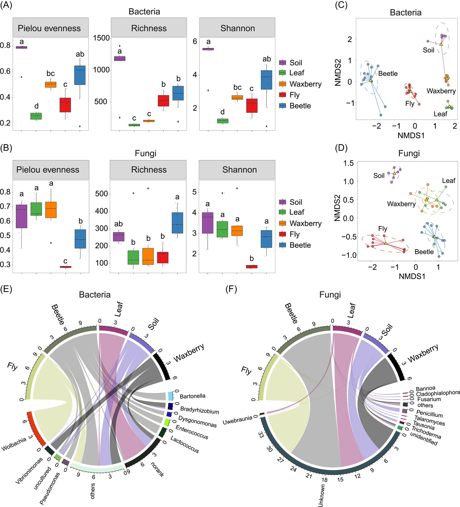
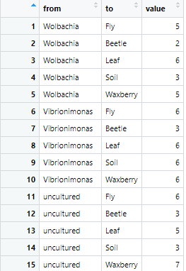
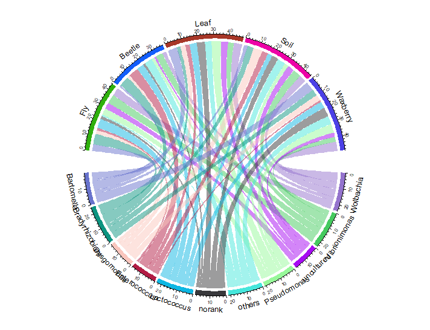
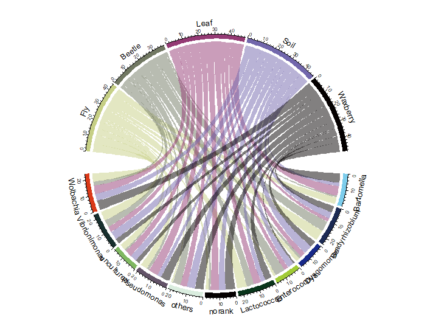

```{r setup, include=FALSE}
knitr::opts_chunk$set(
  collapse = T, echo=T, comment="#>", message=F, warning=F,
	fig.align="center", fig.width=5, fig.height=3, dpi=150)
```

**代码编写及注释：农心生信工作室**<br />

**和弦图 (Chord diagram)** 可以表示不同组数据间的相互关系，在微生物组研究中可以用来展示样本物种相对丰度。本期我们挑选2022年10月13日刊登在**iMeta**上的[Gut microbiota composition in the sympatric and diet-sharing Drosophila simulans and Dicranocephalus wallichii bowringi shaped largely by community assembly processes rather than regional species pool](https://onlinelibrary.wiley.com/doi/full/10.1002/imt2.57)- [iMeta | 扬州大学杜予州团队揭示同域内同食物的两种昆虫肠道微生物群落装配机制](https://view.officeapps.live.com/op/view.aspx?src=http%3A%2F%2Fwww.imeta.science%2FiMeta%2FPapers%2F9Chinese%2Fimt2.57.docx&wdOrigin=BROWSELINK)，选择文章的Figure 1E进行复现，基于顾祖光博士开发的**circlize**包，讲解和探讨和弦图的绘制方法，先上原图：<br />


接下来，我们将通过详尽的代码逐步拆解原图，最终实现对原图的复现。

### R包检测和安装
1. 安装核心R包circlize以及一些功能辅助性R包，并载入所有R包。
```{r}
# 检查开发者工具devtools，如没有则安装
if (!require("devtools"))
  install.packages("devtools")
# 加载开发者工具devtools
library(devtools)
# 检查热图包，没有则通过github安装最新版
if (!require("circlize"))
  install_github("jokergoo/circlize")
if (!require("tidyr"))
  install.packages('tidyr') 
# 加载包
library(circlize)
library(tidyr)
```
### 生成测试数据
2. 生成测试数据，一般情况下，和弦图表示组与组之间对应关系。因此，和弦图的数据可以是一个矩阵，行名和列名对应。
```{r}
# 设置随机数种子，确保数据可重复
set.seed(123)
#仿照原图创建一个11×5的随机数矩阵
mat<-matrix(runif(55,min=1,max=7),11,5)
#列名为样本名
colnames(mat)<-c("Fly","Beetle","Leaf","Soil","Waxberry")
#行名为属名
rownames(mat)<-c("Wolbachia","Vibrionimonas","uncultured","Pseudomonas","others","norank","Lactococcus","Enterococcus","Dysgomonas","Bradyrhizobium","Bartomella")
```


3. 除此之外，和弦图还可以用另一种长表形式的数据绘制，第一列代表起点，第二列对应终点，第三列代表分配的数值。我们可以利用tidyr包的pivot_longer函数将矩阵数据转化成长表。两种数据格式都符合和弦图的绘图要求。
```{r}
mat2<-as.data.frame(mat)
mat2<-cbind(rownames(mat2),mat2)
#pivot_longer函数核心参数cols决定哪些列进行转化，本例中为除第一列外所有列
df<-pivot_longer(mat2,cols=-1)
colnames(df)<-c("from","to","value")
```


### 和弦图预览

4. 先绘制一张简单的和弦图，绘图时我们输入矩阵mat。代码非常简洁，使用的核心函数是**chordDiagram**函数：
```{r}
pdf("plot1.pdf",width = 8, height = 6)
chordDiagram(mat)
circos.clear()
dev.off()
```


5. 接下来，对和弦图的细节进行优化：
```{r}
pdf("plot2.pdf",width = 8, height = 6)
#首先对布局进行设置，设置扇形间的距离
circos.par(gap.after = c(rep(3, nrow(mat)-1), 10, rep(3, ncol(mat)-1), 10))
#调整扇形顺序与原图保持一致
orderlist<-c(rev(rownames(mat)),colnames(mat))
#设置扇形颜色，可以使扇形区域与颜色一一对应
col_list1<-c(Fly="#C6CF85",Beetle="#717862",Leaf="#943A74",Soil="#7267AC",Waxberry="#040000",
             Wolbachia="#DA3918",Vibrionimonas="#172F2E",uncultured="#80B862",Pseudomonas="#635368",others="#DAEDDF",
             norank="#040000",Lactococcus="#0A351B",Enterococcus="#A1CB36",Dysgomonas="#172989",Bradyrhizobium="#1C2A53",Bartomella="#7DCDEC")
#设置link颜色,link颜色与列所代表的扇形颜色一致，因此使用column.col参数设置
col_list2<-c(Fly="#C6CF85",Beetle="#717862",Leaf="#943A74",Soil="#7267AC",Waxberry="#040000")

chordDiagram(mat,order = orderlist, #设置扇区顺序
             grid.col = col_list1, #设置扇区颜色
             column.col = col_list2) #设置link颜色
circos.clear()
dev.off()
```


6. 目前为止，基本的复现已经完成，但观察原图，我们注意到原图中扇形注释文字的方向是垂直指向和弦图圆心的，chordDiagram函数中并没有参数可以直接设置注释文字的方向。因此，我们需要手动添加注释：
```{r}
pdf("plot3.pdf",width = 8, height = 6)
#首先对布局进行设置，设置扇形间的距离
circos.par(gap.after = c(rep(3, nrow(mat)-1), 10, rep(3, ncol(mat)-1), 10))
#调整扇形顺序与原图保持一致
orderlist<-c(rev(rownames(mat)),colnames(mat))
#设置扇形颜色，可以使扇形区域与颜色一一对应
col_list1<-c(Fly="#C6CF85",Beetle="#717862",Leaf="#943A74",Soil="#7267AC",Waxberry="#040000",
             Wolbachia="#DA3918",Vibrionimonas="#172F2E",uncultured="#80B862",Pseudomonas="#635368",others="#DAEDDF",
             norank="#040000",Lactococcus="#0A351B",Enterococcus="#A1CB36",Dysgomonas="#172989",Bradyrhizobium="#1C2A53",Bartomella="#7DCDEC")
#设置link颜色,link颜色与列所代表的扇形颜色一致，因此使用column.col参数设置
col_list2<-c(Fly="#C6CF85",Beetle="#717862",Leaf="#943A74",Soil="#7267AC",Waxberry="#040000")

chordDiagram(mat,order = orderlist, #设置扇区顺序
             grid.col = col_list1, #设置扇区颜色
             column.col = col_list2, #设置link颜色
             annotationTrack = "grid") #不绘制扇区注释

#添加扇形区注释
for(i in get.all.sector.index()) {
  xlim = get.cell.meta.data("xlim", sector.index = i, track.index = 1)
  circos.text(x=mean(xlim), y=0.5, sector.index=i, 
              facing = "clockwise",niceFacing = TRUE, cex = 1, 
              col = "black", labels = i, track.index = 1)
}
circos.clear()
dev.off()
```
7. 最后，用AI调整图片，成图如下：


### 附.完整代码
```{r}
# 检查开发者工具devtools，如没有则安装
if (!require("devtools"))
  install.packages("devtools")
# 加载开发者工具devtools
library(devtools)
# 检查热图包，没有则通过github安装最新版
if (!require("circlize"))
  install_github("jokergoo/circlize")
if (!require("tidyr"))
  install.packages('tidyr') 
# 加载包
library(circlize)
library(tidyr)

#数据生成
# 设置随机数种子，确保数据可重复
set.seed(123)
#仿照原图创建一个11×5的随机数矩阵
mat<-matrix(runif(55,min=1,max=7),11,5)
#列名为样本名
colnames(mat)<-c("Fly","Beetle","Leaf","Soil","Waxberry")
#行名为属名
rownames(mat)<-c("Wolbachia","Vibrionimonas","uncultured","Pseudomonas","others","norank","Lactococcus","Enterococcus","Dysgomonas","Bradyrhizobium","Bartomella")

#另一种输入数据格式
#mat2<-as.data.frame(mat2)
#mat2<-cbind(rownames(mat2),mat2)
#pivot_longer函数核心参数cols决定哪些列进行转化，本例中为除第一列外所有列
#df<-pivot_longer(mat2,cols=-1)
#colnames(df)<-c("from","to","value")

# 可选 从文件读取矩阵
# write.table(mat, file="mat.txt", sep="\t", quote=F, row.names=T, col.names=T)
# mat = as.matrix(read.table(("mat.txt"), header=T, row.names=1, sep="\t", comment.char=""))
pdf("Figure 1E.pdf",width = 8, height = 6)
#首先对布局进行设置，设置扇形间的距离
circos.par(gap.after = c(rep(3, nrow(mat)-1), 10, rep(3, ncol(mat)-1), 10))
#调整扇形顺序与原图保持一致
orderlist<-c(rev(rownames(mat)),colnames(mat))
#设置扇形颜色，可以使扇形区域与颜色一一对应
col_list1<-c(Fly="#C6CF85",Beetle="#717862",Leaf="#943A74",Soil="#7267AC",Waxberry="#040000",
             Wolbachia="#DA3918",Vibrionimonas="#172F2E",uncultured="#80B862",Pseudomonas="#635368",others="#DAEDDF",
             norank="#040000",Lactococcus="#0A351B",Enterococcus="#A1CB36",Dysgomonas="#172989",Bradyrhizobium="#1C2A53",Bartomella="#7DCDEC")
#设置link颜色,link颜色与列所代表的扇形颜色一致，因此使用column.col参数设置
col_list2<-c(Fly="#C6CF85",Beetle="#717862",Leaf="#943A74",Soil="#7267AC",Waxberry="#040000")

chordDiagram(mat,order = orderlist, #设置扇区顺序
             grid.col = col_list1, #设置扇区颜色
             column.col = col_list2, #设置link颜色
             annotationTrack = "grid") #不绘制扇区注释

#添加扇形区注释
for(i in get.all.sector.index()) {
  xlim = get.cell.meta.data("xlim", sector.index = i, track.index = 1)
  circos.text(x=mean(xlim), y=0.5, sector.index=i, 
              facing = "clockwise",niceFacing = TRUE, cex = 1, 
              col = "black", labels = i, track.index = 1)
}
circos.clear()
dev.off()
```
