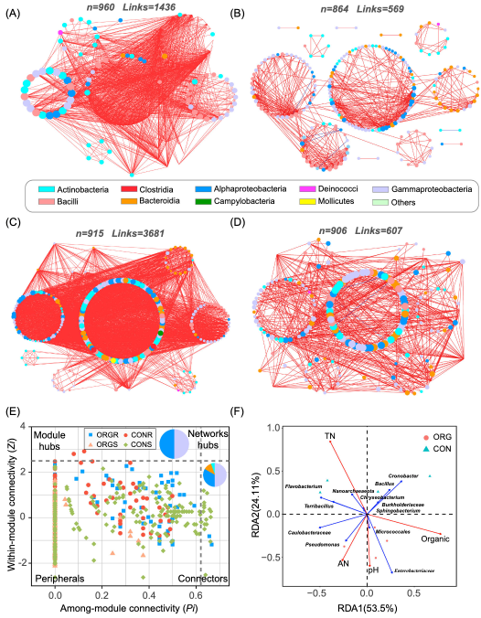

```{r setup, include=FALSE}
knitr::opts_chunk$set(
  collapse = T, echo=T, comment="#>", message=F, warning=F,
	fig.align="center", fig.width=5, fig.height=5, dpi=150)
```
本教程相关代码已经上传至 https://github.com/iMetaScience/iMetaPlot/tree/main/221030RDA
如果你使用本代码，请引用：
Zeyu Zhang. 2022. Tomato microbiome under long-term organic and conventional farming. iMeta 1: e48. https://onlinelibrary.wiley.com/doi/full/10.1002/imt2.48

**代码编写及注释：农心生信工作室**<br />

中农李季组冗余分析（Redundancy analysis，RDA）是微生物生态领域常用的分析手段，可用于研究微生物群落结构对环境变化的响应，相信此类专业的老师和同学一定不陌生，我们挑选了iMeta期刊上发表的来自中国农业大学李季老师团队的论文[Tomato Microbiome under Long-term Organic and Conventional Farming](https://onlinelibrary.wiley.com/doi/full/10.1002/imt2.48)，该研究对番茄内生细菌群落的变化及其影响因素进行了分析，论文的Figure 4 F中涉及RDA分析，Figure 4如下：<br />

本文我们利用R语言重现该图，数据均随机生成，大家直接复制粘贴即可运行

### R包检测和安装
1. 安装核心R包circlize以及一些功能辅助性R包，并载入所有R包。
```{r}
# 检查微生物群落分析包vegan，如没有则安装
if (!require("vegan"))
  install.packages("vegan")
# 检查ggplot2拓展包用图中文字的标注
if (!require("ggrepel"))
  install.packages("ggrepel")

# 加载包
library(vegan)
library(ggrepel)
```
### 生成测试数据
2. 设定随机种子并开始随机生成响应变量数据，共生成80条样本，数值为0-10之间的随机数
```{r}
set.seed(42) #设置随机种子
data1 <- data.frame(TN = runif(80, 0, 10), 
										PH = runif(80, 0, 10), 
										Organic=runif(80, 0, 10), 
										AN=runif(80, 0, 10),
                    Enterobacteriaceae=runif(80, 0, 10), 
                    Pseudomonas=runif(80, 0, 10),
                    Caulobacteraceae=runif(80, 0, 10),
                    Terribacillus=runif(80, 0, 10),
                    Sphingobacteriunm=runif(80, 0, 10),
                    Burkholderiaceae=runif(80, 0, 10),
                    Micrococcales=runif(80, 0, 10),
                    Chryseobacterium=runif(80, 0, 10),
                    Cronobacter=runif(80, 0, 10),
                    Bacillus=runif(80, 0, 10),
                    Nanoarchaeaeota=runif(80, 0, 10),
                    Flavobacterium=runif(80, 0, 10))
# 可选：从文件中读取
# write.table(data1, file="data1.txt", sep="\t", quote = F, row.names = T, col.names = T)
# data1 <- read.table("data1.txt")
data1  # 查看data1数据框

```
3. 对响应变量进行hellinger标准化，
```{r}
data1 <- decostand(data1, method = "hellinger")
```
4. 随机生成解释变量数据，data2和data1行数必须相等，前面40条数据属于CON处理，后面40条数据属于ORG处理
```{r}
data2 = data.frame(group = c(rep("CON1",10),rep("CON2",10), rep("CON3",10), rep("CON4",10), rep("ORG1",10),rep("ORG2",10), rep("ORG3",10), rep("ORG4",10)))

# 可选：从文件中读取
# write.table(data2, file="data2.txt", sep="\t", quote = F, row.names = T, col.names = T)
# data2 <- read.table("data2.txt")
```
### RDA分析和排序图绘制
5. RDA分析本身实现很简单，一行代码即可
```{r}
res <- rda(data1 ~ . , data2)
```
6. 下面进行一些画图前的数据处理，注意这里使用factor函数的levels参数只是为了改变ggplot2中legend的顺序从而和原图保持一致，默认强况下画出的图ORG在CON下方
```{r}
centroids <- as.data.frame(res$CCA$centroids[,c(1,2)]) #取RDA1，RDA2轴进行可视化
centroids$group <- factor(c(rep('CON',4),rep('ORG',4)), levels = c('ORG', 'CON')) # 给centroids数据框增加一列用于区分形状并上色
rda.v <- as.data.frame(res$CCA$v[,c(1,2)])
rda.v$name = row.names(rda.v) #提取响应变量名称用于在图中展示标签
```
制定画图中箭头的数据，并给出颜色
```{r}
arrow_data <- data.frame(x=rda.v[,1], y = rda.v[,2], x_end=0, y_end=0, name=rda.v[,3], col='blue')
arrow_data[arrow_data$name %in% c('PH', 'TN', 'Organic', 'AN'), ]$col <- 'red'
```
7. 开始画图，先把解释变量的point画出
```{r}
p1 <- ggplot(data = centroids) + 
        geom_point(size=2, aes(x = RDA1,y=RDA2,color=group, shape=group))
p1
```
8. 在p1的基础上再把响应变量的位置标出，注意标签斜体
```{r}
p2 <- p1 + ggrepel::geom_text_repel(data = arrow_data, aes(x,y,label=name), 
                              size=3, fontface="italic")
p2
```
9. 进一步画出响应变量的箭头
```{r}
p3 <- p2 + geom_segment(data = arrow_data,
               aes(x=0, y=0, xend=x, yend=y), 
               arrow = arrow(length = unit(0.05,"inches")), color = arrow_data$col, size=.8) 
p3
```
10. 这是图已经基本成型，需要再完善一些细节。画出虚线
```{r}
p4 <- p3 + geom_hline(yintercept = 0, linetype = "dashed", size=1.2) + 
  geom_vline(xintercept = 0,linetype = "dashed", size=1.2)
p4
```
11. 去掉图例标题并改变图例位置
```{r}
p5 <- p4 + theme(legend.title = element_blank(), legend.position = c(0.9,0.8), legend.background = element_blank())
p5
```
12. 距离成功只差一步啦，改变背景颜色，并修改横纵坐标轴
```{r}
p6 <- p5 + theme(panel.grid.major = element_blank(), panel.grid.minor = element_blank(),
            panel.background = element_blank(), axis.line = element_line(colour = "black"), panel.border = element_rect(colour = "black", fill=NA, size=1)) + labs(x = 'RDA1(53.5%)',y = 'RDA2(24.11%)')
ggsave('RDA_plot.pdf', p6, height = 10, width = 8)  # 保存图片并设置宽和高
```

### 附.完整代码
```{r}
if (!require("vegan"))
  install.packages("vegan")
if (!require("ggrepel"))
  install.packages("ggrepel")

library(vegan)
library(ggrepel)

set.seed(42) #设置随机种子
data1 <- data.frame(TN = runif(80, 0, 10), 
										PH = runif(80, 0, 10), 
										Organic=runif(80, 0, 10), 
										AN=runif(80, 0, 10),
                    Enterobacteriaceae=runif(80, 0, 10), 
                    Pseudomonas=runif(80, 0, 10),
                    Caulobacteraceae=runif(80, 0, 10),
                    Terribacillus=runif(80, 0, 10),
                    Sphingobacteriunm=runif(80, 0, 10),
                    Burkholderiaceae=runif(80, 0, 10),
                    Micrococcales=runif(80, 0, 10),
                    Chryseobacterium=runif(80, 0, 10),
                    Cronobacter=runif(80, 0, 10),
                    Bacillus=runif(80, 0, 10),
                    Nanoarchaeaeota=runif(80, 0, 10),
                    Flavobacterium=runif(80, 0, 10))

data1 <- decostand(data1, method = "hellinger")
data2 = data.frame(group = c(rep("CON1",10),rep("CON2",10), rep("CON3",10), rep("CON4",10), rep("ORG1",10),rep("ORG2",10), rep("ORG3",10), rep("ORG4",10)))
res <- rda(data1 ~ . , data2)

centroids <- as.data.frame(res$CCA$centroids[,c(1,2)]) #取RDA1，RDA2轴进行可视化
centroids$group <- factor(c(rep('CON',4),rep('ORG',4)), levels = c('ORG', 'CON')) # 给centroids数据框增加一列用于区分形状并上色
rda.v <- as.data.frame(res$CCA$v[,c(1,2)])
rda.v$name = row.names(rda.v) #提取响应变量名称用于在图中展示标签
arrow_data <- data.frame(x=rda.v[,1], y = rda.v[,2], x_end=0, y_end=0, name=rda.v[,3], col='blue')
arrow_data[arrow_data$name %in% c('PH', 'TN', 'Organic', 'AN'), ]$col <- 'red'
p1 <- ggplot(data = centroids) + 
        geom_point(size=2, aes(x = RDA1,y=RDA2,color=group, shape=group))
p2 <- p1 + ggrepel::geom_text_repel(data = arrow_data, aes(x,y,label=name), 
                              size=3, fontface="italic")
p3 <- p2 + geom_segment(data = arrow_data,
               aes(x=0, y=0, xend=x, yend=y), 
               arrow = arrow(length = unit(0.05,"inches")), color = arrow_data$col, size=.8) 
p4 <- p3 + geom_hline(yintercept = 0, linetype = "dashed", size=1.2) + 
  geom_vline(xintercept = 0,linetype = "dashed", size=1.2)
p5 <- p4 + theme(legend.title = element_blank(), legend.position = c(0.9,0.8), legend.background = element_blank())
p6 <- p5 + theme(panel.grid.major = element_blank(), panel.grid.minor = element_blank(),
            panel.background = element_blank(), axis.line = element_line(colour = "black"), panel.border = element_rect(colour = "black", fill=NA, size=1)) + labs(x = 'RDA1(53.5%)',y = 'RDA2(24.11%)')
ggsave('RDA_plot.pdf', p6, height = 10, width = 8)
```
RDA的绘图就完成了。大家多多动手操作，很快就可以学会！RDA分析绘图不难，但是理解其数学原理还是有一定难度的，对于我们非统计专业的老师和同学会使用、会解释实验结果即可。


