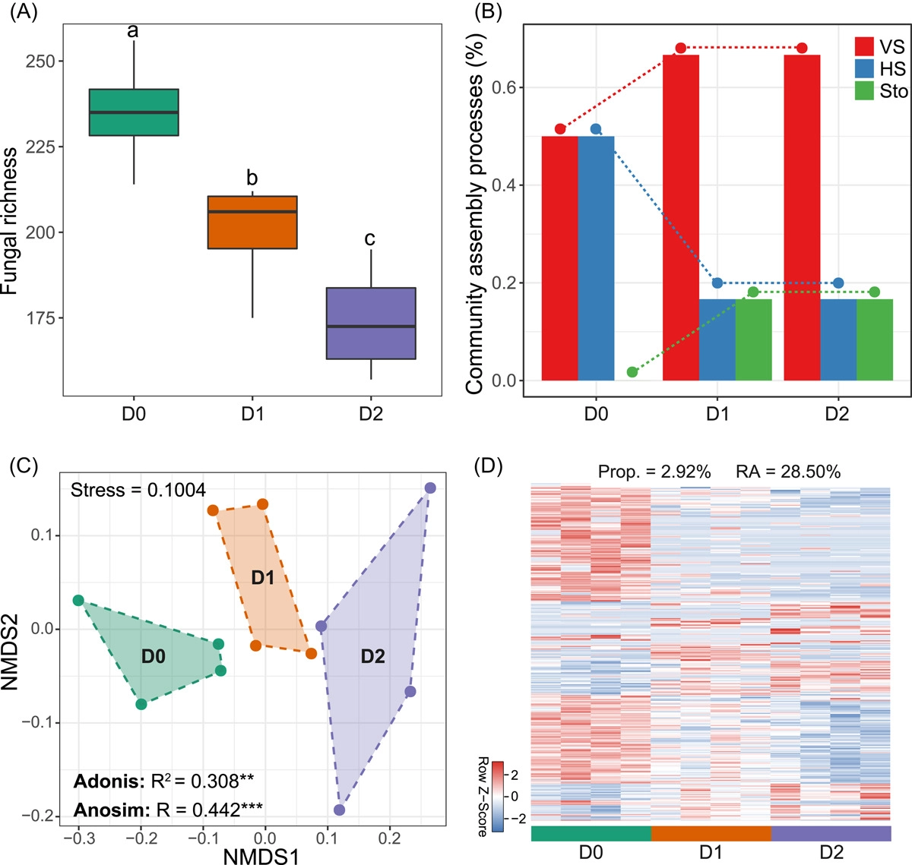
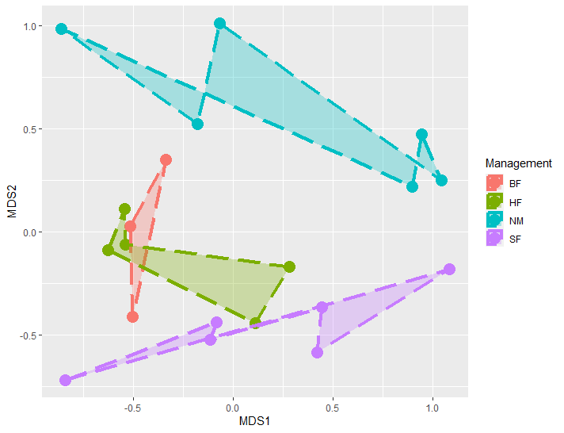
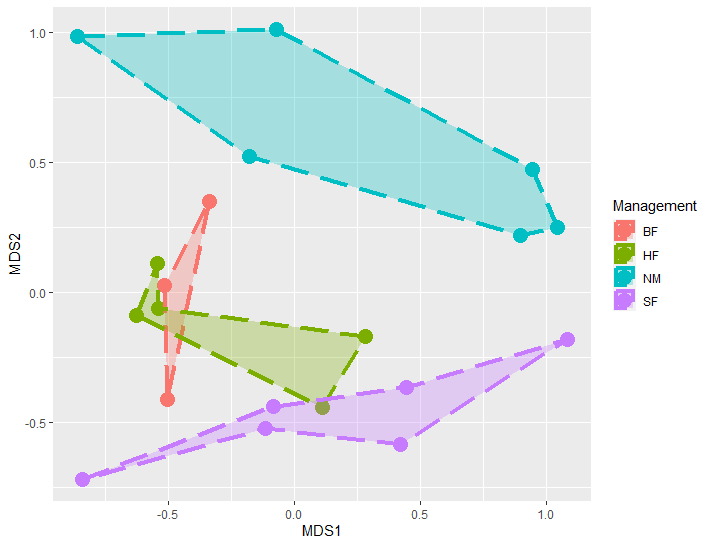
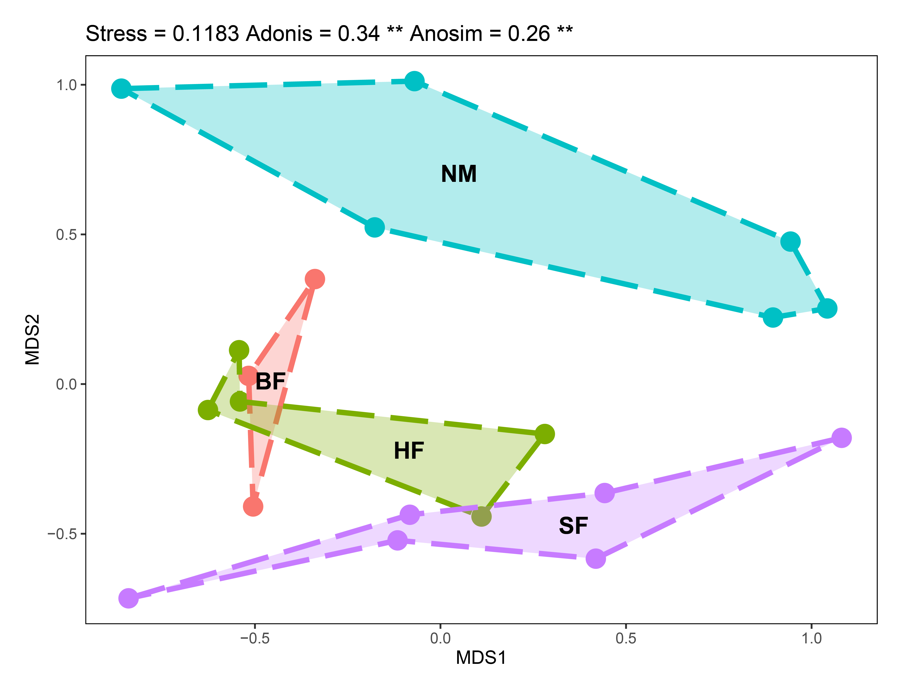

```{r setup, include=FALSE}
knitr::opts_chunk$set(
  collapse = T, echo=T, comment="#>", message=F, warning=F,
	fig.align="center", fig.width=5, fig.height=3, dpi=150)
```

**代码编写及注释：农心生信工作室**<br />

**非度量多维尺度分析(Non-metric multidimensional scaling, NMDS)**，是基于相异矩阵或距离矩阵进行排序分析的间接梯度分析方法，在微生物组研究中可以用来展示群落beta多样性。本期我们挑选2022年2月24日刊登在**iMeta**上的[Linking soil fungi to bacterial community assembly in arid ecosystems](https://onlinelibrary.wiley.com/doi/10.1002/imt2.2)- [iMeta：西农韦革宏团队焦硕等-土壤真菌驱动细菌群落的构建](https://mp.weixin.qq.com/s/Tw3JYcANGhfMqiELLf5D8Q)，选择文章的Figure 6C进行复现，基于**vegan**包，讲解和探讨和NMDS分析和可视化的方法，先上原图：<br />


接下来，我们将通过详尽的代码逐步拆解原图，最终实现对原图的复现。

### R包检测和安装
1. 安装核心R包vegan以及ggplot2，并载入所有R包。
```{r}
if (!require("vegan"))
  install.packages('vegan')
if (!require("ggplot2"))
  install.packages('ggplot2') 
# 加载包
library(vegan)
library(ggplot2)
```
### 生成测试数据
2. 由于缺少原始数据，因此本例使用vegan包自带的dune数据集进行测试。dune包含了20个样品，每个样品有30个物种丰度，每一行是一个样品，每一列是一个物种。
```{r}
# 载入dune数据集
data(dune)
#载入dune包含分组信息等的元数据（即metadata），分组信息为Management列
data(dune.env)
```


### NMDS分析
3. 获取数据后，即可利用vegan包进行NMDS分析。
```{r}
#计算bray_curtis距离
distance <- vegdist(dune, method = 'bray')
#NMDS排序分析，k=2预设两个排序轴
nmds <- metaMDS(distance, k = 2)
#查看结果
#summary(nmds)
```
4. 获取可视化所需数据。
```{r}
#获得应力值（stress）
stress<-nmds$stress
#将绘图数据转化为数据框
df<-as.data.frame(nmds$points)
#与分组数据合并
df<-cbind(df,dune.env)
```
### NMDS可视化
5. 根据分组绘制一个最基础的散点图。
```{r}
p<-ggplot(df,aes(MDS1,MDS2))+
  geom_point(aes(color=Management),size=5)
```


6. 我们注意到，原图中，每个分组被连接成不规则的多边形并用不同颜色表示，我们可以通过ggplot2中geom_polygon()来绘制。geom_polygon()会按照数据中出现的顺序连接观测值，内部可填充颜色。
```{r}
p<-ggplot(df,aes(MDS1,MDS2))+
  geom_point(aes(color=Management),size=5)+
  geom_polygon(aes(x=MDS1,y=MDS2,fill=Management,group=Management,color=Management),alpha=0.3,linetype="longdash",linewidth=1.5) #通过按顺序连接观测值绘制多边形
```



7. 由于geom_polygon()会按照数据中出现的顺序连接观测值，因此如果我们按照df自身顺序来绘制多边形，多边形会非常奇怪，没法代表不同分组。因此，我们需要预先处理df的顺序，按合理的顺序连接观测值。
```{r}
df<-df[order(df$Management),]#先按分组排序
df$Order<-c(2,1,3,1,2,3,4,5,3,5,1,6,2,4,1,2,6,3,5,4)#添加一列Order，给每个分组内观测点的手动排序
df<-df[order(df$Management,df$Order),]#按分组和Order排序
p<-ggplot(df,aes(MDS1,MDS2))+
  geom_point(aes(color=Management),size=5)+
  geom_polygon(aes(x=MDS1,y=MDS2,fill=Management,group=Management,color=Management),alpha=0.3,linetype="longdash",linewidth=1.5)
```



8. 分别进行Anosim分析（Analysis of similarities）和PERMANOVA（即adonis）检验分析。
```{r}
#设置随机种子
set.seed(123)
#基于bray-curtis距离进行PERMANOVA分析
adonis<- adonis2(dune ~ Management, data = dune.env, permutations = 999, method="bray")
#基于bray-curtis距离进行anosim分析
anosim=anosim(dune, dune.env$Management, permutations=999,distance = "bray")
```
9. 美化图片，并用AI微调。
```{r}
# 应力值stress，Adonis R2与显著性，Anosim R与显著性
stress_text<-paste("Stress =",round(stress,4))
adonis_text<-paste(paste("Adonis =",round(adonis$R2,2)),"**")[1]
anosim_text<-paste(paste("Anosim =",round(anosim$statistic,2)),"**")

p<-ggplot(df,aes(MDS1,MDS2))+
  geom_point(aes(color=Management),size=5)+
  geom_polygon(aes(x=MDS1,y=MDS2,fill=Management,group=Management,color=Management),alpha=0.3,linetype="longdash",linewidth=1.5)+
  theme(plot.margin=unit(rep(1,4),'lines'),
        panel.border = element_rect(fill=NA,color="black", size=0.5, linetype="solid"),
        panel.grid=element_blank(),
        panel.background = element_rect(fill = 'white'))+
  guides(color="none",fill="none")+
  ggtitle(paste(paste(stress_text,adonis_text),anosim_text))
```



### 附.完整代码
```{r}
if (!require("vegan"))
  install.packages('vegan')
if (!require("ggplot2"))
  install.packages('ggplot2') 
# 加载包
library(vegan)
library(ggplot2)

# 载入dune数据集
data(dune)
#载入dune包含分组信息等的元数据（即metadata），分组信息为Management列
data(dune.env)
#计算bray_curtis距离
distance <- vegdist(dune, method = 'bray')
#NMDS排序分析，k=2预设两个排序轴
nmds <- metaMDS(distance, k = 2)
#查看结果
#summary(nmds)
#获得应力值（stress）
stress<-nmds$stress
#将绘图数据转化为数据框
df<-as.data.frame(nmds$points)
#与分组数据合并
df<-cbind(df,dune.env)
df<-df[order(df$Management),]#先按分组排序
df$Order<-c(2,1,3,1,2,3,4,5,3,5,1,6,2,4,1,2,6,3,5,4)#添加一列Order，给每个分组内观测点的手动排序
df<-df[order(df$Management,df$Order),]#按分组和Order排序

#设置随机种子
set.seed(123)
#基于bray-curtis距离进行PERMANOVA分析
adonis <- adonis2(dune ~ Management, data = dune.env, permutations = 999, method="bray")
#基于bray-curtis距离进行anosim分析
anosim=anosim(dune, dune.env$Management, permutations=999,distance = "bray")

# 应力值stress，Adonis R2与显著性，Anosim R与显著性
stress_text<-paste("Stress =",round(stress,4))
adonis_text<-paste(paste("Adonis =",round(adonis$R2,2)),"**")[1]
anosim_text<-paste(paste("Anosim =",round(anosim$statistic,2)),"**")

p<-ggplot(df,aes(MDS1,MDS2))+
  geom_point(aes(color=Management),size=5)+
  geom_polygon(aes(x=MDS1,y=MDS2,fill=Management,group=Management,color=Management),alpha=0.3,linetype="longdash",linewidth=1.5)+
  theme(plot.margin=unit(rep(1,4),'lines'),
        panel.border = element_rect(fill=NA,color="black", size=0.5, linetype="solid"),
        panel.grid=element_blank(),
        panel.background = element_rect(fill = 'white'))+
  guides(color="none",fill="none")+
  ggtitle(paste(paste(stress_text,adonis_text),anosim_text))

ggsave("Figure6C.pdf",p,height = 5.69,width = 7.42)
```