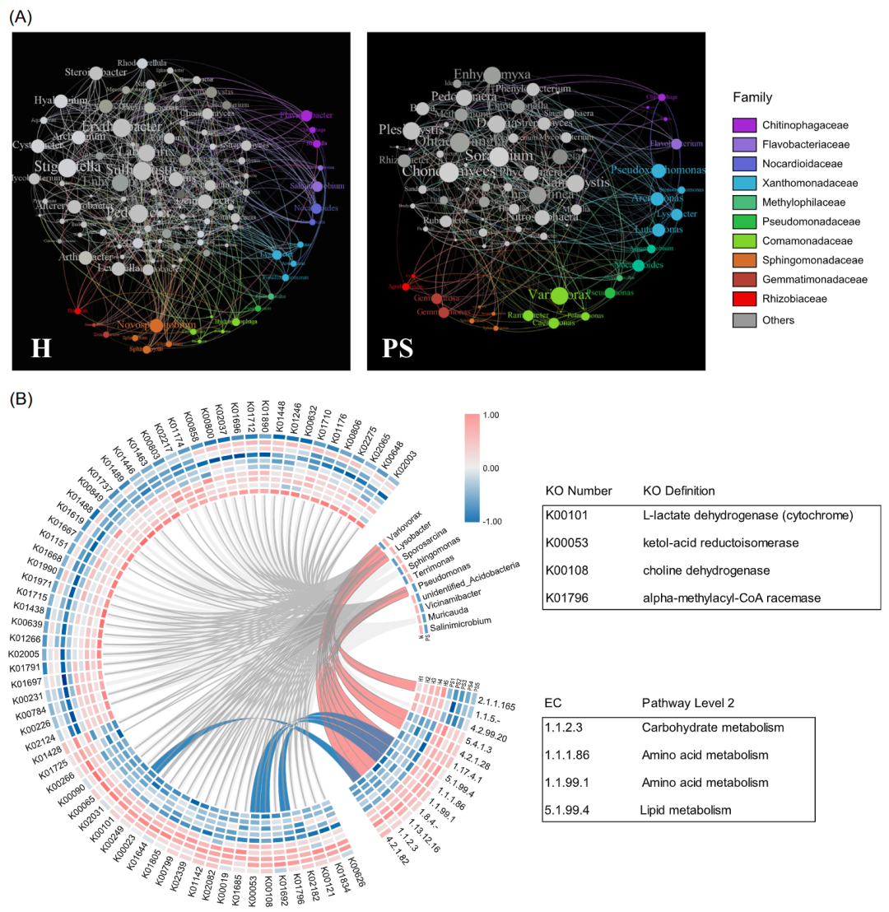
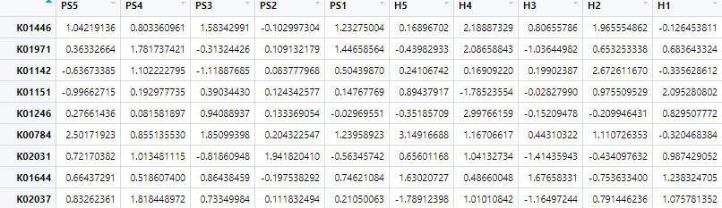
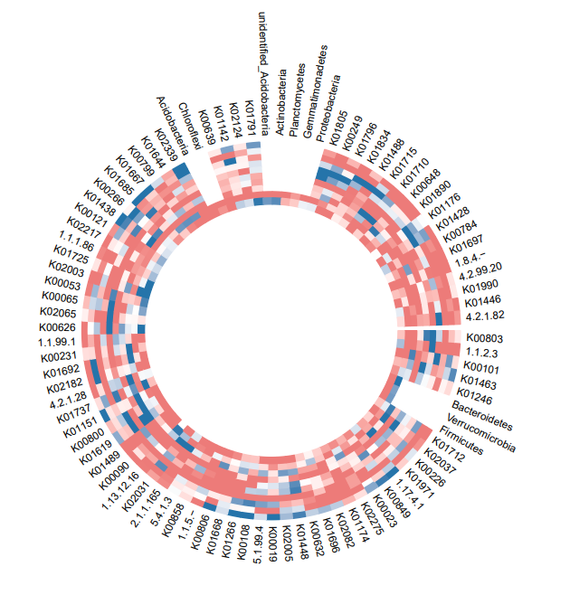
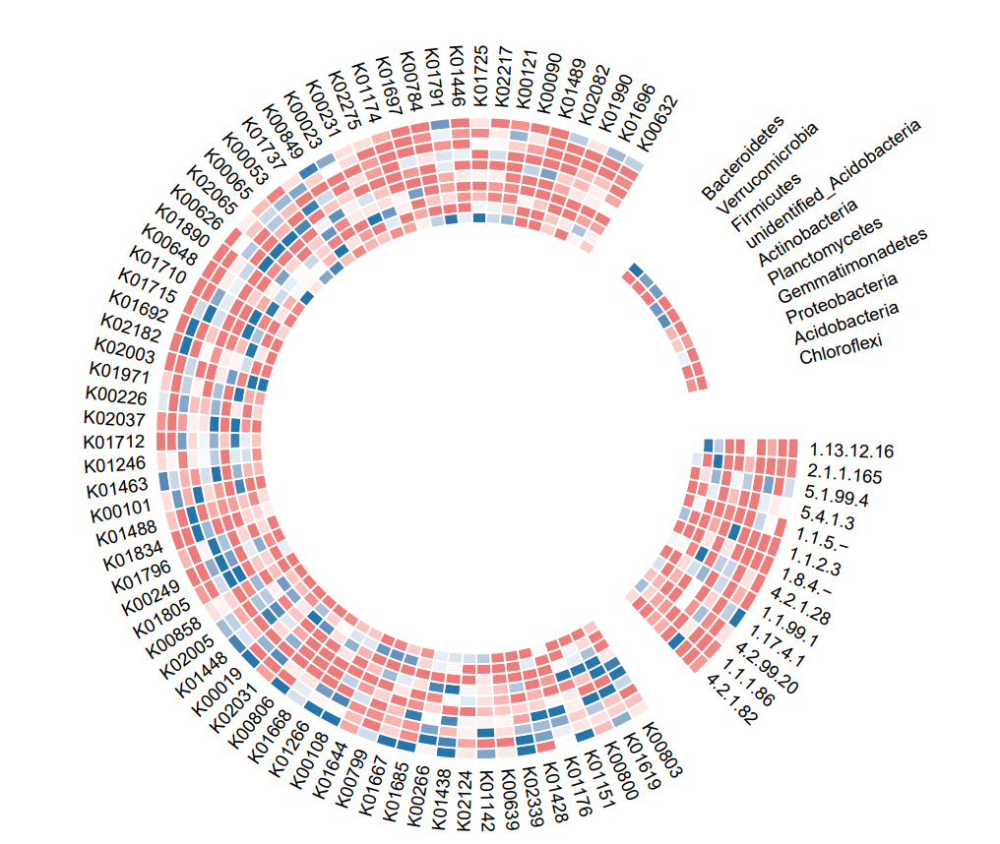
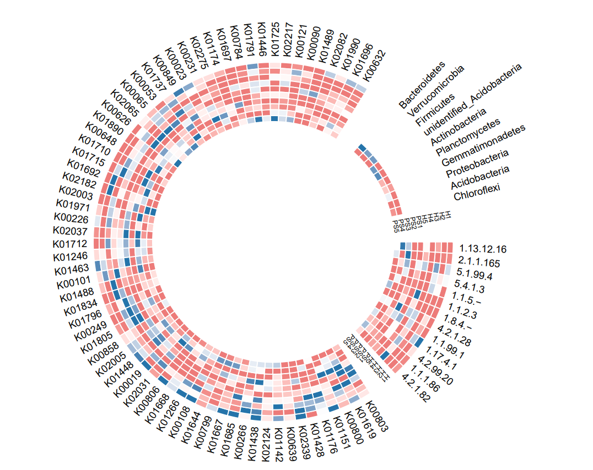
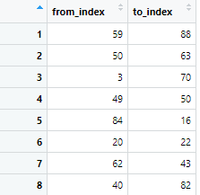
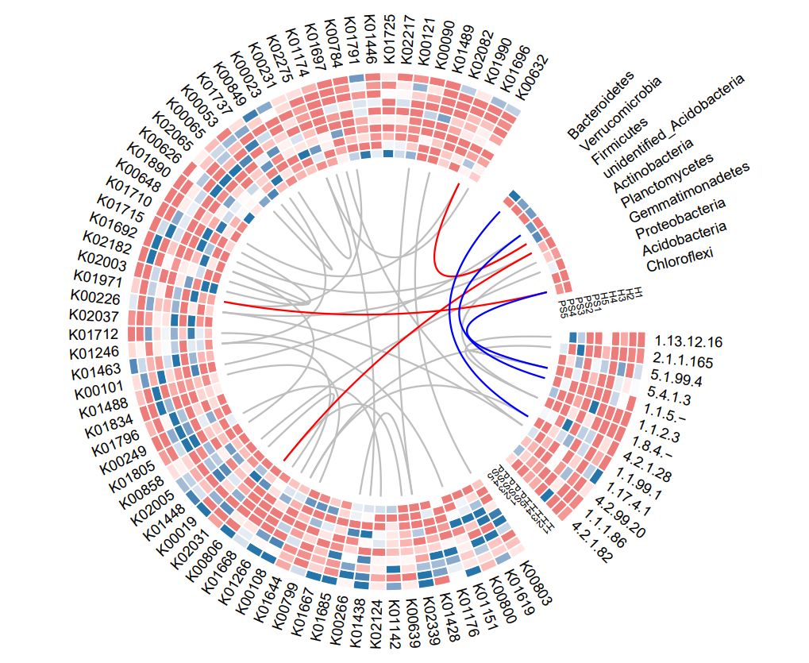
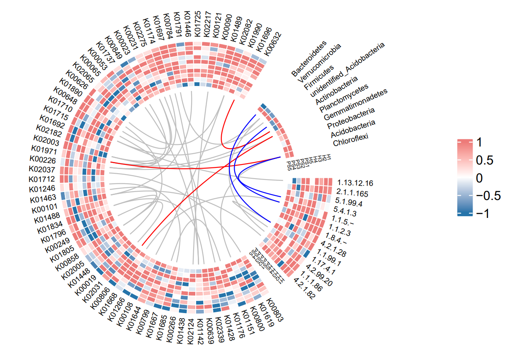
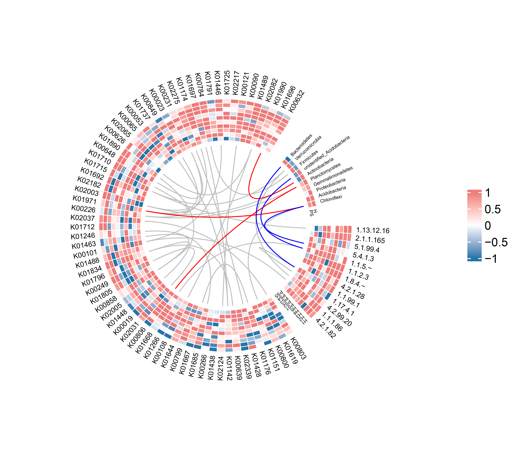

```{r setup, include=FALSE}
knitr::opts_chunk$set(
  collapse = T, echo=T, comment="#>", message=F, warning=F,
	fig.align="center", fig.width=5, fig.height=3, dpi=150)
```

**代码编写及注释：农心生信工作室**<br />

**热图 (Heat map)** 可以在微生物组研究中展示展示细菌功能聚类分析的结果，而环状热图是热图的一种表现形式。本期我们挑选2022年6月13日刊登在**iMeta**上的[Microbial community roles and chemical mechanisms in the parasitic development of Orobanche cumana](https://onlinelibrary.wiley.com/doi/full/10.1002/imt2.31)- [iMeta | 西农林雁冰/ James M. Tiedje等揭示菌群对寄生植物列当的调控作用](https://view.officeapps.live.com/op/view.aspx?src=http%3A%2F%2Fwww.imeta.science%2FiMeta%2FPapers%2F9Chinese%2Fimt2.31.docx&wdOrigin=BROWSELINK)，选择文章的Figure 2B进行复现，基于顾祖光博士开发的**circlize**包，讲解和探讨环形热图的绘制方法，先上原图：<br />


接下来，我们将通过详尽的代码逐步拆解原图，最终实现对原图的复现。

### R包检测和安装
1. 安装核心R包circlize以及一些功能辅助性R包，并载入所有R包。
```{r}
# 检查开发者工具devtools，如没有则安装
if (!require("devtools"))
  install.packages("devtools")
# 加载开发者工具devtools
library(devtools)
# 检查circlize包，没有则通过github安装最新版
if (!require("circlize"))
  install_github("jokergoo/circlize")
if (!require("tidyverse"))
  install.packages('tidyverse') 
if (!require("ComplexHeatmap"))
  install.packages('ComplexHeatmap') 
if (!require("tidyverse"))
  install.packages('tidyverse') 
# 加载包
library(circlize)
library(tidyverse)
library(ComplexHeatmap)
library(gridBase)
```
### 生成测试数据
2. 由于没有在补充文件里找到原文相关数据，在这里我们通过生成随机数据来替代。
```{r}
#生成KEGG数据矩阵（矩阵1）
data1<-matrix(rnorm(670,mean=0.5),nrow=67)
rownames(data1)<-c("K01446","K01971","K01142","K01151","K01246","K00784","K02031","K01644","K02037","K02065","K01448",
  "K01890","K00266","K01725","K00806","K00231","K01737","K00858","K00019","K01715","K01692","K00249",
  "K00023","K00626","K00101","K00803","K01710","K01791","K01176","K00799","K00800","K01667","K01668",
  "K01712","K00053","K01696","K01697","K00108","K00639","K01489","K00226","K01488","K02339","K01428",
  "K01438","K02124","K02275","K01796","K00632","K00648","K00849","K01805","K01685","K00065","K00090",
  "K01619","K01834","K00121","K02182","K02082","K02005","K01266","K01990","K01463","K02217","K01174","K02003")
colnames(data1)<-c(paste('H',seq(1:5),sep = ""),paste("PS",seq(1:5),sep = ""))
#生成EC数据矩阵（矩阵2）
data2<-matrix(rnorm(130,mean=1),nrow = 13)
rownames(data2)<-c("2.1.1.165","1.1.5.-","4.2.99.20","1.1.1.86","1.1.99.1","1.1.2.3","4.2.1.28","4.2.1.82","5.4.1.3","1.13.12.16","5.1.99.4","1.17.4.1","1.8.4.-")
colnames(data2)<-c(paste('H',seq(1:5),sep = ""),paste("PS",seq(1:5),sep = ""))
#生成细菌数据矩阵（矩阵3）
data3<-matrix(rnorm(20,mean=1),nrow = 10)
supdata<-matrix(0,nrow = 10,ncol = 8)
#由于该矩阵为10×2矩阵，需补充10×8全为0的矩阵，使得矩阵123均为m×10的矩阵
data3<-cbind(data3,supdata)
rownames(data3)<-c("Proteobacteria","Actinobacteria","Acidobacteria","Bacteroidetes","Gemmatimonadetes","Chloroflexi","Planctomycetes","Firmicutes","Verrucomicrobia","unidentified_Acidobacteria")
#将三个矩阵按行合并
mat_data<-rbind(data1,data2,data3)
#按行将矩阵反转，这样矩阵3的非零数据会出现在内圈
mat_dataR<-mat_data%>% as.data.frame() %>% rowwise() %>% rev() %>% as.matrix() 
rownames(mat_dataR)<-rownames(mat_data)
```


### 环形热图预览
3. 开始作图，首先画一个最基本的环形热图：
```{r}
pdf("plot1.pdf",width = 8, height = 6)
#设置热图颜色范围：
colpattern = colorRamp2(c(-1, 0, 1), c("#2574AA", "white", "#ED7B79"))
#设置扇区，这里划分了三个扇区，KEGG,EC和细菌种类。
level_test<-c(rep("KEGG",67),rep("EC",13),rep("SP",10)) %>% factor()

#画图
circos.heatmap(mat_dataR, col = colpattern, rownames.side = "outside", cluster = TRUE)
circos.clear()

dev.off()
```


4. 添加扇区分化，单元格边框，轨道高度，扇区间间隔：
```{r}
pdf("plot2.pdf",width = 8, height = 6)
circos.par(gap.after = c(10, 10, 12))
circos.heatmap(mat_dataR, split = level_test, 
               col = colpattern, rownames.side = "outside", 
               cluster = TRUE,cell.lwd=0.8,
               cell.border="white",track.height = 0.2)
circos.clear()

dev.off()
```


5. 添加矩阵的列名。circos.heatmap()不直接支持矩阵的列名，可以通过自定义panel.fun函数轻松添加：
```{r}
pdf("plot3.pdf",width = 8, height = 6)
circos.par(gap.after = c(10, 10, 12))
circos.heatmap(mat_dataR, split = level_test, 
               col = colpattern, rownames.side = "outside", 
               cluster = TRUE,cell.lwd=0.8,
               cell.border="white",track.height = 0.2) 
circos.track(track.index = get.current.track.index(), panel.fun = function(x, y) {
  if(CELL_META$sector.numeric.index == 1) { # the last sector
    cn = colnames(mat_dataR)
    n = length(cn)
    circos.text(rep(CELL_META$cell.xlim[2], n) + convert_x(1, "mm"), 
                1:n - 0.5, cn, 
                cex = 0.3, adj = c(0, 0.5), facing = "inside")
  }
}, bg.border = NA)


circos.track(track.index = get.current.track.index(), panel.fun = function(x, y) {
  if(CELL_META$sector.numeric.index == 3) { # the last sector
    cn = colnames(mat_dataR)
    n = length(cn)
    circos.text(rep(CELL_META$cell.xlim[2], n) + convert_x(1, "mm"), 
                1:n - 0.5, cn, 
                cex = 0.3, adj = c(0, 0.5), facing = "inside")
  }
}, bg.border = NA)
circos.clear()

dev.off()
```


6. 接下来添加连接线，连接线表示位置和位置的对应关系。首先生成数据：
```{r}
#灰色连接线数据
df_link = data.frame(
  from_index = sample(nrow(mat_dataR), 30),
  to_index = sample(nrow(mat_dataR), 30)
)
#红色连接线数据
red_df_link<-data.frame(from_index = c(86,87,82),
                        to_index = c(2,15,36))
#蓝色连接线数据
blue_df_link<-data.frame(from_index = c(84,86,90),
                         to_index = c(72,76,69))
```


7. 接下来开始添加link：
```{r}
pdf("plot4.pdf",width = 8, height = 6)
circos.par(gap.after = c(10, 10, 12))
circos.heatmap(mat_dataR, split = level_test, 
               col = colpattern, rownames.side = "outside", 
               cluster = TRUE,cell.lwd=0.8,
               cell.border="white",track.height = 0.2) 
circos.track(track.index = get.current.track.index(), panel.fun = function(x, y) {
  if(CELL_META$sector.numeric.index == 1) { # the last sector
    cn = colnames(mat_dataR)
    n = length(cn)
    circos.text(rep(CELL_META$cell.xlim[2], n) + convert_x(1, "mm"), 
                1:n - 0.5, cn, 
                cex = 0.3, adj = c(0, 0.5), facing = "inside")
  }
}, bg.border = NA)


circos.track(track.index = get.current.track.index(), panel.fun = function(x, y) {
  if(CELL_META$sector.numeric.index == 3) { # the last sector
    cn = colnames(mat_dataR)
    n = length(cn)
    circos.text(rep(CELL_META$cell.xlim[2], n) + convert_x(1, "mm"), 
                1:n - 0.5, cn, 
                cex = 0.3, adj = c(0, 0.5), facing = "inside")
  }
}, bg.border = NA)

for(i in seq_len(nrow(df_link))) {
  circos.heatmap.link(df_link$from_index[i],
                      df_link$to_index[i],
                      col = "grey")
}

for(i in seq_len(nrow(red_df_link))) {
  circos.heatmap.link(red_df_link$from_index[i],
                      red_df_link$to_index[i],
                      col = "red")
}

for(i in seq_len(nrow(blue_df_link))) {
  circos.heatmap.link(blue_df_link$from_index[i],
                      blue_df_link$to_index[i],
                      col = "blue")
}
circos.clear()


dev.off()
```


8. 添加图例，circos.heatmap()本身是不支持添加图例的，但我们可以利用gridBase和ComplexHeatmap包添加图例：
```{r}
pdf("plot5.pdf",width = 8, height = 6)
plot.new()
circle_size = unit(1, "snpc") # snpc unit gives you a square region

pushViewport(viewport(x = 0, y = 0.5, width = circle_size, height = circle_size,
                      just = c("left", "center")))
par(omi = gridOMI(), new = TRUE)
circos.par(gap.after = c(10, 10, 12))
circos.heatmap(mat_dataR, split = level_test, 
               col = colpattern, rownames.side = "outside", 
               cluster = TRUE,cell.lwd=0.8,
               cell.border="white",track.height = 0.2) 
circos.track(track.index = get.current.track.index(), panel.fun = function(x, y) {
  if(CELL_META$sector.numeric.index == 1) { # the last sector
    cn = colnames(mat_dataR)
    n = length(cn)
    circos.text(rep(CELL_META$cell.xlim[2], n) + convert_x(1, "mm"), 
                1:n - 0.5, cn, 
                cex = 0.3, adj = c(0, 0.5), facing = "inside")
  }
}, bg.border = NA)


circos.track(track.index = get.current.track.index(), panel.fun = function(x, y) {
  if(CELL_META$sector.numeric.index == 3) { # the last sector
    cn = colnames(mat_dataR)
    n = length(cn)
    circos.text(rep(CELL_META$cell.xlim[2], n) + convert_x(1, "mm"), 
                1:n - 0.5, cn, 
                cex = 0.3, adj = c(0, 0.5), facing = "inside")
  }
}, bg.border = NA)

for(i in seq_len(nrow(df_link))) {
  circos.heatmap.link(df_link$from_index[i],
                      df_link$to_index[i],
                      col = "grey")
}

for(i in seq_len(nrow(red_df_link))) {
  circos.heatmap.link(red_df_link$from_index[i],
                      red_df_link$to_index[i],
                      col = "red")
}

for(i in seq_len(nrow(blue_df_link))) {
  circos.heatmap.link(blue_df_link$from_index[i],
                      blue_df_link$to_index[i],
                      col = "blue")
}
circos.clear()
upViewport()

h = dev.size()[2]
lgd = Legend(title = "", col_fun = colpattern)
draw(lgd, x = circle_size, just = "left")

dev.off()
```


9. 最后用AI进行修图，处理掉不合理的部分。成品图如下：


### 附.完整代码
```{r}
# 检查开发者工具devtools，如没有则安装
if (!require("devtools"))
  install.packages("devtools")
# 加载开发者工具devtools
library(devtools)
# 检查circlize包，没有则通过github安装最新版
if (!require("circlize"))
  install_github("jokergoo/circlize")
if (!require("tidyverse"))
  install.packages('tidyverse') 
if (!require("ComplexHeatmap"))
  install.packages('ComplexHeatmap') 
if (!require("tidyverse"))
  install.packages('tidyverse') 
# 加载包
library(circlize)
library(tidyverse)
library(ComplexHeatmap)
library(gridBase)

#part1 生成数据
set.seed(123)
#生成KEGG数据矩阵（矩阵1）
data1<-matrix(rnorm(670,mean=0.5),nrow=67)
rownames(data1)<-c("K01446","K01971","K01142","K01151","K01246","K00784","K02031","K01644","K02037","K02065","K01448",
  "K01890","K00266","K01725","K00806","K00231","K01737","K00858","K00019","K01715","K01692","K00249",
  "K00023","K00626","K00101","K00803","K01710","K01791","K01176","K00799","K00800","K01667","K01668",
  "K01712","K00053","K01696","K01697","K00108","K00639","K01489","K00226","K01488","K02339","K01428",
  "K01438","K02124","K02275","K01796","K00632","K00648","K00849","K01805","K01685","K00065","K00090",
  "K01619","K01834","K00121","K02182","K02082","K02005","K01266","K01990","K01463","K02217","K01174","K02003")
colnames(data1)<-c(paste('H',seq(1:5),sep = ""),paste("PS",seq(1:5),sep = ""))
#生成EC数据矩阵（矩阵2）
data2<-matrix(rnorm(130,mean=1),nrow = 13)
rownames(data2)<-c("2.1.1.165","1.1.5.-","4.2.99.20","1.1.1.86","1.1.99.1","1.1.2.3","4.2.1.28","4.2.1.82","5.4.1.3","1.13.12.16","5.1.99.4","1.17.4.1","1.8.4.-")
colnames(data2)<-c(paste('H',seq(1:5),sep = ""),paste("PS",seq(1:5),sep = ""))
#生成细菌数据矩阵（矩阵3）
data3<-matrix(rnorm(20,mean=1),nrow = 10)
supdata<-matrix(0,nrow = 10,ncol = 8)
#由于该矩阵为10×2矩阵，需补充10×8全为0的矩阵，使得矩阵123均为m×10的矩阵
data3<-cbind(data3,supdata)
rownames(data3)<-c("Proteobacteria","Actinobacteria","Acidobacteria","Bacteroidetes","Gemmatimonadetes","Chloroflexi","Planctomycetes","Firmicutes","Verrucomicrobia","unidentified_Acidobacteria")
#将三个矩阵按行合并
mat_data<-rbind(data1,data2,data3)
#按行将矩阵反转，这样矩阵3的非零数据会出现在内圈
mat_dataR<-mat_data%>% as.data.frame() %>% rowwise() %>% rev() %>% as.matrix() 
rownames(mat_dataR)<-rownames(mat_data)
#设置热图颜色范围
colpattern = colorRamp2(c(-1, 0, 1), c("#2574AA", "white", "#ED7B79"))
#设置扇区，这里划分了三个扇区，KEGG,EC和细菌种类
level_test<-c(rep("KEGG",67),rep("EC",13),rep("SP",10)) %>% factor()
#level_test<-row.names(mat_dataR) %>% str_match("[k]+") %>% replace_na("EC") %>% factor()
#生成连接线数据
df_link = data.frame(
  from_index = sample(nrow(mat_dataR), 30),
  to_index = sample(nrow(mat_dataR), 30)
)
red_df_link<-data.frame(from_index = c(86,87,82),
                        to_index = c(2,15,36))

blue_df_link<-data.frame(from_index = c(84,86,90),
                         to_index = c(72,76,69))

#开始画图
pdf("Figure 2B.pdf",width = 8, height = 6)
plot.new()
circle_size = unit(1, "snpc") # snpc unit gives you a square region

pushViewport(viewport(x = 0, y = 0.5, width = circle_size, height = circle_size,
                      just = c("left", "center")))
par(omi = gridOMI(), new = TRUE)
circos.par(gap.after = c(10, 10, 12))
circos.heatmap(mat_dataR, split = level_test, 
               col = colpattern, rownames.side = "outside", 
               cluster = TRUE,cell.lwd=0.8,
               cell.border="white",track.height = 0.2) 
circos.track(track.index = get.current.track.index(), panel.fun = function(x, y) {
  if(CELL_META$sector.numeric.index == 1) { # the last sector
    cn = colnames(mat_dataR)
    n = length(cn)
    circos.text(rep(CELL_META$cell.xlim[2], n) + convert_x(1, "mm"), 
                1:n - 0.5, cn, 
                cex = 0.3, adj = c(0, 0.5), facing = "inside")
  }
}, bg.border = NA)


circos.track(track.index = get.current.track.index(), panel.fun = function(x, y) {
  if(CELL_META$sector.numeric.index == 3) { # the last sector
    cn = colnames(mat_dataR)
    n = length(cn)
    circos.text(rep(CELL_META$cell.xlim[2], n) + convert_x(1, "mm"), 
                1:n - 0.5, cn, 
                cex = 0.3, adj = c(0, 0.5), facing = "inside")
  }
}, bg.border = NA)

for(i in seq_len(nrow(df_link))) {
  circos.heatmap.link(df_link$from_index[i],
                      df_link$to_index[i],
                      col = "grey")
}


for(i in seq_len(nrow(red_df_link))) {
  circos.heatmap.link(red_df_link$from_index[i],
                      red_df_link$to_index[i],
                      col = "red")
}

for(i in seq_len(nrow(blue_df_link))) {
  circos.heatmap.link(blue_df_link$from_index[i],
                      blue_df_link$to_index[i],
                      col = "blue")
}
circos.clear()
upViewport()

h = dev.size()[2]
lgd = Legend(title = "", col_fun = colpattern)
draw(lgd, x = circle_size, just = "left")

dev.off()
```