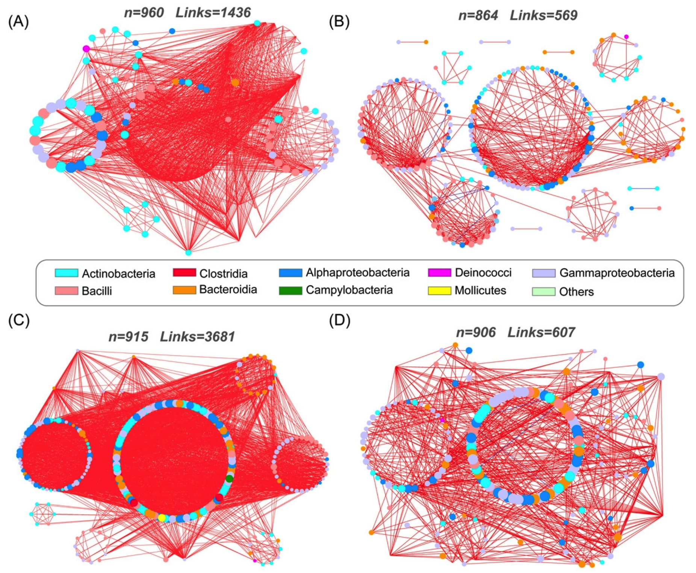
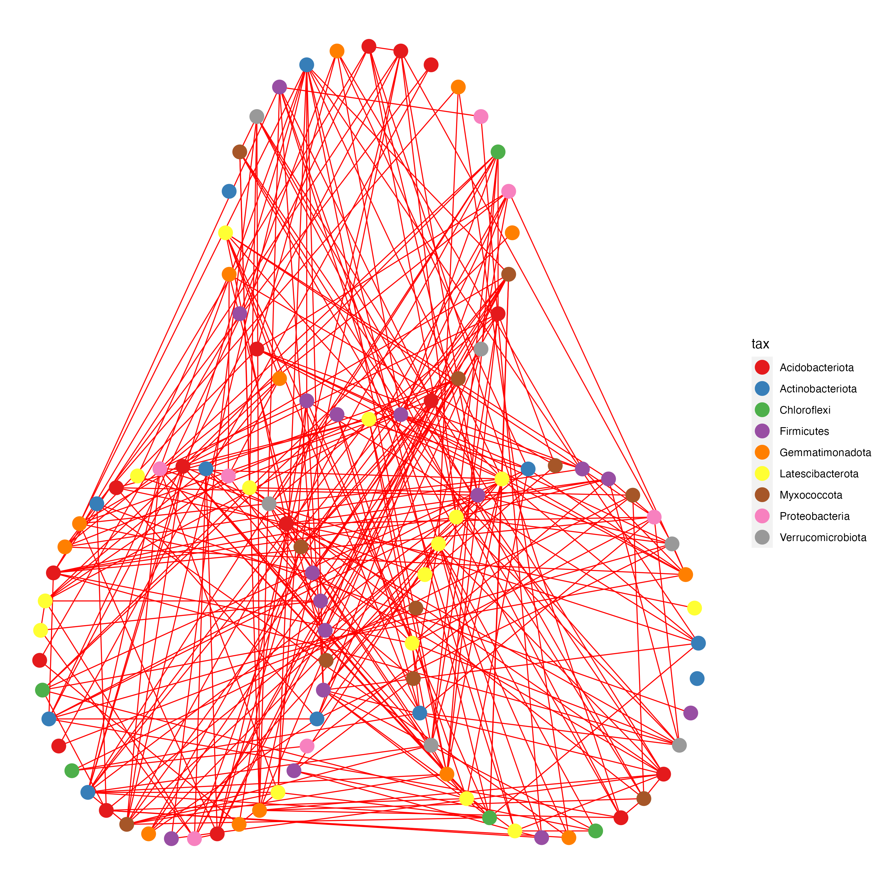

```{r setup, include = FALSE}
knitr::opts_chunk$set(
  collapse = T, echo=T, comment="#>", message=F, warning=F,
	fig.align="center", fig.width=5, fig.height=3, dpi=150)
```
本教程相关代码已经上传至 https://github.com/iMetaScience/iMetaPlot/tree/main/221120ggClusterNet-occurrence_network
如果你使用本代码，请引用：
Zeyu Zhang. 2022. Tomato microbiome under long-term organic and conventional farming. iMeta 1: e48. https://onlinelibrary.wiley.com/doi/full/10.1002/imt2.48
Tao Wen. 2022. ggClusterNet: An R package for microbiome network analysis and modularity-based multiple network layouts. iMeta 1: e32. https://onlinelibrary.wiley.com/doi/10.1002/imt2.32
**代码编写及注释：农心生信工作室**<br />

之前我们用igraph结合R基础包复现过论文中的共现网络，ggClusterNet是绘制网络图的R包，拥有更加丰富的布局，本期我们使用ggClusterNet复现来自中国农业大学李季老师团队的论文[Tomato Microbiome under Long-term Organic and Conventional Farming](https://onlinelibrary.wiley.com/doi/full/10.1002/imt2.48)中Figure 4 A-D中的共现网络，Figure 4如下：
<br />

### R包检测和安装

1. 先安装软件包及其依赖并将所有包载入

```{r}
# 检查网络图构建包igraph，如没有则安装
if (!require("igraph"))
  install.packages("igraph")
if (!require("BiocManager"))
  install.packages("BiocManager")
if (!require("phyloseq"))
  BiocManager::install("phyloseq")
if (!require("devtools"))
  install.packages("devtools")
if (!require("ggClusterNet"))
  devtools::install_github("taowenmicro/ggClusterNet")
if (!require("ggplot2"))
  install.packages("ggplot2")
if (!require("sna"))
  install.packages("sna")
if (!require("tidyfst"))
  install.packages("tidyfst")

library(igraph)
library(phyloseq)
library(sna)
library(ggClusterNet)
library(ggplot2)
```

### 生成测试数据

2. 设置随机种子并生成2000个otu的丰度表

```{r}
# 设置随机数种子，确保数据可重复
set.seed(123)
# 生成A、B两个样本各三个重复，共2000个otu的丰度表
otu <- data.frame(replicate(6, sample.int(10, 2000, replace = T))) 
rownames(otu) <- paste0('otu_', 1:nrow(otu)) # 行命名
colnames(otu) <- c('A1', 'A2', 'A3', 'B1', 'B2', 'B3') # 列命名

dim(otu) #查看数据维度

# 可选 从文件读取矩阵
# write.table(otu, file="otu.txt", sep="\t", quote=F, row.names=T, col.names=T)
# otu = read.table(("otu.txt"), header=T, row.names=1, sep="\t", comment.char="")

```
3. 生成门水平的otu分类并整合数据
```{r}
otu2tax <- data.frame(row.names = rownames(otu), 
                      tax=sample(c('Proteobacteria', 'Firmicutes', 'Acidobacteriota', 
                                   'Chloroflexi', 'Verrucomicrobiota', 'Myxococcota', 
                                   'Actinobacteriota', 'Gemmatimonadota', 'Latescibacterota'), 2000, replace = T))
# 生成metadata A,B各三个重复
metadata <- data.frame(row.names = colnames(otu), 
                       Group=c(rep('A', 3),rep('B',3)))

# 构建phyloseq对象
ps <- phyloseq(sample_data(metadata),
               otu_table(as.matrix(otu), taxa_are_rows=TRUE),
               tax_table(as.matrix(otu2tax)))

```
### 构建图
4. 计算OTU之间的相关系数矩阵
```{r}
result = corMicro(ps = ps,
                  N = 100, # 根据相关系数选取top100进行可视化
                  method.scale = "TMM", # TMM标准化
                  r.threshold=0.2, # 相关系数阀值
                  p.threshold=0.05, # p value阀值
                  method = "pearson")  


# 提取相关矩阵
cor = result[[1]]
```
5. 构建图
```{r}
igraph <- graph_from_adjacency_matrix(cor, diag = F, mode="undirected",weighted=TRUE)
```

### 对节点和边进行注释并分组

6. 提取过滤后的OTU表
```{r}
# 网络中包含的OTU的phyloseq文件提取
ps_net = result[[3]]

# 导出otu表格
otu_table = ps_net %>% 
  vegan_otu() %>%
  t() %>%
  as.data.frame()
```


7. 对节点进行注释并随机分为三组
```{r}
#构建分组，可以根据图的最大连接分组，通过clusters(igraph)得到分组信息；也可以自定义分组，这里随机地将100个过滤后的otu分成三组
gp = data.frame(ID = rownames(otu_table), group=sample(1:3, 100, replace = T))

layout = PolygonClusterG(cor = cor, nodeGroup = gp) # 生成网络图布局，'PolygonClusterG'是该论文中的布局

node = layout[[1]] # 提取节点

tax_table = ps_net %>%
  vegan_tax() %>%
  as.data.frame()

# node节点注释
nodes = nodeadd(plotcord =node,otu_table = otu_table,tax_table = tax_table)

edge = edgeBuild(cor = cor,node = node)  # 构建边
```

### 网络图可视化

8. 画图并保存
```{r}
# 开始绘图
p1 <- ggplot() + geom_segment(data = edge, aes(x = X1, y = Y1, xend = X2, yend = Y2), size = 0.4, color = 'red') +
  geom_point(data = nodes, aes(X1, X2, color=tax), size=5) +
  scale_colour_brewer(palette = "Set1") +
  scale_size_continuous(range = c(2,5)) + 
  scale_x_continuous(breaks = NULL) + scale_y_continuous(breaks = NULL) +
  theme(panel.background = element_blank()) +
  theme(axis.title.x = element_blank(), axis.title.y = element_blank()) +
  theme(legend.background = element_rect(colour = NA)) +
  theme(panel.background = element_rect(fill = "white",  colour = NA)) +
  theme(panel.grid.minor = element_blank(), panel.grid.major = element_blank())

ggsave("plot.png", p1, width = 10, height = 10) # 保存图片
```

<br /><br />

### 附.完整代码

```{r}
library(igraph)
library(phyloseq)
library(sna)
library(ggClusterNet)
library(ggplot2)

# 设置随机数种子，确保数据可重复
set.seed(123)
# 生成A、B两个样本各三个重复，共2000个otu的丰度表
otu <- data.frame(replicate(6, sample.int(10, 2000, replace = T))) 
rownames(otu) <- paste0('otu_', 1:nrow(otu)) # 行命名
colnames(otu) <- c('A1', 'A2', 'A3', 'B1', 'B2', 'B3') # 列命名

dim(otu) #查看数据维度

# 可选 从文件读取矩阵
# write.table(otu, file="otu.txt", sep="\t", quote=F, row.names=T, col.names=T)
# otu = read.table(("otu.txt"), header=T, row.names=1, sep="\t", comment.char="")

otu2tax <- data.frame(row.names = rownames(otu), 
                      tax=sample(c('Proteobacteria', 'Firmicutes', 'Acidobacteriota', 
                                   'Chloroflexi', 'Verrucomicrobiota', 'Myxococcota', 
                                   'Actinobacteriota', 'Gemmatimonadota', 'Latescibacterota'), 2000, replace = T))
# 生成metadata A,B各三个重复
metadata <- data.frame(row.names = colnames(otu), 
                       Group=c(rep('A', 3),rep('B',3)))

# 构建phyloseq对象
ps <- phyloseq(sample_data(metadata),
               otu_table(as.matrix(otu), taxa_are_rows=TRUE),
               tax_table(as.matrix(otu2tax)))

result = corMicro(ps = ps,
                  N = 100, # 根据相关系数选取top100进行可视化
                  method.scale = "TMM", # TMM标准化
                  r.threshold=0.2, # 相关系数阀值
                  p.threshold=0.05, # p value阀值
                  method = "pearson")  


# 提取相关矩阵
cor = result[[1]]

igraph <- graph_from_adjacency_matrix(cor, diag = F, mode="undirected",weighted=TRUE)

# 网络中包含的OTU的phyloseq文件提取
ps_net = result[[3]]

# 导出otu表格
otu_table = ps_net %>% 
  vegan_otu() %>%
  t() %>%
  as.data.frame()

#构建分组，可以根据图的最大连接分组，通过clusters(igraph)得到分组信息；也可以自定义分组，这里随机地将100个过滤后的otu分成三组
gp = data.frame(ID = rownames(otu_table), group=sample(1:3, 100, replace = T))

layout = PolygonClusterG(cor = cor, nodeGroup = gp) # 生成网络图布局，'PolygonClusterG'是该论文中的布局

node = layout[[1]] # 提取节点

tax_table = ps_net %>%
  vegan_tax() %>%
  as.data.frame()

# node节点注释
nodes = nodeadd(plotcord =node,otu_table = otu_table,tax_table = tax_table)

edge = edgeBuild(cor = cor,node = node)  # 构建边

# 开始绘图
p1 <- ggplot() + geom_segment(data = edge, aes(x = X1, y = Y1, xend = X2, yend = Y2), size = 0.4, color = 'red') +
  geom_point(data = nodes, aes(X1, X2, color=tax), size=5) +
  scale_colour_brewer(palette = "Set1") +
  scale_size_continuous(range = c(2,5)) + 
  scale_x_continuous(breaks = NULL) + scale_y_continuous(breaks = NULL) +
  theme(panel.background = element_blank()) +
  theme(axis.title.x = element_blank(), axis.title.y = element_blank()) +
  theme(legend.background = element_rect(colour = NA)) +
  theme(panel.background = element_rect(fill = "white",  colour = NA)) +
  theme(panel.grid.minor = element_blank(), panel.grid.major = element_blank())


ggsave("plot.png", p1, width = 10, height = 10)
```

以上数据和代码仅供大家参考，如有不完善之处，欢迎大家指正！
