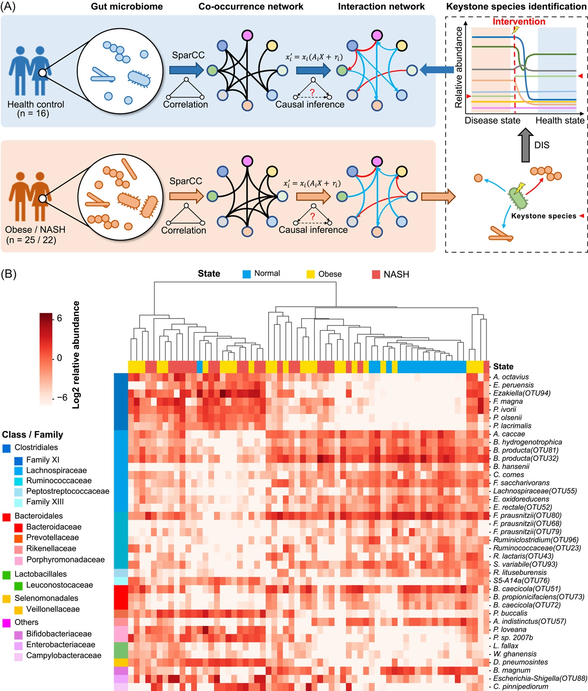
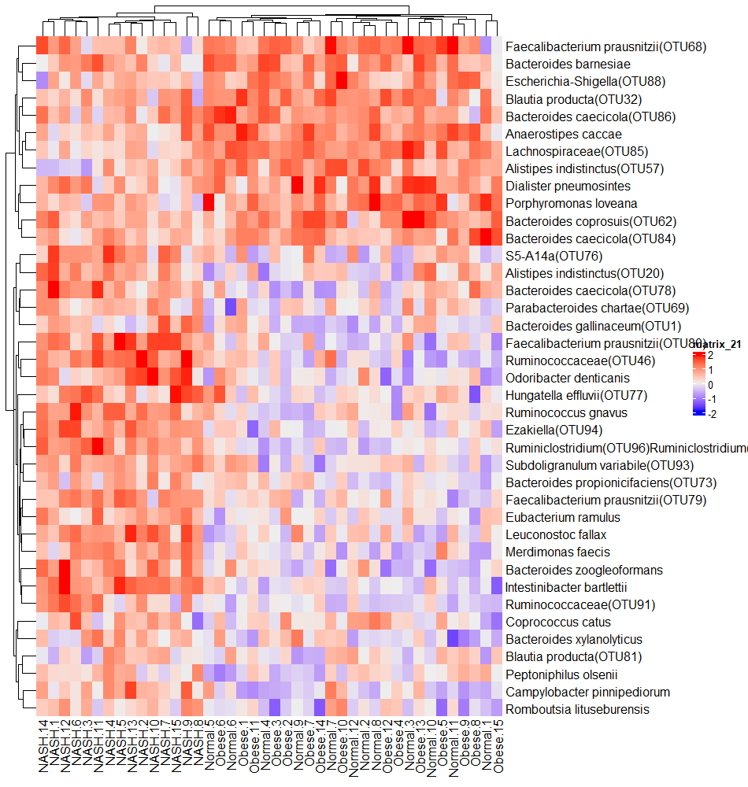
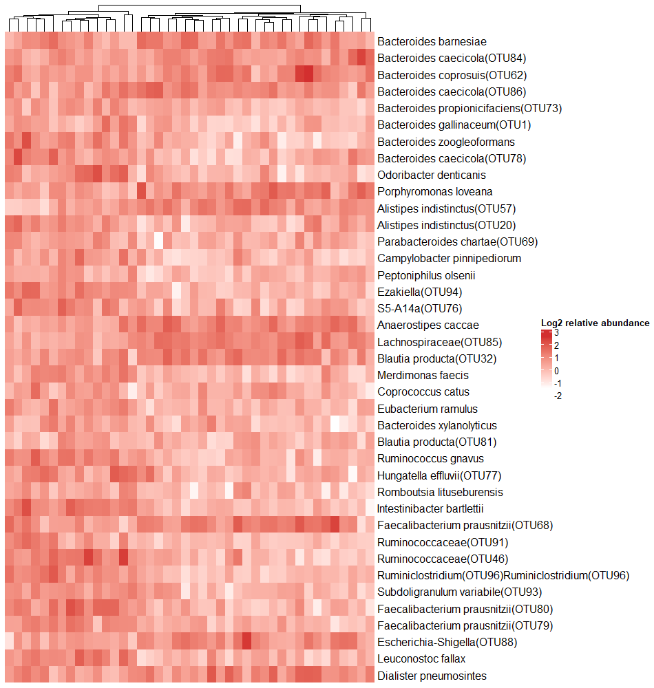
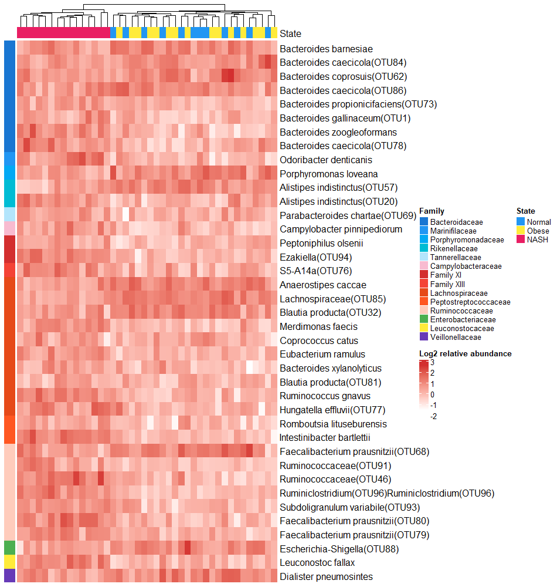
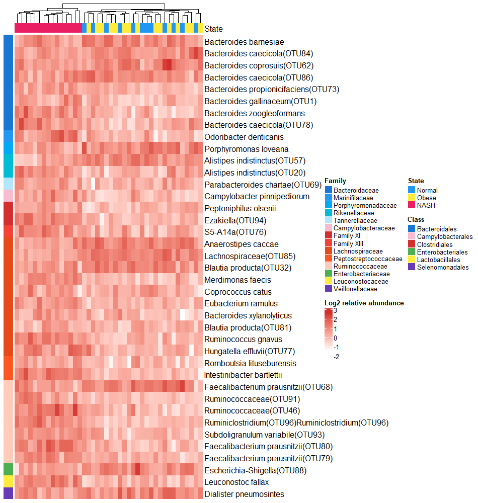

```{r setup, include=FALSE}
knitr::opts_chunk$set(
  collapse = T, echo=T, comment="#>", message=F, warning=F,
	fig.align="center", fig.width=5, fig.height=3, dpi=150)
```
本教程相关代码已经上传至 https://github.com/iMetaScience/iMetaPlot/tree/main/221125HeatmapOfAbundance
如果你使用本代码，请引用：
Dingfeng Wu. 2022. Targeting keystone species helps restore the dysbiosis of butyrate-producing bacteria in nonalcoholic fatty liver disease. iMeta 1: e61. https://onlinelibrary.wiley.com/doi/full/10.1002/imt2.61
Zuguang Gu. 2022. Complex heatmap visualization. iMeta 1: e43. https://doi.org/10.1002/imt2.43
**代码编写及注释：农心生信工作室**<br />

**热图 (Heat map)** 可以在微生物组研究中展示不同处理中物种的相对丰度。本期我们挑选2022年11月16日刊登在**iMeta**上的[Targeting keystone species helps restore the dysbiosis of butyrate-producing bacteria in nonalcoholic fatty liver disease](https://onlinelibrary.wiley.com/doi/full/10.1002/imt2.61)- [iMeta｜同济大学朱瑞新团队靶向基石菌种可恢复非酒精性脂肪肝中失调的产丁酸菌](https://mp.weixin.qq.com/s/3rhAQbwFPhdaKEBV0O6yCw)，选择文章的Figure 1B进行复现，基于顾祖光博士开发的**ComplexHeatmap**包，讲解和探讨复杂热图的绘制方法，先上原图：<br />



接下来，我们将通过详尽的代码逐步拆解原图，最终实现对原图的复现。

### R包检测和安装
1. 安装核心R包ComplexHeatmap以及一些功能辅助性R包，并载入所有R包。
```{r}
if (!require("BiocManager"))
  install.packages('BiocManager') 
if (!require("ComplexHeatmap"))
  BiocManager::install('ComplexHeatmap') 
# 加载包
library(ComplexHeatmap)
```

### 生成测试数据
2. 基于补充文件里的一些相关数据，在这里我们通过生成随机数据来替代。最终生成一个相对丰度矩阵及class-family-species对应表，一个分组数据表。相关示例数据可以在GitHub上下载。
```{r}
#读取相对丰度矩阵及class-family-species对应表
df<-read.csv("test.csv",header = T)
#读取分组数据表
group_df<-read.csv("group.csv",header = F)

#按Class和Family列对df的所有行进行排序
df<-df[order(df$Class,df$Family),]
#获得相对丰度矩阵
mat<-df[-c(1,2,3)]
mat<-as.matrix(mat) #将数据框转化为矩阵
row.names(mat)<-df[,3]
#获得class-family-species对应表
df_annotation<-df[c(1,2,3)]
```
### 环形热图预览
3. 开始作图，首先画一个最基本的热图：
```{r}
ht<-Heatmap(mat)
```


4. 调整参数美化热图：
```{r}
ht<-Heatmap(mat,
        cluster_rows = F,  #不按行聚类
        show_column_names = F, #不展示列名
        heatmap_legend_param = list(title = "Log2 relative abundance"), #设置热图图例名称
        col = c("#FFFFFF","#D32F2F")) #设置热图颜色

```


5. 添加行分组注释和列分组注释
```{r}
#生成列分组注释
top_col<-c("Normal"="#2196F3","Obese"="#FFEB3B","NASH"="#E91E63")
top_anno<-HeatmapAnnotation(State = group_df[,2], 
                            col = list(State =top_col), #设置颜色
                            annotation_legend_param = list(State = list(at=c("Normal","Obese","NASH")))) #设置图例顺序


#生成行分组注释
left_col<-c("Bacteroidaceae"="#1976D2","Marinifilaceae"="#2196F3","Porphyromonadaceae"="#03A9F4","Rikenellaceae"="#00BCD4","Tannerellaceae"="#B3E5FC",
            "Campylobacteraceae"="#F8BBD0",
            "Family XI"="#D32F2F","Family XIII"="#F44336","Lachnospiraceae"="#E64A19","Peptostreptococcaceae"="#FF5722","Ruminococcaceae"="#FFCCBC",
            "Enterobacteriaceae"="#4CAF50",
            "Leuconostocaceae"="#FFEB3B",
            "Veillonellaceae"="#673AB7") #生成行分组颜色的具名向量

left_anno<-rowAnnotation(Family = df_annotation[,2],
                         show_annotation_name = F, #不展示行分组注释名
                         col = list(Family =left_col),
                         annotation_legend_param = list(Family = list(at=c("Bacteroidaceae","Marinifilaceae","Porphyromonadaceae","Rikenellaceae","Tannerellaceae",
                                                                          "Campylobacteraceae",
                                                                          "Family XI","Family XIII","Lachnospiraceae","Peptostreptococcaceae","Ruminococcaceae",
                                                                          "Enterobacteriaceae",
                                                                          "Leuconostocaceae",
                                                                          "Veillonellaceae"))))


ht<-Heatmap(mat,
        cluster_rows = F,  #不按行聚类
        show_column_names = F, #不展示列名
        heatmap_legend_param = list(title = "Log2 relative abundance"), #设置热图图例名称
        col = c("#FFFFFF","#D32F2F"), #设置热图颜色
        top_annotation = top_anno, #添加列注释
        left_annotation = left_anno) #添加行注释
```


6. 给Class单独添加图例：
```{r}
class<-unique(df_annotation$Class)
#绘制class单独的图例
lgd<-Legend(labels = class, title = "Class",
            legend_gp = gpar(fill = c("#1976D2","#F8BBD0","#D32F2F","#4CAF50","#FFEB3B","#673AB7")))
#将单独图例与其他部分合并
pdf("plot.pdf",width = 11, height = 10)
draw(ht, ht_gap = unit(7, "mm"),annotation_legend_list = lgd)
dev.off()
```


### 附.完整代码
```{r}
if (!require("ComplexHeatmap"))
  install.packages('ComplexHeatmap') 
# 加载包
library(ComplexHeatmap)

#读取相对丰度矩阵及class-family-species对应表
df<-read.csv("test.csv",header = T)
#读取分组数据表
group_df<-read.csv("group.csv",header = F)

#按Class和Family列对df的所有行进行排序
df<-df[order(df$Class,df$Family),]
#获得相对丰度矩阵
mat<-df[-c(1,2,3)]
mat<-as.matrix(mat) #将数据框转化为矩阵
row.names(mat)<-df[,3]
#获得class-family-species对应表
df_annotation<-df[c(1,2,3)]

#生成列分组注释
top_col<-c("Normal"="#2196F3","Obese"="#FFEB3B","NASH"="#E91E63")
top_anno<-HeatmapAnnotation(State = group_df[,2], 
                            col = list(State =top_col), #设置颜色
                            annotation_legend_param = list(State = list(at=c("Normal","Obese","NASH")))) #设置图例顺序


#生成行分组注释
left_col<-c("Bacteroidaceae"="#1976D2","Marinifilaceae"="#2196F3","Porphyromonadaceae"="#03A9F4","Rikenellaceae"="#00BCD4","Tannerellaceae"="#B3E5FC",
            "Campylobacteraceae"="#F8BBD0",
            "Family XI"="#D32F2F","Family XIII"="#F44336","Lachnospiraceae"="#E64A19","Peptostreptococcaceae"="#FF5722","Ruminococcaceae"="#FFCCBC",
            "Enterobacteriaceae"="#4CAF50",
            "Leuconostocaceae"="#FFEB3B",
            "Veillonellaceae"="#673AB7") #生成行分组颜色的具名向量

left_anno<-rowAnnotation(Family = df_annotation[,2],
                         show_annotation_name = F, #不展示行分组注释名
                         col = list(Family =left_col),
                         annotation_legend_param = list(Family = list(at=c("Bacteroidaceae","Marinifilaceae","Porphyromonadaceae","Rikenellaceae","Tannerellaceae",
                                                                          "Campylobacteraceae",
                                                                          "Family XI","Family XIII","Lachnospiraceae","Peptostreptococcaceae","Ruminococcaceae",
                                                                          "Enterobacteriaceae",
                                                                          "Leuconostocaceae",
                                                                          "Veillonellaceae"))))


ht<-Heatmap(mat,
        cluster_rows = F,  #不按行聚类
        show_column_names = F, #不展示列名
        heatmap_legend_param = list(title = "Log2 relative abundance"), #设置热图图例名称
        col = c("#FFFFFF","#D32F2F"), #设置热图颜色
        top_annotation = top_anno, #添加列注释
        left_annotation = left_anno) #添加行注释

class<-unique(df_annotation$Class)
#绘制class单独的图例
lgd<-Legend(labels = class, title = "Class",
            legend_gp = gpar(fill = c("#1976D2","#F8BBD0","#D32F2F","#4CAF50","#FFEB3B","#673AB7")))
#将单独图例与其他部分合并
pdf("Figure 1B.pdf",width = 11, height = 10)
draw(ht, ht_gap = unit(7, "mm"),annotation_legend_list = lgd)
dev.off()
```