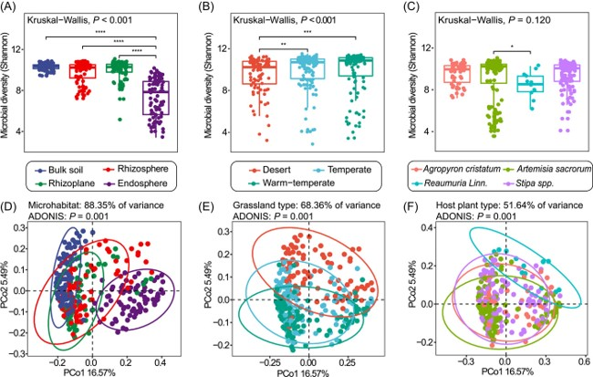

```{r setup, include=FALSE}
knitr::opts_chunk$set(
  collapse = T, echo=T, comment="#>", message=F, warning=F,
	fig.align="center", fig.width=5, fig.height=3, dpi=150)
```

本教程相关代码已经上传至 https://github.com/iMetaScience/iMetaPlot/tree/main/221129PCoA
如果你使用本代码，请引用：
Yangquanwei Zhong. 2022. Differential microbial assembly processes and co-occurrence networks in the soil-root continuum along an environmental gradient. iMeta 1: e18. https://onlinelibrary.wiley.com/doi/full/10.1002/imt2.18

**代码编写及注释：农心生信工作室**<br />

**主坐标分析图 (PCoA Plot)** 主要是将多变量的数据进行降维，方便在二维平面进行展示，使我们能够直观的观察到样本之间可能存在的某种关系。本期我们挑选2022年4月5日刊登在**iMeta**上的[Differential microbial assembly processes and co-occurrence networks in the soil-root continuum along an environmental gradient)](https://onlinelibrary.wiley.com/doi/10.1002/imt2.18)，选择文章的Figure 2D-F进行复现，先上原图：<br />

该图是PCoA分析的二维展示，并添加了分组

### R包检测和安装
1. 安装核心R包ggplot2以及一些功能辅助性R包，并载入所有R包
```{r}
if (!require("ggplot2"))
  install.packages('ggplot2') 
if (!require("vegan"))
  install.packages('vegan') 
if (!require("ape"))
  install.packages('ape')
if (!require("BiocManager"))
  install.packages('BiocManager')
if (!require("phyloseq"))
  BiocManager::install('phyloseq')
# 加载包
library(ggplot2)
library(vegan)
library(ape)
library(phyloseq)
```
### 读取或生成数据
2. 生成otu表和各otu进化树示例数据
```{r}
set.seed(42) # 固定随机种子

#随机生成1000个otu之间的进化树
tree <- rtree(1000, rooted = T, tip.label = paste("s",1:1000, sep=""))
#随机生成OTU表 10个样品各1000个otu
otu <- matrix(sample(0:10, 10000, replace = T), nrow = 10)
# 可选：从文件中读取
# write.table(otu, file="otu.txt", sep="\t", quote = F, row.names = T, col.names = T)
# otu <- read.table("otu.txt")

#给每个otu命名，和进化树节点名称保持一致
colnames(otu) <- tree$tip.label
```
3. 用phyloseq计算非加权的uniFrac距离
```{r}
df <- phyloseq(otu_table(otu, taxa_are_rows = F), phy_tree(tree)) # 生成phyloseq对象
#计算非加权的uniFrac距离矩阵，衡量10个样品之间的群落谱系差异
dist.mat <- phyloseq::UniFrac(df, weighted=F)
```
4. 计算PCoA
```{r}
# 用非加权的uniFrac距离矩阵做pcoa分析
df.pcoa <- pcoa(dist.mat)

# 提取pcoa结果表格，用于绘图
df.plot<-data.frame(df.pcoa$vectors)

#获得坐标轴上显示的百分比
x_label<-round(df.pcoa$values$Rel_corr_eig[1]*100, 2)
y_label<-round(df.pcoa$values$Rel_corr_eig[2]*100, 2)
#对数据进行人为分组
df.plot$group <- ifelse(df.plot$Axis.1<0,"Agropyron cristatum","Reaumuria Linn.")
```

### PCoA图预览
5. 先用**_ggplot2_**包画出10个样品点：
```{r}
#用ggplot2画图，然后添加一个表示分组的椭圆
ggplot(data=df.plot,aes(x=Axis.1,y=Axis.2,color=group,shape=group))+
  geom_point(size=5)+
  theme_bw()+theme(panel.grid = element_blank())+
  geom_vline(xintercept = 0,lty="dashed")+
  geom_hline(yintercept = 0,lty="dashed")
```
6. 添加分组椭圆和坐标轴标签
```{r}
#用ggplot2画图，然后添加一个表示分组的椭圆
ggplot(data=df.plot,aes(x=Axis.1,y=Axis.2,color=group,shape=group))+
  geom_point(size=5)+
  theme_bw()+theme(panel.grid = element_blank())+
  geom_vline(xintercept = 0,lty="dashed")+
  geom_hline(yintercept = 0,lty="dashed")+
  stat_ellipse(data=df.plot,alpha=0.3)+
  labs(x=paste0("PCoA1",x_label,"%"),y=paste0("PCoA2",y_label,"%"))
```

### 附.完整代码
```{r}
# 加载包
library(phyloseq)
library(vegan)
library(ape)
library(ggplot2)

set.seed(42) # 固定随机种子
#随机生成1000个otu之间的进化树
tree <- rtree(1000, rooted = T, tip.label = paste("s",1:1000, sep=""))
#随机生成OTU表 10个样品各1000个otu
otu <- matrix(sample(0:10, 10000, replace = T), nrow = 10)

#给每个otu命名，和进化树节点名称保持一致
colnames(otu) <- tree$tip.label
df <- phyloseq(otu_table(otu, taxa_are_rows = F), phy_tree(tree)) # 生成phyloseq对象
#计算非加权的uniFrac距离矩阵，衡量10个样品之间的群落谱系差异
dist.mat <- phyloseq::UniFrac(df, weighted=F)
# 用非加权的uniFrac距离矩阵做pcoa分析
df.pcoa <- pcoa(dist.mat)

# 提取pcoa结果表格，用于绘图
df.plot<-data.frame(df.pcoa$vectors)

#获得坐标轴上显示的百分比
x_label<-round(df.pcoa$values$Rel_corr_eig[1]*100, 2)
y_label<-round(df.pcoa$values$Rel_corr_eig[2]*100, 2)
#对数据进行人为分组
df.plot$group <- ifelse(df.plot$Axis.1<0,"Agropyron cristatum","Reaumuria Linn.")

#用ggplot2画图，然后添加一个表示分组的椭圆
p <- ggplot(data=df.plot,aes(x=Axis.1,y=Axis.2,color=group,shape=group))+geom_point(size=5)+theme_bw()+theme(panel.grid = element_blank())+geom_vline(xintercept = 0,lty="dashed")+geom_hline(yintercept = 0,lty="dashed")+labs(x=paste0("PCoA1",x_label,"%"),y=paste0("PCoA2",y_label,"%"))+stat_ellipse(data=df.plot,alpha=0.3)
ggsave('pcoa_plot.png', p)
```