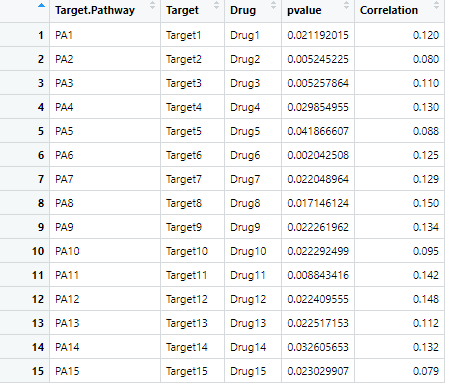

```{r setup, include=FALSE}
knitr::opts_chunk$set(
  collapse = T, echo=T, comment="#>", message=F, warning=F,
	fig.align="center", fig.width=5, fig.height=3, dpi=150)
```
如果你使用本代码，请引用：
Changwu Wu. 2022. Pan-cancer analyses reveal molecular and clinical characteristics of cuproptosis regulators. iMeta 1: e68. https://onlinelibrary.wiley.com/doi/full/10.1002/imt2.68
**代码编写及注释：农心生信工作室**<br />

**气泡图 (bubble map)** 具有多种衍生的形式，在气泡图中加入线段可以展现一些变量之间的相关性。本期我们挑选2022年12月5日刊登在**iMeta**上的[Pan-cancer analyses reveal molecular and clinical characteristics of cuproptosis regulators](https://onlinelibrary.wiley.com/doi/full/10.1002/imt2.68)- [iMeta｜湘雅医院刘庆组-泛癌分析揭示铜死亡调节子的临床和分子特征](https://mp.weixin.qq.com/s/hCf-aMijEvqQKVt1YQnbPw)，选择文章的Figure 9A进行复现，基于**ggplot2**包，讲解和探讨棒棒糖图的绘制方法，先上原图：<br />


接下来，我们将通过详尽的代码逐步拆解原图，最终实现对原图的复现。

### R包检测和安装
1. 安装核心R包ggplot2以及一些功能辅助性R包，并载入所有R包。
```{r}
if (!require("ggplot2"))
  install.packages('ggplot2') 
if (!require("cowplot"))
  install.packages('cowplot') 
# 加载包
library(ggplot2)
library(cowplot)
```

### 生成测试数据
2. 原图表示铜死亡活性与药物敏感性（IC50值）之间的相关性。每一行代表一种药物和药物靶标。线的长度代表相关系数。点的大小代表统计学意义，点越大，统计学显著性越高。我们根据原图特征生成测试数据test.CSV。相关示例数据可以在GitHub上下载: https://github.com/iMetaScience/iMetaPlot/221220Lollipops
```{r}
#读取test.CSV对应表
df<-read.csv("test.CSV",header = T)
#固定列的顺序
df$Drug<-factor(df$Drug,levels = df$Drug)
df$Target<-factor(df$Target,levels = df$Target)
df$Target.Pathway<-factor(df$Target.Pathway,levels = df$Target.Pathway)
```


### 作图预览
3. 开始作图，首先根据Grug一列做y轴，画一个最基本的气泡图：
```{r}
p1<-ggplot(df,aes(Correlation,Drug))+
  geom_point(aes(size=pvalue),color="skyblue")
```


4. 添加线段，这里使用的关键函数是geom_segment，它可以通过映射x坐标和y坐标的起点终点，最终得到有方向由长度的向量。本例中所有线段都是垂直与x轴，长度代表相关性，因此需要先根据相关性生成一个包括x和y终点和起点的数据框：
```{r}
#生成线段数据框
segment_df<-data.frame(x=0,y=seq(1:15),xend=df$Correlation,yend=seq(1:15))
p1<-ggplot(df,aes(Correlation,Drug))+
  geom_point(aes(size=pvalue),color="skyblue")+
  geom_segment(segment_df,mapping=aes(x = x, y = y, xend = xend, yend = yend),size=0.8,color="skyblue")

```


5. 调整参数美化图片：
```{r}
p1<-ggplot(df,aes(Correlation,Drug))+
  geom_point(aes(size=pvalue),color="skyblue")+
  geom_segment(segment_df,mapping=aes(x = x, y = y, xend = xend, yend = yend),size=0.8,color="skyblue")+
  scale_x_continuous(limits=c(0,0.152), #设置x轴范围
                     expand = expansion(mult = 0))+ #expansion函数的参数mult: 百分比间距，可以接受一个向量
  theme(panel.background = element_blank(), #删除背景
        panel.grid = element_line (colour="lightgrey"), #设置网格颜色
        panel.border = element_rect(fill = NA,colour = "black",size=0.8))+ #设置边框
  ylab("") #删除y轴名

```


6. 我们注意到原图左侧还有两列代表Target.Pathway和Target。我们通过ggplot2绘制两幅只显示列名的图片，最后通过cowplot包将所有图片组合。
```{r}
#Target
p2<-ggplot(df,aes("",Target))+
  theme(panel.background = element_blank(),#去除背景
        panel.border = element_blank(), #去除边框
        axis.ticks.y = element_blank(), #去除y轴刻度
        axis.ticks.x = element_blank())+ #去除x轴刻度
  xlab("")+ #去除x轴标题
  ylab("")+ #去除y轴标题
  coord_fixed(ratio=10) #将y轴和x轴标度比例设置为10:1
#Target.Pathway，同上
p3<-ggplot(df,aes("",Target.Pathway))+
  theme(panel.background = element_blank(),#去除背景
        panel.border = element_blank(),
        axis.ticks.y = element_blank(),
        axis.ticks.x = element_blank())+
  xlab("")+
  ylab("")+
  coord_fixed(ratio=10)

p<-plot_grid(p3,p2,p1,
             ncol = 3, #三张图片分三列合并
             rel_widths=c(1,1,2), #三列所占比例为1:1:2
             labels = c("Target.Pathway","Target","Drug"), #每一幅子图片标题名
             label_size=8) #标题大小
```


### 附.完整代码
```{r}
if (!require("ggplot2"))
  install.packages('ggplot2') 
if (!require("cowplot"))
  install.packages('cowplot') 
# 加载包
library(ggplot2)
library(cowplot)

#读取test.CSV对应表
df<-read.csv("test.CSV",header = T)
#固定列的顺序
df$Drug<-factor(df$Drug,levels = df$Drug)
df$Target<-factor(df$Target,levels = df$Target)
df$Target.Pathway<-factor(df$Target.Pathway,levels = df$Target.Pathway)

#生成线段数据框
segment_df<-data.frame(x=0,y=seq(1:15),xend=df$Correlation,yend=seq(1:15))

p1<-ggplot(df,aes(Correlation,Drug))+
  geom_point(aes(size=pvalue),color="skyblue")+
  geom_segment(segment_df,mapping=aes(x = x, y = y, xend = xend, yend = yend),size=0.8,color="skyblue")+
  scale_x_continuous(limits=c(0,0.152), #设置x轴范围
                     expand = expansion(mult = 0))+ #expansion函数的参数mult: 百分比间距，可以接受一个向量
  theme(panel.background = element_blank(), #删除背景
        panel.grid = element_line (colour="lightgrey"), #设置网格颜色
        panel.border = element_rect(fill = NA,colour = "black",size=0.8))+ #设置边框
  ylab("") #删除y轴名

#Target
p2<-ggplot(df,aes("",Target))+
  theme(panel.background = element_blank(),#去除背景
        panel.border = element_blank(), #去除边框
        axis.ticks.y = element_blank(), #去除y轴刻度
        axis.ticks.x = element_blank())+ #去除x轴刻度
  xlab("")+ #去除x轴标题
  ylab("")+ #去除y轴标题
  coord_fixed(ratio=10) #将y轴和x轴标度比例设置为10:1
#Target.Pathway，同上
p3<-ggplot(df,aes("",Target.Pathway))+
  theme(panel.background = element_blank(),#去除背景
        panel.border = element_blank(),
        axis.ticks.y = element_blank(),
        axis.ticks.x = element_blank())+
  xlab("")+
  ylab("")+
  coord_fixed(ratio=10)

pdf("Figure 9A.pdf",width = 11, height = 5.7)
plot_grid(p3,p2,p1,
             ncol = 3, #三张图片分三列合并
             rel_widths=c(1,1,2), #三列所占比例为1:1:2
             labels = c("Target.Pathway","Target","Drug"), #每一幅子图片标题名
             label_size=8) #标题大小
dev.off()
```