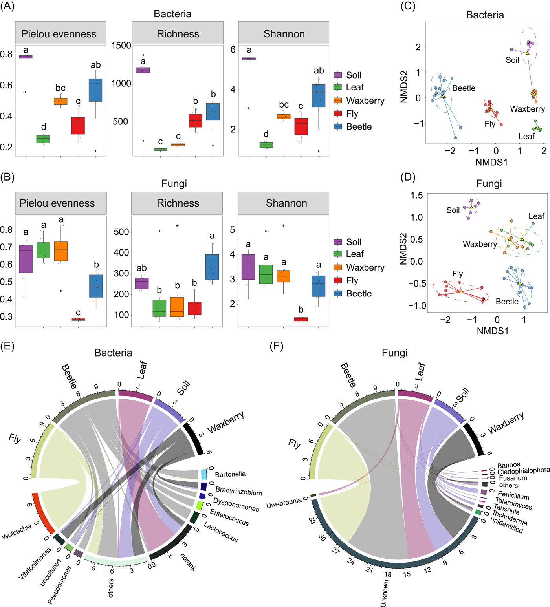
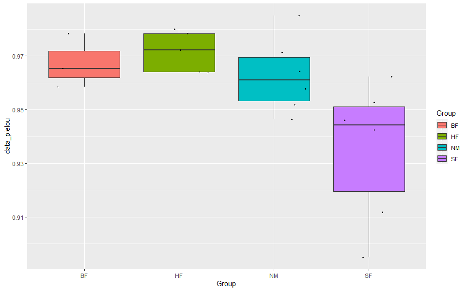
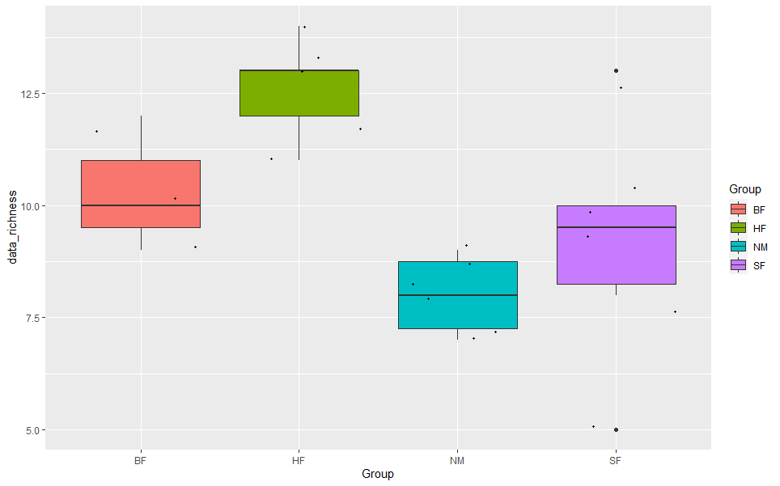
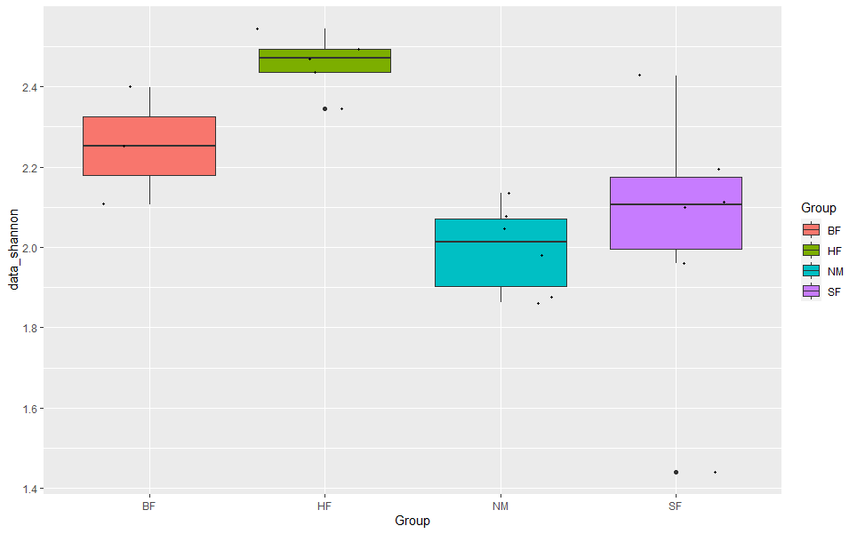
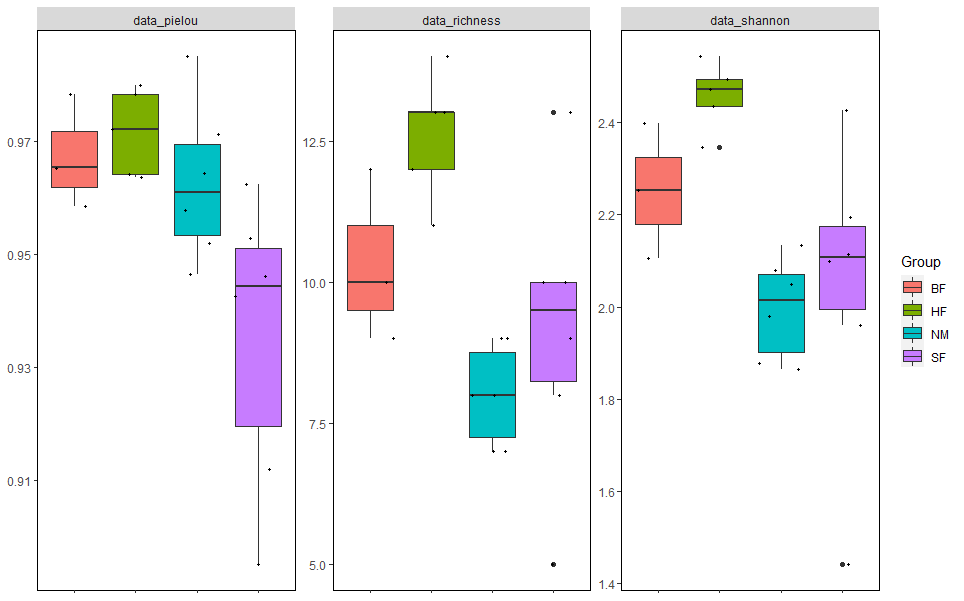
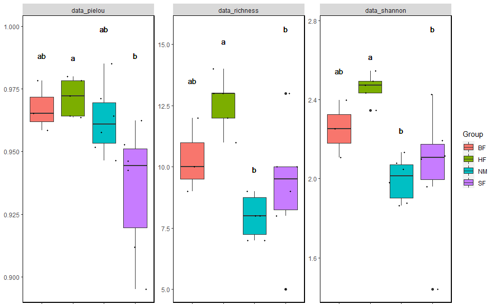

```{r setup, include=FALSE}
knitr::opts_chunk$set(
  collapse = T, echo=T, comment="#>", message=F, warning=F,
	fig.align="center", fig.width=5, fig.height=3, dpi=150)
```
本教程相关代码已经上传至 https://github.com/iMetaScience/iMetaPlot/tree/main/230107FacetsBoxplot
如果你使用本代码，请引用：Yu-Xi Zhu. 2022. Gut microbiota composition in the sympatric and diet-sharing Drosophila simulans and Dicranocephalus wallichii bowringi shaped largely by community assembly processes rather than regional species pool. iMeta 1: e57.  https://onlinelibrary.wiley.com/doi/full/10.1002/imt2.57
**代码编写及注释：农心生信工作室**<br />

**箱线图 (boxplot)**是一种基于五位数摘要（“最小”，第一四分位数（Q1），中位数，第三四分位数（Q3）和“最大”）显示数据分布的标准化方法， 可以表示微生物群落的alpha多样性。本期我们挑选2022年10月13日刊登在**iMeta**上的[Gut microbiota composition in the sympatric and diet-sharing Drosophila simulans and Dicranocephalus wallichii bowringi shaped largely by community assembly processes rather than regional species pool](https://onlinelibrary.wiley.com/doi/full/10.1002/imt2.57)- [iMeta | 扬州大学杜予州团队揭示同域内同食物的两种昆虫肠道微生物群落装配机制](https://view.officeapps.live.com/op/view.aspx?src=http%3A%2F%2Fwww.imeta.science%2FiMeta%2FPapers%2F9Chinese%2Fimt2.57.docx&wdOrigin=BROWSELINK)，选择文章的Figure 1A进行复现，基于**vegan**包和**ggplot2**包，讲解和探讨alpha多样性的计算、箱线图的可视化以及用ANOVA进行差异分析并用字母标注显著性，先上原图：<br />


接下来，我们将通过详尽的代码逐步拆解原图，最终实现对原图的复现。

### R包检测和安装
1. 安装核心R包vegan、ggplot2以及一些功能辅助性R包，并载入所有R包。
```{r}
# 下载包
if (!require("vegan"))
  install.packages('vegan') 
if (!require("ggplot2"))
  install.packages('ggplot2')
if (!require("tidyverse"))
  install.packages('tidyverse')
if (!require("agricolae"))
  install.packages('agricolae')
# 加载包
library(vegan)
library(ggplot2)
library(tidyverse)
library(agricolae)
```
### 生成测试数据
2. 由于缺少原始数据，因此本例使用vegan包自带的dune数据集进行测试。dune数据集的格式是otu表转置后的格式，包含了20个样品，每个样品有30个物种丰度，每一行是一个样品，每一列是一个物种。
```{r}
# 载入dune数据集
data(dune)
#载入dune包含分组信息等的元数据（即metadata），分组信息为Management列
data(dune.env)
```

3. 计算alpha多样性，包括均匀度、丰富度和香农指数。
```{r}
#计算丰富度richness，即群落中丰度大于0的otu数量之和
richness <- rowSums(dune>0)
#计算香农指数Shannon diversity index，以e作为底数
shannon<-diversity(dune,index='shannon',base = exp(1))
#计算均匀度Pielou evenness，即香农指数与ln(Richness)的比值
pielo<-shannon/log(richness,base = exp(1))
```
4. 创建函数一步计算alpha多样性。
```{r}
calculate_alpha<-function(otu){
  data_richness <- rowSums(otu>0)
  data_shannon<-diversity(otu,index='shannon',base = exp(1))
  data_pielou<-data_shannon/log(data_richness,base = exp(1))
  alpha_matrix<-cbind(data_pielou,data_richness,data_shannon)
  alpha_df<-as.data.frame(alpha_matrix)
  return(alpha_df)
}
```
5. 利用函数calculate_alpha()，创建绘图所需数据框并重命名其中的列：
```{r}
plot_df<-calculate_alpha(dune)%>%
  cbind(dune.env$Management)%>%
  rename_with(~"Group",4)
```

6. 接下来，逐一预览不同alpha多样性的箱线图：
```{r}
#绘制Pielou evenness的箱线图
p_pielou<-ggplot(plot_df,aes(Group,data_pielou))+
  geom_boxplot(aes(fill=Group))+ 
  geom_jitter(aes(Group,data_pielou),size=0.8) #添加散点
```

```{r}
#绘制Shannon的箱线图
p_richness<-ggplot(plot_df,aes(Group,data_richness))+
  geom_boxplot(aes(fill=Group))+
  geom_jitter(aes(Group,data_richness),size=0.8)
```

```{r}
#绘制Richness的箱线图
p_shannon<-ggplot(plot_df,aes(Group,data_shannon))+
  geom_boxplot(aes(fill=Group))+
  geom_jitter(aes(Group,data_shannon),size=0.8)
```


7. 现在，需要绘制分面箱线图，以在同一张图片中表示三种不同的alpha多样性，为此，我们需要将plot_df的**宽表**转化为**长表**：
```{r}
#宽表转化为长表
df_long<-pivot_longer(plot_df,cols = -Group,names_to = "type",values_to = "alpha_index")
#根据不同的alpha多样性绘制分面箱线图
p<-ggplot(df_long,aes(Group,alpha_index))+
  geom_boxplot(aes(fill=Group))+
  geom_jitter(aes(Group,alpha_index),size=0.8)+
  facet_wrap(.~type, #type列作为变量，分面为一行多列
             scales = "free_y")+  #scales="free_y"可以使各个分面有自己的y轴刻度
  theme(panel.grid=element_blank(),
        panel.background = element_rect(fill = 'white'),
        panel.border = element_rect(fill=NA,color="black", size=0.5, linetype="solid"),
        axis.title = element_blank(),
        axis.text.x = element_blank())
```


8. 到这一步，基本的分面箱线图已经完成，但我们注意到原图做了差异分析，并用字母标记了差异分析结果。这里我们以参数检验中的one-way ANOVA为例进行差异分析（默认总体符合正态分布和方差齐性，所以在这里没有做正态检验和方差齐性检验）：
```{r}
#先选择Shannon进行one-way ANOVA分析
shannon_anova<-aov(data_shannon~Group,data=plot_df)
#查看ANOVA结果，其中Pr(>F)是p值，p<0.05时，认为不同组的Shannon具有显著差异
summary(shannon_anova)
#进一步得到更详细的两两比较，用TukeyHSD()函数
pair_comparison<-TukeyHSD(shannon_anova)
pair_comparison<-as.data.frame(pair_comparison$Group)
pair_comparison
```

9. 如何用abc字母标注差异分析的结果，是本文的难点。为此，我们利用**agricolae**包的**orderPvalue()*函数来得到显著性标记。这个函数需要四个参数，因此要对数据提前处理：
```{r}
#计算分组平均数
group_mean<-aggregate(x=plot_df$data_shannon,by=list(plot_df$Group),FUN = mean)%>%
  rename_with(~c("Group","mean_val"),1:2)

#创建一个pvalue矩阵
ntr<-nrow(group_mean)
mat <- matrix(1, ncol = ntr, nrow = ntr)
p <- pair_comparison$`p adj`
k <- 0
for (i in 1:(ntr - 1)) {
  for (j in (i + 1):ntr) {
    k <- k + 1
    mat[i, j] <- p[k]
    mat[j, i] <- p[k]
  }
}

treatments <- as.vector(group_mean$Group)
means<-as.vector(group_mean$mean_val)
alpha <- 0.05
pvalue<-mat
out<-orderPvalue(treatments,means,alpha,pvalue,console=TRUE)
out
```

10. 将整个ANOVA分析和显著性标记过程打包成一个函数**anova_sig()**便于后续绘图，在这个函数里我们还添加了分组最大值和sd值的计算：
```{r}
anova_sig<-function(df,alpha_diversity,group){
  anova<-aov(alpha_diversity~group,data=plot_df)
  pair_comparison<-TukeyHSD(anova)
  pair_comparison_df<-pair_comparison$group
  pair_comparison_df<-as.data.frame(pair_comparison_df)
  group_mean<-aggregate(x=alpha_diversity,by=list(group),FUN = mean)%>%
    rename_with(~c("Group","mean_val"),1:2)
  group_max<-aggregate(x=alpha_diversity,by=list(group),FUN = max)%>%
    rename_with(~c("Group","max"),1:2)
  group_sd<-aggregate(x=alpha_diversity,by=list(group),FUN = sd)%>%
    rename_with(~c("Group","sd"),1:2)
  ntr<-nrow(group_mean)
  mat <- matrix(1, ncol = ntr, nrow = ntr)
  p <- pair_comparison_df$`p adj`
  k <- 0
  for (i in 1:(ntr - 1)) {
    for (j in (i + 1):ntr) {
      k <- k + 1
      mat[i, j] <- p[k]
      mat[j, i] <- p[k]
    }
  }
  treatments <- as.vector(group_mean$Group)
  means<-as.vector(group_mean$mean_val)
  alpha <- 0.05
  pvalue<-mat
  output<-orderPvalue(treatments,means,alpha,pvalue,console=TRUE)
  output$Group<-rownames(output)
  output<-left_join(output,group_max,by="Group")
  output<-left_join(output,group_sd,by="Group")
  return(output)
}

#丰富度的ANOVA检验及结果
data_richness<-plot_df$data_richness
Group=plot_df$Group
richness_out<-anova_sig(plot_df,data_richness,Group)
richness_out$type<-"data_richness" #添加一列alpha多样性类别

#均匀度的ANOVA检验及结果
data_pielou<-plot_df$data_pielou
Group=plot_df$Group
pielou_out<-anova_sig(plot_df,data_pielou,Group)
pielou_out$type<-"data_pielou"

#香农指数的的ANOVA检验及结果
data_shannon<-plot_df$data_shannon
Group=plot_df$Group
shannon_out<-anova_sig(plot_df,data_shannon,Group)
shannon_out$type<-"data_shannon"

#合并三者结果
alpha_out<-rbind(pielou_out,shannon_out,richness_out)%>%rename_with(~"marker",2)
#将长表与差异分析结果合并
df_long_all<-left_join(df_long,alpha_out,by=c("type","Group"))
```

11. 最后，用**geom_text()**来添加abc标记，成品图可以根据个人喜好用AI微调：
```{r}
p<-ggplot(df_long_all,aes(Group,alpha_index))+
  geom_boxplot(aes(fill=Group))+
  geom_jitter(aes(Group,alpha_index),size=0.8)+
  geom_text(aes(x=Group,y=max+sd,label=marker),size=4,position= position_dodge(0.6))+
  facet_wrap(.~type, #type列作为变量，分面为一行多列
             scales = "free_y")+  #scales="free_y"可以使各个分面有自己的y轴刻度
  theme(panel.grid=element_blank(),
        panel.background = element_rect(fill = 'white'),
        panel.border = element_rect(fill=NA,color="black", size=0.8, linetype="solid"),
        axis.title = element_blank(),
        axis.text.x = element_blank())
```



### 附.完整代码
```{r}
# 下载包
if (!require("vegan"))
  install.packages('vegan') 
if (!require("ggplot2"))
  install.packages('ggplot2')
if (!require("tidyverse"))
  install.packages('tidyverse')
if (!require("agricolae"))
  install.packages('agricolae')
# 加载包
library(vegan)
library(ggplot2)
library(tidyverse)
library(agricolae)

# 载入dune数据集
data(dune)
#载入dune包含分组信息等的元数据（即metadata），分组信息为Management列
data(dune.env)

#计算丰富度Richness，即群落中丰度大于0的otu数量之和
richness <- rowSums(dune>0)
#计算香农指数Shannon diversity index，以e作为底数
shannon<-diversity(dune,index='shannon',base = exp(1))
#计算均匀度Pielou evenness，即香农指数与ln(Richness)的比值
pielo<-shannon/log(richness,base = exp(1))

#创建函数一步计算alpha多样性
calculate_alpha<-function(otu){
  data_richness <- rowSums(otu>0)
  data_shannon<-diversity(otu,index='shannon',base = exp(1))
  data_pielou<-data_shannon/log(data_richness,base = exp(1))
  alpha_matrix<-cbind(data_pielou,data_richness,data_shannon)
  alpha_df<-as.data.frame(alpha_matrix)
  return(alpha_df)
}
plot_df<-calculate_alpha(dune)%>%
  cbind(dune.env$Management)%>%
  rename_with(~"Group",4)

#绘制Pielou evenness的箱线图
p_pielou<-ggplot(plot_df,aes(Group,data_pielou))+
  geom_boxplot(aes(fill=Group))+ 
  geom_jitter(aes(Group,data_pielou),size=0.8) #添加散点

#绘制Shannon的箱线图
p_richness<-ggplot(plot_df,aes(Group,data_richness))+
  geom_boxplot(aes(fill=Group))+
  geom_jitter(aes(Group,data_richness),size=0.8)

#绘制Richness的箱线图
p_shannon<-ggplot(plot_df,aes(Group,data_shannon))+
  geom_boxplot(aes(fill=Group))+
  geom_jitter(aes(Group,data_shannon),size=0.8)

#宽表转化为长表
df_long<-pivot_longer(plot_df,cols = -Group,names_to = "type",values_to = "alpha_index")
#根据不同的alpha多样性绘制分面箱线图
p<-ggplot(df_long,aes(Group,alpha_index))+
  geom_boxplot(aes(fill=Group))+
  geom_jitter(aes(Group,alpha_index),size=0.8)+
  facet_wrap(.~type, #type列作为变量，分面为一行多列
             scales = "free_y")+  #scales="free_y"可以使各个分面有自己的y轴刻度
  theme(panel.grid=element_blank(),
        panel.background = element_rect(fill = 'white'),
        panel.border = element_rect(fill=NA,color="black", size=0.5, linetype="solid"),
        axis.title = element_blank(),
        axis.text.x = element_blank())

#先选择Shannon进行one-way ANOVA分析
shannon_anova<-aov(data_shannon~Group,data=plot_df)
#查看ANOVA结果，其中Pr(>F)是p值，p<0.05时，认为不同组的Shannon具有显著差异
summary(shannon_anova)
#进一步得到更详细的两两比较，用TukeyHSD()函数
pair_comparison<-TukeyHSD(shannon_anova)
pair_comparison<-as.data.frame(pair_comparison$Group)

#计算分组平均数
group_mean<-aggregate(x=plot_df$data_shannon,by=list(plot_df$Group),FUN = mean)%>%
  rename_with(~c("Group","mean_val"),1:2)

#创建一个pvalue矩阵
ntr<-nrow(group_mean)
mat <- matrix(1, ncol = ntr, nrow = ntr)
p <- pair_comparison$`p adj`
k <- 0
for (i in 1:(ntr - 1)) {
  for (j in (i + 1):ntr) {
    k <- k + 1
    mat[i, j] <- p[k]
    mat[j, i] <- p[k]
  }
}

treatments <- as.vector(group_mean$Group)
means<-as.vector(group_mean$mean_val)
alpha <- 0.05
pvalue<-mat
out<-orderPvalue(treatments,means,alpha,pvalue,console=TRUE)

anova_sig<-function(df,alpha_diversity,group){
  anova<-aov(alpha_diversity~group,data=plot_df)
  pair_comparison<-TukeyHSD(anova)
  pair_comparison_df<-pair_comparison$group
  pair_comparison_df<-as.data.frame(pair_comparison_df)
  group_mean<-aggregate(x=alpha_diversity,by=list(group),FUN = mean)%>%
    rename_with(~c("Group","mean_val"),1:2)
  group_max<-aggregate(x=alpha_diversity,by=list(group),FUN = max)%>%
    rename_with(~c("Group","max"),1:2)
  group_sd<-aggregate(x=alpha_diversity,by=list(group),FUN = sd)%>%
    rename_with(~c("Group","sd"),1:2)
  ntr<-nrow(group_mean)
  mat <- matrix(1, ncol = ntr, nrow = ntr)
  p <- pair_comparison_df$`p adj`
  k <- 0
  for (i in 1:(ntr - 1)) {
    for (j in (i + 1):ntr) {
      k <- k + 1
      mat[i, j] <- p[k]
      mat[j, i] <- p[k]
    }
  }
  treatments <- as.vector(group_mean$Group)
  means<-as.vector(group_mean$mean_val)
  alpha <- 0.05
  pvalue<-mat
  output<-orderPvalue(treatments,means,alpha,pvalue,console=TRUE)
  output$Group<-rownames(output)
  output<-left_join(output,group_max,by="Group")
  output<-left_join(output,group_sd,by="Group")
  return(output)
}

#丰富度的ANOVA检验及结果
data_richness<-plot_df$data_richness
Group=plot_df$Group
richness_out<-anova_sig(plot_df,data_richness,Group)
richness_out$type<-"data_richness" #添加一列alpha多样性类别

#均匀度的ANOVA检验及结果
data_pielou<-plot_df$data_pielou
Group=plot_df$Group
pielou_out<-anova_sig(plot_df,data_pielou,Group)
pielou_out$type<-"data_pielou"

#香农指数的的ANOVA检验及结果
data_shannon<-plot_df$data_shannon
Group=plot_df$Group
shannon_out<-anova_sig(plot_df,data_shannon,Group)
shannon_out$type<-"data_shannon"

#合并三者结果
alpha_out<-rbind(pielou_out,shannon_out,richness_out)%>%rename_with(~"marker",2)
#将长表与差异分析结果合并
df_long_all<-left_join(df_long,alpha_out,by=c("type","Group"))

pdf("Figure 1A.pdf",width = 8, height = 6)
ggplot(df_long_all,aes(Group,alpha_index))+
  geom_boxplot(aes(fill=Group))+
  geom_jitter(aes(Group,alpha_index),size=0.8)+
  geom_text(aes(x=Group,y=max+sd,label=marker),size=4,position= position_dodge(0.6))+
  facet_wrap(.~type, #type列作为变量，分面为一行多列
             scales = "free_y")+  #scales="free_y"可以使各个分面有自己的y轴刻度
  theme(panel.grid=element_blank(),
        panel.background = element_rect(fill = 'white'),
        panel.border = element_rect(fill=NA,color="black", size=0.8, linetype="solid"),
        axis.title = element_blank(),
        axis.text.x = element_blank())
dev.off()
```