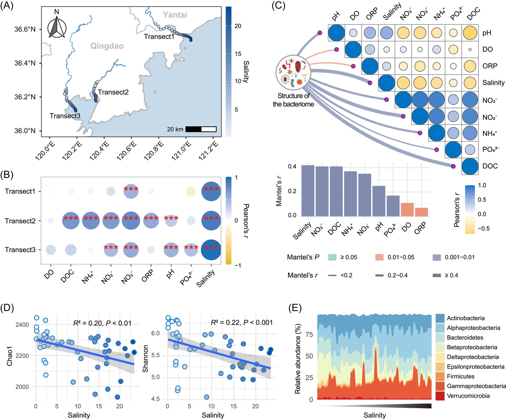
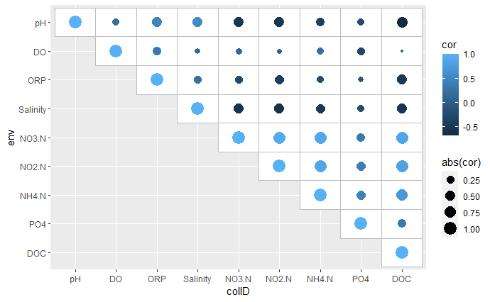
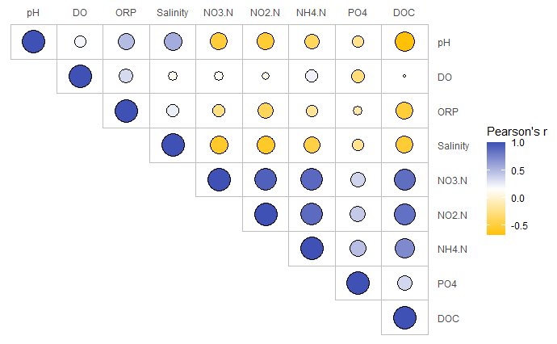
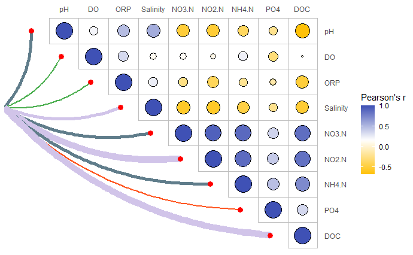
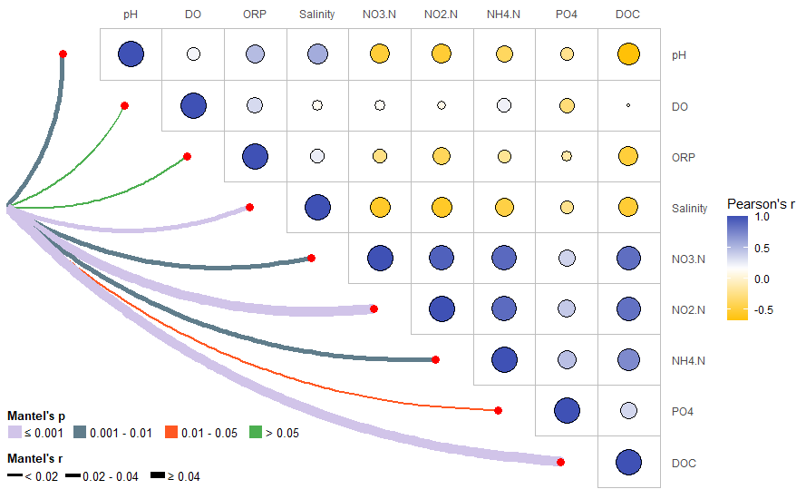

```{r setup, include=FALSE}
knitr::opts_chunk$set(
  collapse = T, echo=T, comment="#>", message=F, warning=F,
	fig.align="center", fig.width=5, fig.height=3, dpi=150)
```
本文代码已经上传至https://github.com/iMetaScience/iMetaPlot230118corr
如果你使用本代码，请引用：Changchao Li. 2023. Destabilized microbial networks with distinct performances of abundant and rare biospheres in maintaining networks under increasing salinity stress. iMeta 1: e79.  https://onlinelibrary.wiley.com/doi/10.1002/imt2.79

**代码编写及注释：农心生信工作室**<br />

**相关性热图 (Correlation Heatmap)** 的使用在微生物组研究中非常普遍，尤其是线面组合的相关性热图，其中的相关性热图通常表示环境因子间的Pearson相关系数，连线则表示物种组成与各环境因子的Mantel相关性。本期我们挑选2023年1月9日刊登在**iMeta**上的[Destabilized microbial networks with distinct performances of abundant and rare biospheres in maintaining networks under increasing salinity stress](https://onlinelibrary.wiley.com/doi/10.1002/imt2.79)，选择文章的Figure 1C进行复现，讲解和探讨如何基于ggplot2绘制线面组合的相关性热图，先上原图：<br />

接下来，我们将通过详尽的代码逐步拆解原图，最终实现对原图的复现。

### R包检测和安装
1. 安装核心R包ggplot2以及一些功能辅助性R包，并载入所有R包
```{r}
options(repos = list(CRAN="https://mirrors.tuna.tsinghua.edu.cn/CRAN/"))
if (!require("ggplot2"))
  install.packages('ggplot2') 
if (!require("vegan"))
  install.packages('vegan')
if (!require("tidyverse"))
  install.packages('tidyverse') 
if (!require("BiocManager"))
  install.packages('BiocManager') 
if (!require("ComplexHeatmap"))
  BiocManager::install('ComplexHeatmap')
# 检查开发者工具devtools，如没有则安装
if (!require("devtools"))
  install.packages("devtools")
# 加载开发者工具devtools
library(devtools)
# 检查linkET包，没有则通过github安装最新版
if (!require("linkET"))
  install_github("Hy4m/linkET", force = TRUE)
# 加载包
library(ggplot2)
library(vegan)
library(linkET)
library(tidyverse)
library(ComplexHeatmap)
```
### 读取数据及数据处理
2. 绘制线面组合相关性热图，需要环境因子数据和物种组成数据。示例数据可在GitHub上获取。
```{r}
#读取数据
#根据原文附表S1，获得样品的物理化学特性和地理分布情况，作为环境因子表
env<-read.csv("env.CSV",row.names = 1,header = T)
#生成一个物种组成的丰度表，行为样本，列为物种，行数必须与环境因子表的行数相同
spec<-read.csv("spec.CSV",row.names = 1,header = T)

```

3. 计算环境因子的pearson相关系数，并根据绘图需求对数据进行处理。
```{r}
corM <- cor(env,method = "pearson")#计算相关系数矩阵
#因为需要绘制的是上三角热图，需对矩阵进行处理，保留对角线及一半的数据即可
ncr<-nrow(corM)
for (i in 1:ncr){
  for (j in 1:ncr){
    if (j>i){
      corM[i,j]<-NA
    }
  }
}

corM<-as.data.frame(corM)%>%mutate(colID=rownames(corM))

#宽表转长表
corM_long<-pivot_longer(corM,cols=-"colID",names_to = "env",values_to="cor")%>%na.omit()

#根据原图，固定x轴和y轴的顺序
corM_long$colID<-factor(corM_long$colID,levels = rownames(corM))
corM_long$env<-factor(corM_long$env,levels = rev(rownames(corM)))
```

### 绘图预览
4. 使用**_ggplot2_**包绘制一个简单的上三角相关性热图：
```{r}
p<-ggplot(corM_long)+
  geom_tile(aes(colID,env),fill="white",color="grey")+ #添加方框
  geom_point(aes(colID,env,size=abs(cor),color=cor)) #添加散点
```


5. 对相关性热图进行美化：
```{r}
col_fun<-colorRampPalette(c("#FFC107","white","#3F51B5"))(50) #设置渐变色
p<-ggplot(corM_long)+
  geom_tile(aes(colID,env),fill="white",color="grey")+ #添加方框
  geom_point(aes(colID,env,size=abs(cor),fill=cor),color="black",shape=21)+ #添加散点
  scale_x_discrete(position = "top")+ #x轴移动到顶部
  scale_y_discrete(position = "right")+ #y轴移动到右侧
  scale_size_continuous(range = c(1,10))+
  scale_fill_gradientn(colours=col_fun)+ #渐变色设置
  theme(axis.ticks = element_blank(),
        axis.title = element_blank(),
        panel.background = element_blank())+ #去除背景
  guides(size="none",  #隐藏size图例
         fill=guide_colorbar(title="Pearson's r"))  #修改fill图例标题

```


6. 用Mantel test检验物种组成和不同环境因子之间的相关性。这里可以使用linkET包中的mantel_test()函数轻松完成检验：
```{r}
mantel<-mantel_test(spec=spec,env = env)
#spec参数后是物种组成数据，env参数后是环境因子数据
```

7. 生成绘制连接弧线所需的数据框。包括连线的起点和终点坐标，根据mantel r的值确定线条粗细，mantel p的值确定线条颜色，：
```{r}
n=nrow(corM)
curve_df<-data.frame(
  x0=rep(-1,n),
  y0=rep(6,n),
  x1=c(0:(n-1)-0.1),
  y1=c(n:1)
)%>%cbind(mantel)%>%
  mutate(
    line_col = ifelse(p <= 0.001, '#D1C4E9', NA),  #根据p值不同设置连接曲线的颜色不同
    line_col = ifelse(p > 0.001 & p <= 0.01, '#607D8B', line_col),
    line_col = ifelse(p > 0.01 & p <= 0.05, '#FF5722', line_col),
    line_col = ifelse(p > 0.05, '#4CAF50', line_col),
    linewidth = ifelse(r >= 0.4, 4, NA),
    # 根据r值不同设置连接曲线的宽度不同
    linewidth = ifelse(r >= 0.2 & r < 0.4, 2, linewidth),
    linewidth = ifelse(r < 0.2, 0.8, linewidth)
  )
```

8. 绘制带有连线的相关性热图：
```{r}
p<-ggplot(corM_long)+
  geom_tile(aes(colID,env),fill="white",color="grey")+ #添加方框
  geom_point(aes(colID,env,size=abs(cor),fill=cor),color="black",shape=21)+ #添加散点
  scale_x_discrete(position = "top")+ #x轴移动到顶部
  scale_y_discrete(position = "right")+ #y轴移动到右侧
  scale_size_continuous(range = c(1,10))+
  scale_fill_gradientn(colours=col_fun)+ #渐变色设置
  theme(axis.ticks = element_blank(),
        axis.title = element_blank(),
        panel.background = element_blank())+ #去除背景
  guides(size="none",  #隐藏size图例
         fill=guide_colorbar(title="Pearson's r"))+  #修改fill图例标题
  geom_curve(data=curve_df,aes(x=x0,y=y0,xend=x1,yend=y1), #根据起点终点绘制弧线
             size=curve_df$linewidth, #根据r值设置线条宽度
             color=curve_df$line_col,  #根据p值设置线条颜色
             curvature = 0.2)+ #设置弧度
  geom_point(data = curve_df,aes(x=x1,y=y1),size=3,color="red") #添加连线终点的点
```


9. 我们发现，目前的图形缺少连线颜色和粗细的图例。为此，我们利用顾祖光博士开发的ComplexHeatmap包（关于ComplexHeatmap包的使用，可以参考往期推文[跟着iMeta学做图｜ComplexHeatmap绘制多样的热图](https://mp.weixin.qq.com/s/6ljx0A1DtpJOIaHleFV9HA)），绘制一个单独的图例，并置于画布的左下方：
```{r}
pdf("fig5.pdf",width = 10.04, height = 6.26)
grid.newpage()
#重新创建一个1行1列的布局
pushViewport(viewport(layout = grid.layout(nrow = 1, ncol = 1)))
vp_value <- function(row, col){
  viewport(layout.pos.row = row, layout.pos.col = col)
} 
p1<-ggplot(corM_long)+
  geom_tile(aes(colID,env),fill="white",color="grey")+ #添加方框
  geom_point(aes(colID,env,size=abs(cor),fill=cor),color="black",shape=21)+ #添加散点
  scale_x_discrete(position = "top")+ #x轴移动到顶部
  scale_y_discrete(position = "right")+ #y轴移动到右侧
  scale_size_continuous(range = c(1,10))+
  scale_fill_gradientn(colours=col_fun)+ #渐变色设置
  theme(axis.ticks = element_blank(),
        axis.title = element_blank(),
        panel.background = element_blank())+ #去除背景
  guides(size="none",  #隐藏size图例
         fill=guide_colorbar(title="Pearson's r"))+  #修改fill图例标题
  geom_curve(data=curve_df,aes(x=x0,y=y0,xend=x1,yend=y1), #根据起点终点绘制弧线
             size=curve_df$linewidth, #根据r值设置线条宽度
             color=curve_df$line_col,  #根据p值设置线条颜色
             curvature = 0.2)+ #设置弧度
  geom_point(data = curve_df,aes(x=x1,y=y1),size=3,color="red") #添加连线终点的点
#将图p1添加进画布
print(p1,vp = vp_value(row = 1, col = 1))

#利用ComplexHeatmap的Legend()函数绘制单独的图例
#绘制Mantel's p图例
lgd1 = Legend(at = 1:4, legend_gp = gpar(fill = c('#D1C4E9','#607D8B','#FF5722','#4CAF50')), 
              title = "Mantel's p",
              labels =c("≤ 0.001","0.001 - 0.01","0.01 - 0.05","> 0.05"),
              nr = 1)
#绘制Mantel's r图例
lgd2 = Legend(labels =c("< 0.02","0.02 - 0.04","≥ 0.04"),
              title = "Mantel's r",
              #graphics参数自定义图例的高度
              graphics = list(
                function(x, y, w, h) grid.rect(x, y, w, h*0.1*0.8, gp = gpar(fill = "black")),
                function(x, y, w, h) grid.rect(x, y, w, h*0.1*2, gp = gpar(fill = "black")),
                function(x, y, w, h) grid.rect(x, y, w, h*0.1*4, gp = gpar(fill = "black"))
              ),nr = 1)
lgd = packLegend(lgd1, lgd2)

#将图例添加进相关性热图中
draw(lgd, x = unit(45, "mm"), y = unit(5, "mm"), just = c( "bottom"))
dev.off()
```


### 附.完整代码
```{r}
if (!require("ggplot2"))
  install.packages('ggplot2') 
if (!require("vegan"))
  install.packages('vegan')
if (!require("tidyverse"))
  install.packages('tidyverse') 
if (!require("BiocManager"))
  install.packages('BiocManager') 
if (!require("ComplexHeatmap"))
  BiocManager::install('ComplexHeatmap')
# 检查开发者工具devtools，如没有则安装
if (!require("devtools"))
  install.packages("devtools")
# 加载开发者工具devtools
library(devtools)
# 检查linkET包，没有则通过github安装最新版
if (!require("linkET"))
  install_github("Hy4m/linkET", force = TRUE)
# 加载包
library(ggplot2)
library(vegan)
library(linkET)
library(tidyverse)
library(ComplexHeatmap)
#读取数据
#根据原文附表S1，获得样品的物理化学特性和地理分布情况，作为环境因子表
env<-read.csv("env.CSV",row.names = 1,header = T)
#生成一个物种组成的丰度表，行为样本，列为物种，行数必须与环境因子表的行数相同
spec<-read.csv("spec.CSV",row.names = 1,header = T)

corM <- cor(env,method = "pearson")#计算相关系数矩阵
#因为需要绘制的是上三角热图，需对矩阵进行处理，保留对角线及一半的数据即可
ncr<-nrow(corM)
for (i in 1:ncr){
  for (j in 1:ncr){
    if (j>i){
      corM[i,j]<-NA
    }
  }
}

corM<-as.data.frame(corM)%>%mutate(colID=rownames(corM))

#宽表转长表
corM_long<-pivot_longer(corM,cols=-"colID",names_to = "env",values_to="cor")%>%na.omit()

#根据原图，固定x轴和y轴的顺序
corM_long$colID<-factor(corM_long$colID,levels = rownames(corM))
corM_long$env<-factor(corM_long$env,levels = rev(rownames(corM)))

mantel<-mantel_test(spec=spec,env = env)
#spec参数后是物种组成数据，env参数后是环境因子数据
n=nrow(corM)
curve_df<-data.frame(
  x0=rep(-1,n),
  y0=rep(6,n),
  x1=c(0:(n-1)-0.1),
  y1=c(n:1)
)%>%cbind(mantel)%>%
  mutate(
    line_col = ifelse(p <= 0.001, '#D1C4E9', NA),  #根据p值不同设置连接曲线的颜色不同
    line_col = ifelse(p > 0.001 & p <= 0.01, '#607D8B', line_col),
    line_col = ifelse(p > 0.01 & p <= 0.05, '#FF5722', line_col),
    line_col = ifelse(p > 0.05, '#4CAF50', line_col),
    linewidth = ifelse(r >= 0.4, 4, NA),
    # 根据r值不同设置连接曲线的宽度不同
    linewidth = ifelse(r >= 0.2 & r < 0.4, 2, linewidth),
    linewidth = ifelse(r < 0.2, 0.8, linewidth)
  )

pdf("Figure1A.pdf",width = 10.04, height = 6.26)
grid.newpage()
#重新创建一个1行1列的布局
pushViewport(viewport(layout = grid.layout(nrow = 1, ncol = 1)))
vp_value <- function(row, col){
  viewport(layout.pos.row = row, layout.pos.col = col)
} 
p1<-ggplot(corM_long)+
  geom_tile(aes(colID,env),fill="white",color="grey")+ #添加方框
  geom_point(aes(colID,env,size=abs(cor),fill=cor),color="black",shape=21)+ #添加散点
  scale_x_discrete(position = "top")+ #x轴移动到顶部
  scale_y_discrete(position = "right")+ #y轴移动到右侧
  scale_size_continuous(range = c(1,10))+
  scale_fill_gradientn(colours=col_fun)+ #渐变色设置
  theme(axis.ticks = element_blank(),
        axis.title = element_blank(),
        panel.background = element_blank())+ #去除背景
  guides(size="none",  #隐藏size图例
         fill=guide_colorbar(title="Pearson's r"))+  #修改fill图例标题
  geom_curve(data=curve_df,aes(x=x0,y=y0,xend=x1,yend=y1), #根据起点终点绘制弧线
             size=curve_df$linewidth, #根据r值设置线条宽度
             color=curve_df$line_col,  #根据p值设置线条颜色
             curvature = 0.2)+ #设置弧度
  geom_point(data = curve_df,aes(x=x1,y=y1),size=3,color="red") #添加连线终点的点
#将图p1添加进画布
print(p1,vp = vp_value(row = 1, col = 1))

#利用ComplexHeatmap的Legend()函数绘制单独的图例
#绘制Mantel's p图例
lgd1 = Legend(at = 1:4, legend_gp = gpar(fill = c('#D1C4E9','#607D8B','#FF5722','#4CAF50')), 
              title = "Mantel's p",
              labels =c("≤ 0.001","0.001 - 0.01","0.01 - 0.05","> 0.05"),
              nr = 1)
#绘制Mantel's r图例
lgd2 = Legend(labels =c("< 0.02","0.02 - 0.04","≥ 0.04"),
              title = "Mantel's r",
              #graphics参数自定义图例的高度
              graphics = list(
                function(x, y, w, h) grid.rect(x, y, w, h*0.1*0.8, gp = gpar(fill = "black")),
                function(x, y, w, h) grid.rect(x, y, w, h*0.1*2, gp = gpar(fill = "black")),
                function(x, y, w, h) grid.rect(x, y, w, h*0.1*4, gp = gpar(fill = "black"))
              ),nr = 1)
lgd = packLegend(lgd1, lgd2)

#将图例添加进相关性热图中
draw(lgd, x = unit(45, "mm"), y = unit(5, "mm"), just = c( "bottom"))

dev.off()
```