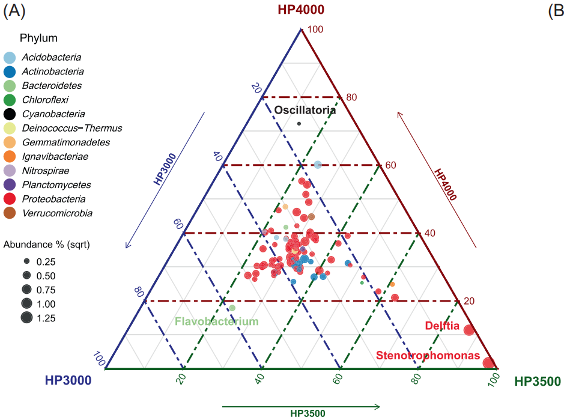
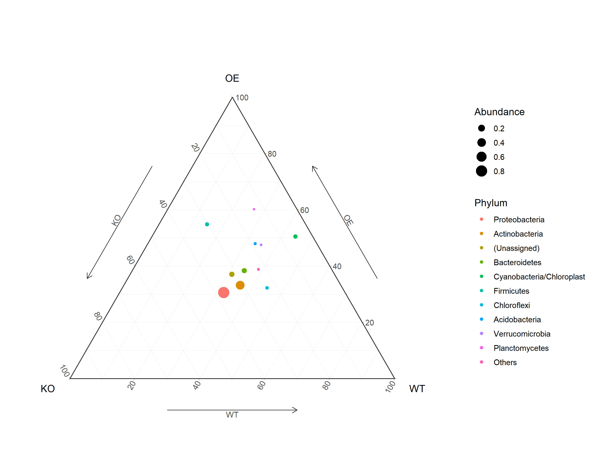

```{r setup, include=FALSE}
knitr::opts_chunk$set(
  collapse = T, echo=T, comment="#>", message=F, warning=F,
	fig.align="center", fig.width=5, fig.height=3, dpi=150)
```
本文代码已经上传至https://github.com/iMetaScience/iMetaPlot230125ternary
如果你使用本代码，请引用：Chenyuan Dang. 2022. Microorganisms as bio‐filters to mitigate greenhouse gas emissions from high‐altitude permafrost revealed by nanopore‐based metagenomics. iMeta 1: e24 https://onlinelibrary.wiley.com/doi/10.1002/imt2.24

**代码编写及注释：农心生信工作室**<br />

**三元相图 (Ternary plot)** 可以展示三个变量的关系，既美观且信息更加丰富，在微生物领域常用于比较多个样品的丰度信息。本期我们挑选刊登在**iMeta**上的[Microorganisms as bio‐filters to mitigate greenhouse gas emissions from high‐altitude permafrost revealed by nanopore‐based metagenomics.](https://onlinelibrary.wiley.com/doi/10.1002/imt2.24)论文的Figure 2A进行复现，基于ggtern绘制三元图，先上原图：<br />

接下来，我们将通过详尽的代码逐步拆解原图，最终实现对原图的复现。

### R包检测和安装
1. 安装核心R包ggtern以及一些功能辅助性R包，并载入所有R包
```{r}
options(repos = list(CRAN="https://mirrors.tuna.tsinghua.edu.cn/CRAN/"))
if (!require("devtools"))
  install.packages('devtools') 
if (!require("ggtern"))
  install.packages('ggtern')
install.packages("devtools")
devtools::install_github("microbiota/amplicon")
# 加载包
library(amplicon)
library(ggtern)

```
### 读取数据及数据处理
2.使用R包amplicon中的示例数据tax_phylum并计算相对丰度
```{r}
dim(tax_phylum) # 查看数据维度，共3个样品各6个重复共18列数据

rela_tax <- apply(tax_phylum, 2, function(x) x/sum(x)) # 绝对丰度/对每一列的丰度总和得到每个物种的相对丰度

rela_group_tax <- t(apply(rela_tax, 1, function(x) c(mean(x[1:6]), mean(x[7:12]), mean(x[13:18])))) # 对每个样品的6个重复计算相对丰度均值
colnames(rela_group_tax) <- c('KO', "OE", "WT") # 对列重命名

```

3. 保留相对丰度较高的10个门，合并其余门的相对丰度
```{r}
df <- as.data.frame(rela_group_tax)
df$total <- rowSums(df) # 对每个门额外计算一列总相对丰度用于选出高丰度的门
sort_df <- df[order(df$total, decreasing = T),] # 得到排序后的数据框

others <- colSums(sort_df[11:nrow(df),]) # 计算其他低丰度门的丰度总和
df2 <- rbind(sort_df[1:10, ], others) # 合并表格

# 计算丰度并添加分组，分别代表三元图中点的大小和颜色
df2$Abundance <- rowMeans(df2) 
gp <- c(rownames(df2)[1:10],"Others")
df2$Phylum <- factor(gp, level=gp)

```

### 绘图预览
4. 使用**_ggtern_**包绘制群落丰度三元图：
```{r}
p <- ggtern(data=df2, aes(KO, OE, WT)) + geom_point(aes(color=Phylum, size=Abundance)) +  theme_bw() +  theme_arrowdefault()
ggsave('ternay.png', p, width = 10, height = 8)
```


### 附.完整代码
```{r}
options(repos = list(CRAN="https://mirrors.tuna.tsinghua.edu.cn/CRAN/"))
if (!require("devtools"))
  install.packages('devtools') 
if (!require("ggtern"))
  install.packages('ggtern')
install.packages("devtools")
devtools::install_github("microbiota/amplicon")
# 加载包
library(amplicon)
library(ggtern)

dim(tax_phylum) # 查看数据维度，共3个样品各6个重复共18列数据
rela_tax <- apply(tax_phylum, 2, function(x) x/sum(x)) # 绝对丰度/对每一列的丰度总和得到每个物种的相对丰度
rela_group_tax <- t(apply(rela_tax, 1, function(x) c(mean(x[1:6]), mean(x[7:12]), mean(x[13:18])))) # 对每个样品的6个重复计算相对丰度均值
colnames(rela_group_tax) <- c('KO', "OE", "WT") # 对列重命名

df <- as.data.frame(rela_group_tax)
df$total <- rowSums(df) # 对每个门额外计算一列总相对丰度用于选出高丰度的门
sort_df <- df[order(df$total, decreasing = T),] # 得到排序后的数据框

others <- colSums(sort_df[11:nrow(df),]) # 计算其他低丰度门的丰度总和
df2 <- rbind(sort_df[1:10, ], others) # 合并表格

# 计算丰度并添加分组，分别代表三元图中点的大小和颜色
df2$Abundance <- rowMeans(df2) 
gp <- c(rownames(df2)[1:10],"Others")
df2$Phylum <- factor(gp, level=gp)

p <- ggtern(data=df2, aes(KO, OE, WT)) + geom_point(aes(color=Phylum, size=Abundance)) +  theme_bw() +  theme_arrowdefault()
ggsave('ternay.png', p, width = 10, height = 8)
```