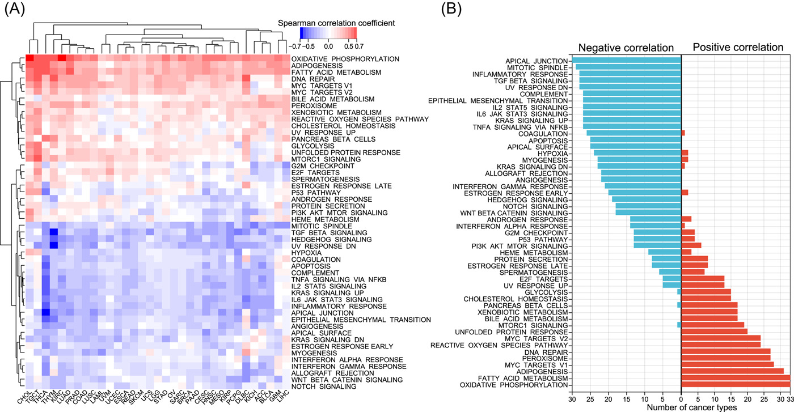
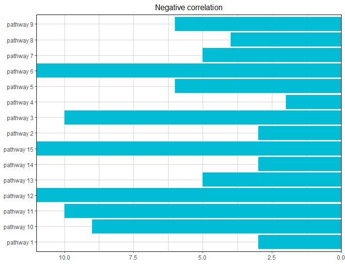
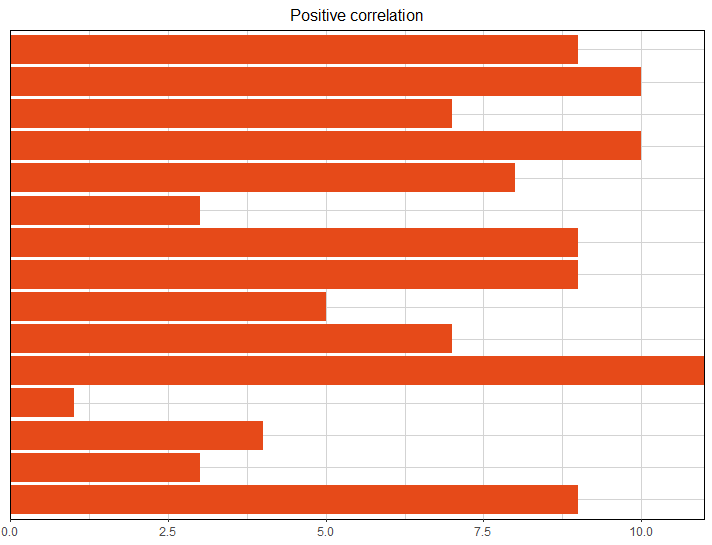
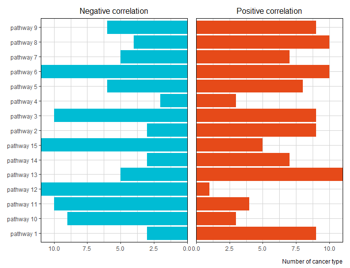
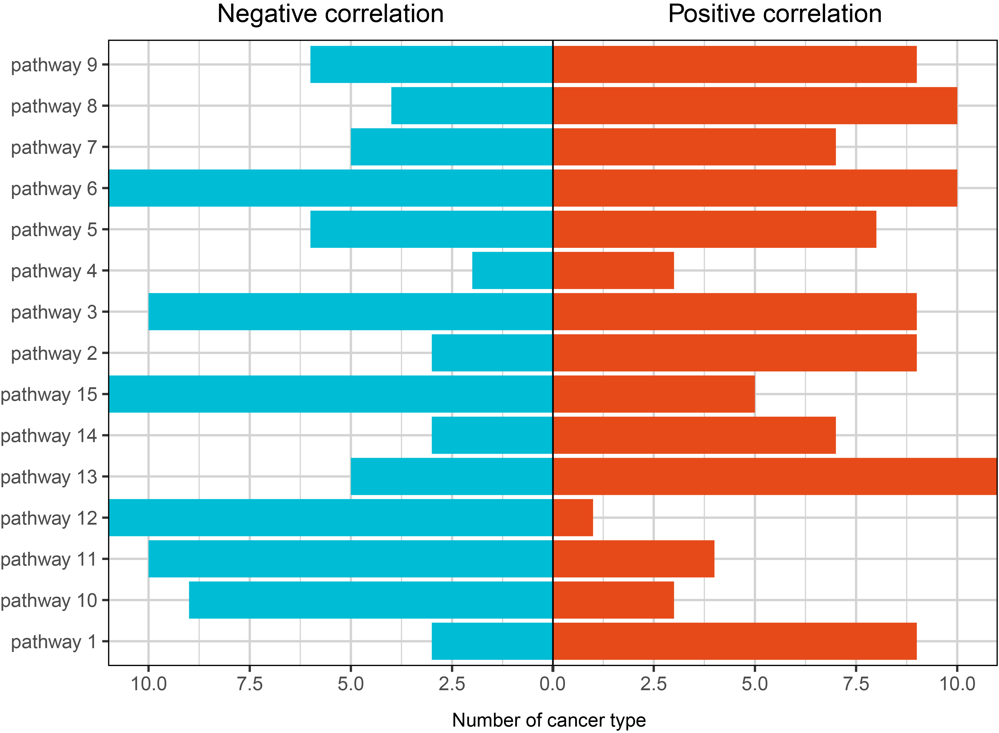

```{r setup, include=FALSE}
knitr::opts_chunk$set(
  collapse = T, echo=T, comment="#>", message=F, warning=F,
	fig.align="center", fig.width=5, fig.height=3, dpi=150)
```
源代码已经上传至https://github.com/iMetaScience/iMetaPlot/tree/main/230130barplot
如果你使用本代码，请引用：
Changwu Wu. 2022. Pan-cancer analyses reveal molecular and clinical characteristics of cuproptosis regulators. iMeta 1: e68. https://onlinelibrary.wiley.com/doi/full/10.1002/imt2.68
**代码编写及注释：农心生信工作室**<br />

**柱状图 (bar plot)** 及其衍生图是最常见的绘图模式，能够描述多种类型数据。本期我们挑选2022年12月5日刊登在**iMeta**上的[Pan-cancer analyses reveal molecular and clinical characteristics of cuproptosis regulators](https://onlinelibrary.wiley.com/doi/full/10.1002/imt2.68)- [iMeta｜湘雅医院刘庆组-泛癌分析揭示铜死亡调节子的临床和分子特征](https://mp.weixin.qq.com/s/hCf-aMijEvqQKVt1YQnbPw)，选择文章的Figure 7B进行复现，基于**ggplot2**包，讲解和探讨双侧柱状图的绘制方法，先上原图：<br />


接下来，我们将通过详尽的代码逐步拆解原图，最终实现对原图的复现。

### R包检测和安装
1. 安装核心R包ggplot2以及一些功能辅助性R包，并载入所有R包。
```{r}
if (!require("ggplot2"))
  install.packages('ggplot2') 
if (!require("patchwork"))
  install.packages('patchwork') 
# 加载包
library(ggplot2)
library(patchwork)
```

### 生成测试数据
2. 观察原图，正负两种相关性分别用不同颜色柱状图表示，因此我们的思路是先绘制两幅柱状图，再将柱状图拼接起来。这需要随机生成两个数据框。
```{r}
set.seed(123)
df_negative <-data.frame(pathway=paste("pathway",c(1:15)),num=sample(11,15,replace = T))
df_positive <- data.frame(pathway=paste("pathway",c(1:15)),num=sample(11,15,replace = T))
```


### 作图预览
3. 开始作图，先绘制左半边柱状图。该图需要反转x轴y轴，并颠倒柱子方向：
```{r}
p1<-ggplot(df_negative)+
  geom_bar(aes(x = pathway,y=num),stat = "identity",fill="#00BCD4") +
  coord_flip()+ #反转x轴和y轴
  scale_y_reverse(expand = expansion(0))+ #颠倒y轴，并将y轴与边框距离缩小为0
  ggtitle("Negative correlation")+
  theme(axis.title = element_blank(), #去除轴标题
        panel.background = element_blank(), #去除背景
        panel.grid = element_line (colour="lightgrey"), #设置网格线颜色
        panel.border = element_rect(fill = NA,colour = "black",linewidth=0.5),#设置背景边框
        plot.title = element_text(size = 12,hjust = 0.5)) #设置主标题字体大小并让标题居中
```


4. 再绘制右半边柱状图。该图仅需要反转x轴y轴，不需要颠倒柱子方向：
```{r}
p2<-ggplot(df_positive)+
  geom_bar(aes(x = pathway,y=num),stat = "identity",fill="#E64A19") +
  coord_flip()+ #反转x轴和y轴
  scale_y_continuous(expand = expansion(0))+
  ggtitle("Positive correlation")+ #添加主标题
  theme(axis.text.y = element_blank(),#去除y轴刻度文本
        axis.ticks.y = element_blank(),#去除y轴刻度
        axis.title= element_blank(),
        panel.background = element_blank(), #去除背景
        panel.grid = element_line (colour="lightgrey"), #设置网格线颜色
        panel.border = element_rect(fill = NA,colour = "black",linewidth=0.5),#设置背景边框
        plot.title = element_text(size = 12,hjust = 0.5)) #设置主标题字体大小并让标题居中

```


5. 利用patchwork包合并左右两幅图片：
```{r}
#合并图片，添加一个脚注释  
p<-p1+p2+plot_annotation(caption = 'Number of cancer type')
```


6. 我们需要用AI微调，将两幅图之间缝隙消除。成品图如下：



### 附.完整代码
```{r}
if (!require("ggplot2"))
  install.packages('ggplot2') 
if (!require("patchwork"))
  install.packages('patchwork') 
# 加载包
library(ggplot2)
library(patchwork)

set.seed(123)
df_negative <-data.frame(pathway=paste("pathway",c(1:15)),num=sample(11,15,replace = T))
df_positive <- data.frame(pathway=paste("pathway",c(1:15)),num=sample(11,15,replace = T))


p1<-ggplot(df_negative)+
  geom_bar(aes(x = pathway,y=num),stat = "identity",fill="#00BCD4") +
  coord_flip()+ #反转x轴和y轴
  scale_y_reverse(expand = expansion(0))+ #颠倒y轴，并将y轴与边框距离缩小为0
  ggtitle("Negative correlation")+
  theme(axis.title = element_blank(), #去除轴标题
        panel.background = element_blank(), #去除背景
        panel.grid = element_line (colour="lightgrey"), #设置网格线颜色
        panel.border = element_rect(fill = NA,colour = "black",linewidth=0.5),#设置背景边框
        plot.title = element_text(size = 12,hjust = 0.5)) #设置主标题字体大小并让标题居中
  
  


p2<-ggplot(df_positive)+
  geom_bar(aes(x = pathway,y=num),stat = "identity",fill="#E64A19") +
  coord_flip()+ #反转x轴和y轴
  scale_y_continuous(expand = expansion(0))+
  ggtitle("Positive correlation")+ #添加主标题
  theme(axis.text.y = element_blank(),
        axis.ticks.y = element_blank(),
        axis.title= element_blank(),
        panel.background = element_blank(), #去除背景
        panel.grid = element_line (colour="lightgrey"), #设置网格线颜色
        panel.border = element_rect(fill = NA,colour = "black",linewidth=0.5),#设置背景边框
        plot.title = element_text(size = 12,hjust = 0.5)) #设置主标题字体大小并让标题居中

#合并图片，添加一个脚注释
pdf("Figure 7B.pdf",width = 7, height = 5)
p1+p2+plot_annotation(caption = 'Number of cancer type')
dev.off()
```