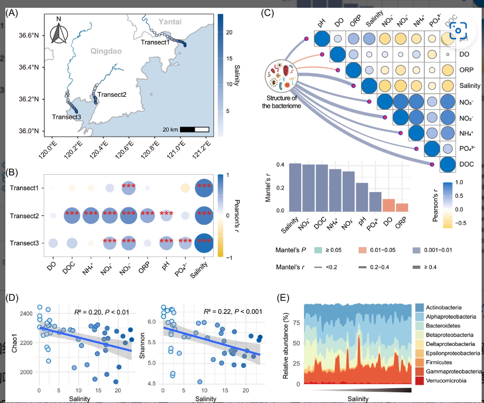

```{r setup, include=FALSE}
knitr::opts_chunk$set(
  collapse = T, echo=T, comment="#>", message=F, warning=F,
	fig.align="center", fig.width=5, fig.height=3, dpi=150)
```


如果你使用本代码，请引用：
Changchao Li. 2023. Destabilized microbial networks with distinct performances of abundant and rare biospheres in maintaining networks under increasing salinity stress. iMeta 1: e79.  https://onlinelibrary.wiley.com/doi/10.1002/imt2.79

**代码翻译及注释：农心生信工作室**<br />

**地图及采样点信息绘制** 的使用在微生物组与环境影响因素相关性研究中非常普遍，其中利用R语言实现环境信息在地图上的可视化，用热图呈现环境信息与地理距离之间的相关性。

本期我们挑选2023年1月9日刊登在**iMeta**上的[Destabilized microbial networks with distinct performances of abundant and rare biospheres in maintaining networks under increasing salinity stress](https://onlinelibrary.wiley.com/doi/10.1002/imt2.79)，以文章中Figure 1A为例，讲解和探讨如何基于geoviz, sf, ggplot2实现环境信息在地图上的可视化，先上原图：<br />

代码、数据和结果下载，请访问https://github.com/iMetaScience/iMetaPlot/230406EnvFactorsOnMap

接下来，我们将通过详尽的代码逐步拆解原图，最终实现对原图的复现。


### R包检测和安装
1. 安装核心R包geoviz，sf（读取和保存空间矢量数据）,ggplot2以及一些功能辅助性R包，并载入所有R包
```{r}
#列出所有需要的R包
package.list=c("geoviz","tidyverse","sf","terra","rasterVis","ggspatial","rgdal","rnaturalearth","rnaturalearthdata","raster","RColorBrewer", "htmltools")
#循环检查package.list中所有所需包并加载包，如没有则安装后加载
for (package in package.list) {
  if(!require(package,character.only=T,quietly=T)){
    install.packages(package)
    library(package,character.only = T)
  }
}

#部分包安装可能会困难，循环加载不了可尝试将每个包分别安装加载，其中geoviz包、sf包和terra包安装不成功，通过devtools安装
#检查开发者工具devtools，如没有则安装
if (!require("devtools"))
  install.packages("devtools")
#加载开发者工具devtools
library(devtools)
if(!require("geoviz"))
  install_github("neilcharles/geoviz", force = TRUE)
  library(geoviz)
#如果无法打开github使用install_github()函数，可多次尝试从https://github.com/neilcharles/geoviz下载zip包后离线手动安装，运行devtools::install_local("C:/Users/TD/Desktop/geoviz.zip")，其中C:/Users/TD/Desktop部分需对应自己电脑中下载好的zip位置，其余包的安装均可参照此方法。

if (!require("devtools"))
  install.packages("devtools")
#加载开发者工具devtools
library(devtools)
if(!require("sf"))
  install_github("r-spatial/sf", force = TRUE)
  library(sf)
#sf包安装依赖GDAL (>= 2.0.1), GEOS (>= 3.4.0) and Proj.4 (>= 4.8.0)，如果环境中存在多版本的GDAL 等会使sf安装报错，解决办法是在编译过程中正确链接库文件，出现库文件冲突时，运行unlink("D:/Tool/R_Library/00LOCK", recursive = TRUE)把报错文件删掉，其中D:/Tool/R_Library/00LOCK是对应自己电脑报错显示的位置；当出现镜像设置报错时，可尝试直接从R-base安装，设置合适镜像位置。

if (!require("devtools"))
  install.packages("devtools")
#加载开发者工具devtools
library(devtools)
if(!require("terra"))
  install_github("rspatial/terra", force = TRUE)
  library(terra)
```

### 读取数据，地图绘制及地图上样带标注
2.绘制地图及在地图上标注相关信息，需要地图的矢量数据，以及相关环境因子的标注数据。示例数据可在GitHub上获取。
```{r}
#读取矢量数据
shp1 <- sf::read_sf("shandong.json") #利用：：使用在sf包中的read_sf函数提取地图的矢量数据
#读取图上标注点的坐标数据
geo <- read.csv("geodata.csv", row.names = 1)

#预设渐变色，颜色来自RColorBrewer包
color2 = colorRampPalette(c("#EFF3FF", "#08519C"))(66)

#开始画图，先绘制地图
p1a_1 <-ggplot()+
  geom_sf(data=shp1)+ #快速绘制地图
  annotation_scale(location="br")+ #设置距离刻度尺
  labs(x=NULL,y=NULL)+
  geom_sf(data=shp1, fill="white",size=0.4,color="grey")+#添加地图边界
  xlim(120,121.2)+#设置x轴范围
  ylim(36,36.7)#设置y轴范围
p1a_1  

```
```{r}
#在图上添加散点的标注
p1a_2<-p1a_1+
  geom_point(data = geo, aes(lon, lat, fill = salinity), 
             size = 1.8, alpha = 1, shape = 21, stroke = 0.2) +
    scale_fill_gradientn(colours = color2) #按salinity值填充渐变色，通过颜色的变化可以看出环境因子与地理距离之间的变化关系
p1a_2
```
  
```{r}
#以上已将环境因子在地图上展示了，接下了需要对整体进行细节美化
p1a_3<-p1a_2+
    theme_bw()+ #预设主题
    theme(panel.grid.major = element_blank(),#去除主题自带的主要网格线
        panel.grid.minor = element_blank(),#去除主题自带的次要网格线
        legend.title = element_blank(),
        panel.background = element_rect(fill="#CADEF0", color="gray71",size = 0.5), #对图形背景色调整
        axis.text.x = element_text(angle = 45, hjust = 1, vjust = 1),
        legend.position = c(0.9, 0.3),#图例位置设置
        legend.key.size = unit(12, "pt"))#图例刻度设置
p1a_3 
``` 

```{r} 
#地图应该还需要添加一个指北针
p1a_4<-p1a_3+
  annotation_north_arrow(location="tl",#调整指北针位置，
                         style = north_arrow_fancy_orienteering(
                           fill = c("grey40","white"),
                           line_col = "grey20")) #对指北针颜色进行调整
p1a_4

ggsave('环境因子在地图上的可视化.pdf', p1a_4, height = 8, width = 8)  # 保存图片并设置宽和高

```

环境因子在地图上的可视化的绘图就完成了。以上过程本质上是使用了一个数据源绘制了局部地图，然后将环境因子的元数据叠加在地图上。大家多看几遍，动手操作很快就可以学会，R中还有其他包可以实现空间数据可视化及地图绘制，敬请期待在此展示。


### 附.完整代码
```{r}
#列出所有需要的R包
package.list=c("geoviz","tidyverse","sf","terra","rasterVis","ggspatial","rgdal","rnaturalearth","rnaturalearthdata","raster")
#循环检查package.list中所有所需包并加载包，如没有则安装后加载
for (package in package.list) {
  if(!require(package,character.only=T,quietly=T)){
    install.packages(package)
    library(package,character.only = T)
  }
}
#读取矢量数据
shp1 <- sf::read_sf("shandong.json")
#读取图上标注点的坐标数据
geo <- read.csv("geodata.csv", row.names = 1)
#预设渐变色，颜色来自RColorBrewer包
color2 = colorRampPalette(c("#EFF3FF", "#08519C"))(66)
p1a <-ggplot()+
  geom_sf(data=shp1)+ #快速绘制地图
  annotation_scale(location="br")+ #设置距离刻度尺
  labs(x=NULL,y=NULL)+
  geom_sf(data=shp1, fill="white",size=0.4,color="grey")+#添加地图边界
  xlim(120,121.2)+#设置x轴范围
  ylim(36,36.7)+#设置y轴范围
  #在图上添加散点的标注
  geom_point(data = geo, aes(lon, lat, fill = salinity), 
             size = 1.8, alpha = 1, shape = 21, stroke = 0.2) +
    scale_fill_gradientn(colours = color2)+ #按salinity值填充渐变色
    theme_bw()+ #预设主题
    theme(panel.grid.major = element_blank(),
        panel.grid.minor = element_blank(),
        panel.background = element_blank(), #去除主题本身设置的背景
        legend.title = element_blank(),
        plot.background = element_rect(fill="#CADEF0", color="gray71",size = 0.5), #图形背景色调整
        axis.text.x = element_text(angle = 45, hjust = 1, vjust = 1),
        legend.position = c(0.9, 0.3),
        legend.key.size = unit(12, "pt"))+
  #添加指北针
  annotation_north_arrow(location="tl",#调整指北针位置，
                         style = north_arrow_fancy_orienteering(
                           fill = c("grey40","white"),
                           line_col = "grey20")) #对指北针颜色进行调整
p1a

```
