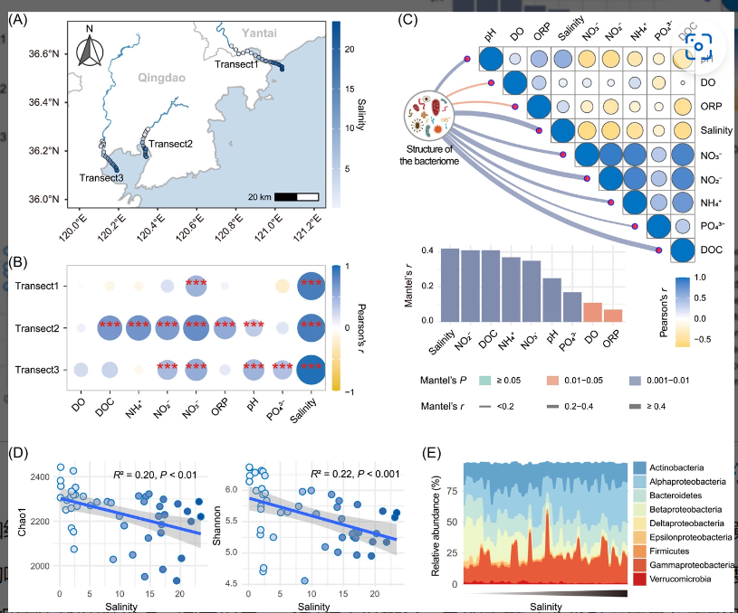

```{r setup, include=FALSE}
knitr::opts_chunk$set(
  collapse = T, echo=T, comment="#>", message=F, warning=F,
	fig.align="center", fig.width=5, fig.height=3, dpi=150)
```


如果你使用本代码，请引用：
Changchao Li. 2023. Destabilized microbial networks with distinct performances of abundant and rare biospheres in maintaining networks under increasing salinity stress. iMeta 1: e79.  https://onlinelibrary.wiley.com/doi/10.1002/imt2.79

**代码翻译及注释：农心生信工作室**<br />

**桑吉图(Sankey diagram)**  可以用来展现数据之间流动和相互关系，在微生物群落分析中可以用来展示不同分类学水平微生物的丰度及其从属关系，利用R语言做桑吉图实现菌群相对丰度的变化是生信分析中较常见的。
本期我们挑选2023年1月9日刊登在**iMeta**上的[Destabilized microbial networks with distinct performances of abundant and rare biospheres in maintaining networks under increasing salinity stress](https://onlinelibrary.wiley.com/doi/10.1002/imt2.79)，以文章中Figure 1E为例，讲解和探讨如何用桑吉图展示菌群随盐度的变化，先上原图：<br />

代码、数据和结果下载，请访问https://github.com/iMetaScience/iMetaPlot/tree/main/230407ggalluvial

接下来，我们将通过详尽的代码逐步拆解原图，最终实现对原图的复现。
### R包检测和安装
1.安装核心R包ggalluvial以及一些功能辅助性R包，并载入所有R包
```{r}
library(reshape2)#重塑数据框的包，可以实现长数据和宽数据之间的转化
#加载ggalluvial包（绘图本图所用关键R包），基于ggplot2的ggalluvial包可用来绘制桑吉图
if (!require("ggalluvial"))
  install.packages("ggalluvial")
library(ggalluvial)
library(ggsci)#ggsci包含期刊或软件的经典配色，可用于ggplot2()配色
library(htmltools)#
```

### 读取绘制所需数据并进行必要转换
2. 绘制桑吉图需要两组变量数据。示例数据可在GitHub上获取。
```{r}
#读取绘制数据，行为菌的名称，列为不同盐度，表中数据为菌的相对丰度
d1e0 <- read.csv("ProClass.csv")
#将宽数据拉长，转化后"自变量"列为variable，代表梯度不同的盐度，"因变量"列为Value，代表菌的相对丰度
d1e = as.data.frame(melt(d1e0, id.vars=c("phylumpro")))#id.vars=c()用于指定要保留的字段
head(d1e)#列出前几行看看数据转化后长什么样

```

### 绘制桑吉图
3. 绘制桑吉图
```{r}
#预设渐变色
taxcol <- c("#64A4CC", "#9CCEE3", "#C7E5DB", "#ECF6C8", "#FEEDAA", "#FDC980", "#F89D59","#E75B3A", "#D7191C")


p1e<-ggplot(data=d1e,aes(x=variable, y=value, alluvium=phylumpro))+ #alluvium=设置冲积层，在这里将菌(phylumpro)设置冲积层
  geom_alluvium(aes(fill = phylumpro), alpha = 1)+ #画桑吉图，按菌(phylumpro)进行颜色填充
  scale_fill_manual(values = taxcol) #对冲积层填充颜色

p1e  
  
```

```{r}
#接下了需要对整体进行细节美化
p1e1<-p1e+ 
  theme_minimal() + #预设主题
  theme(axis.text.x = element_blank(), #因预期x轴另外加一条渐变的图形表示，在这里取消x轴
        panel.grid.minor = element_blank(), #移除图中的网格
        panel.grid.major = element_blank(),
        panel.spacing.x = element_blank())+
  xlab("Salinity")+ #设置x轴标题
  ylab("Relative abundance (%)")#设置Y轴标题
p1e1

ggsave("桑吉图展示菌群随盐度的变化.pdf",p1e1,width=8,height=5)
```

用桑吉图展示菌群随盐度变化的绘图就完成了。以上过程的本质就是利用geom_alluvium()函数，将"自变量"和"因变量"以桑吉图的形式展示。但是需要注意的是，有一个和桑吉图类似的冲积图，有人说冲积图是桑吉图的一种，两者的区别是桑吉图显示数量如何从一种状态流向另一种状态，左/右位置显示移动或变化，就比如我们这里x轴其实要表示从淡水到海水盐度逐渐增大，而冲积图的左右位置没有特别的意义。


### 附.完整代码
```{r}
library(reshape2)#重塑数据框的包，可以实现长数据和宽数据之间的转化
#加载ggalluvial包（绘图本图所用关键R包），基于ggplot2的ggalluvial包可用来绘制桑吉图
if (!require("ggalluvial"))
  install.packages("ggalluvial")
library(ggalluvial)

#读取绘制数据，行为菌的名称，列为不同盐度，表中数据为菌的相对丰度
d1e0 <- read.csv("ProClass.csv")
#将宽数据拉长，转化后自变量列为variable代表梯度不同的盐度，因变量列为Value代表菌的相对丰度
d1e = as.data.frame(melt(d1e0, id.vars=c("phylumpro")))#id.vars=c()用于指定要保留的字段
head(d1e)#列出前几行看看数据转化后长什么样

#预设渐变色
taxcol <- c("#64A4CC", "#9CCEE3", "#C7E5DB", "#ECF6C8", "#FEEDAA", "#FDC980", "#F89D59","#E75B3A", "#D7191C")


p1e<-ggplot(data=d1e,aes(x=variable, y=value, alluvium=phylumpro))+ #alluvium=设置冲积层，在这里将菌(phylumpro)设置冲积层
  geom_alluvium(aes(fill = phylumpro), alpha = 1)+ #画桑吉图，按菌(phylumpro)进行颜色填充
  scale_fill_manual(values = taxcol) #对冲积层填充颜色

p1e  
#接下了需要对整体进行细节美化
p1e1<-p1e+ 
  theme_minimal() + #预设主题
  theme(axis.text.x = element_blank(), #因预期x轴另外加一条渐变的图形表示，在这里取消x轴
        panel.grid.minor = element_blank(), #移除图中的网格
        panel.spacing.x = element_blank())+
  xlab("Salinity")+ #设置x轴标题
  ylab("Relative abundance (%)")#设置Y轴标题
p1e1

ggsave("桑吉图展示菌群随盐度的变化.pdf",p1e1,width=8,height=5)
```