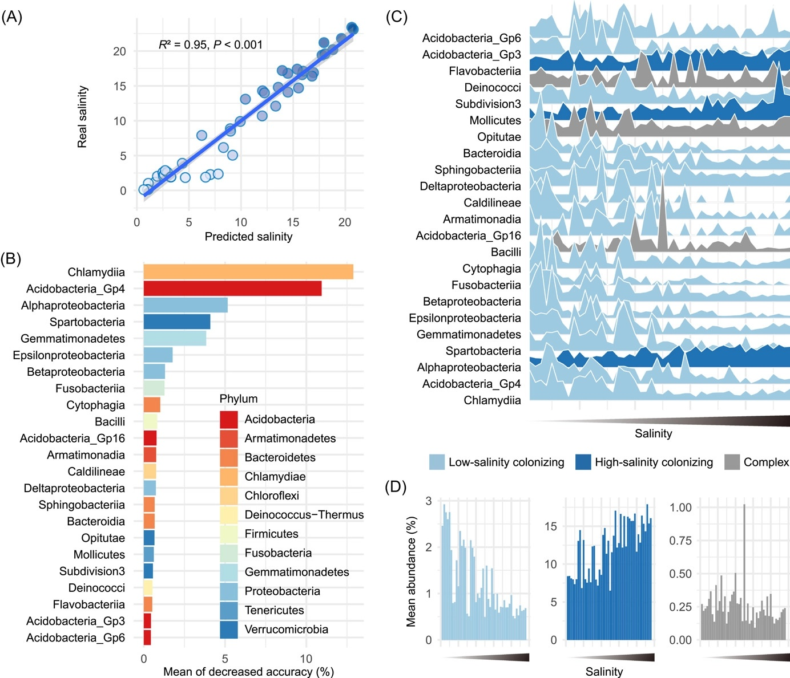

```{r setup, include=FALSE}
knitr::opts_chunk$set(
  collapse = T, echo=T, comment="#>", message=F, warning=F,
	fig.align="center", fig.width=5, fig.height=3, dpi=150)
```


如果你使用本代码，请引用：
Changchao Li. 2023. Destabilized microbial networks with distinct performances of abundant and rare biospheres in maintaining networks under increasing salinity stress. iMeta 1: e79.  https://onlinelibrary.wiley.com/doi/10.1002/imt2.79

**翻译及注释：农心生信工作室**<br />

**山峦图**  可以用来展现数据分布类型，数据分布情况用峰的高低来表示，分布越密集的区间，峰越高。
本期我们挑选2023年1月9日刊登在**iMeta**上的[Destabilized microbial networks with distinct performances of abundant and rare biospheres in maintaining networks under increasing salinity stress](https://onlinelibrary.wiley.com/doi/10.1002/imt2.79)，以文章中Figure 2C为例，讲解和探讨如何利用山峦图展示微生物丰度随盐度增加的动态变化，先上原图：<br />

代码、数据和结果下载，请访问https://github.com/iMetaScience/iMetaPlot/tree/main/230410ggridges

接下来，我们将通过详尽的代码逐步拆解原图，最终实现对原图的复现。


### R包检测和安装
1.安装核心R包ggridges以及一些功能辅助性R包，并载入所有R包
```{r}
library(ggplot2)
if (!require("ggridges"))
  install.packages("ggridges")
library(ggridges)#这个包主要用来绘制山峦图，尤其是针对时间或者空间分布可视化
library(reshape2)
library(ggsci)
library(htmltools)

```

### 读取绘制所需数据并进行必要转换
2. 绘制山峦图需要数据。示例数据可在GitHub上获取
```{r}
otu <- read.csv('feature23.csv')
#由于各 OTU 丰度之间差异巨大，对丰度标准化处理
otu[2:ncol(otu)] <- scale(otu[2:ncol(otu)], center = FALSE)#对表中2到24列做归一化，但不做中心化
#将宽数据变成长数据
otu1 <- reshape2::melt(otu, id = 'Salinity') #保留的字段是“Salinity”，转化后“variable”是原本每列菌的名字，“value”是对应每个菌的丰度值
head(otu1)
#读取分组数据
type <- read.csv('feature_type.csv')
#将分组数据和OTU数据合并到一起
otu2 <- merge(otu1, type, by = 'variable') #合并时按名为“variable'的列为准合并
head(otu2)
```

### 绘制山峦图
3. 绘制山峦图
```{r}
#预设颜色
peakcol = c("#9ECAE1", "#2171B5", "#999999")  

p2c <-  ggplot(otu2, aes(x = Salinity, y = variable, height = value, fill = type))+
        geom_ridgeline(stat="identity",scale=1,color='white',show.legend=T)+#主要绘制山脊线图，绘图函数里的stat参数表示对样本点做统计的方式，默认为identity，表示一个x对应一个y
        scale_fill_manual(values = peakcol,limits = c('Low-salinity colonizing','High-salinity colonizing','Complex'))#设置填充颜色，按limits（即type）填充预设的peakcol中的颜色

p2c 
```
  
```{r} 
#接下了需要对整体进行细节美化
p2c1 <-p2c+ 
   scale_x_continuous(expand = c(0, 0))+#修改x轴刻度，这个也可以在theme()中输入axis.ticks.X=element_blank()取消x轴刻度
   theme_minimal()+ #预设主题
   theme(axis.title.x=element_blank(),axis.text.x.bottom=element_blank())+#取消设定的x轴标题和文本
   labs(x = 'Salinity (ppt)', y = 'Salinity discriminant features')#设置x轴和y轴的标题
p2c1

ggsave("山峦图展示微生物丰度随盐度增加的动态变化.pdf",p2c1,width=8,height=5)

```

#用山峦图展示微生物丰度随盐度增加的动态变化就完成了，山峦图想表达的意思都是突出数据分布类型，换句话说，数据分布多的地方，山峰就应该高一些，反之就低一些

### 附.完整代码
```{r} 

library(ggplot2)
if (!require("ggridges"))
  install.packages("ggridges")
library(ggridges)#这个包主要用来绘制山峦图，尤其是针对时间或者空间分布可视化
library(reshape2)
library(ggsci)

otu <- read.csv('feature23.csv')
#由于各 OTU 丰度之间差异巨大，对丰度标准化处理
otu[2:ncol(otu)] <- scale(otu[2:ncol(otu)], center = FALSE)#对表中2到24列做归一化，但不做中心化
#将宽数据变成长数据
otu1 <- reshape2::melt(otu, id = 'Salinity') #保留的字段是“Salinity”，转化后“variable”是原本每列菌的名字，“value”是对应每个菌的丰度值
head(otu1)
#读取分组数据
type <- read.csv('feature_type.csv')
#将分组数据和OTU数据合并到一起
otu2 <- merge(otu1, type, by = 'variable') #合并时按名为“variable'的列为准合并
head(otu2)

peakcol = c("#9ECAE1", "#2171B5", "#999999")  

p2c <-  ggplot(otu2, aes(x = Salinity, y = variable, height = value, fill = type))+
        geom_ridgeline(stat="identity",scale=1,color='white',show.legend=T)+#主要绘制山脊线图，绘图函数里的stat参数表示对样本点做统计的方式，默认为identity，表示一个x对应一个y
        scale_fill_manual(values = peakcol,limits = c('Low-salinity colonizing','High-salinity colonizing','Complex'))#设置填充颜色，按limits（即type）填充预设的peakcol中的颜色

#接下了需要对整体进行细节美化
p2c1 <-p2c+ 
   scale_x_continuous(expand = c(0, 0))+#修改x轴刻度，这个也可以在theme()中输入axis.ticks.X=element_blank()取消x轴刻度
   theme_minimal()+ #预设主题
   theme(axis.title.x=element_blank(),axis.text.x.bottom=element_blank())+#取消设定的x轴标题和文本
   labs(x = 'Salinity (ppt)', y = 'Salinity discriminant features')#设置x轴和y轴的标题
p2c1

ggsave("山峦图展示微生物丰度随盐度增加的动态变化.pdf",p2c1,width=8,height=5)
