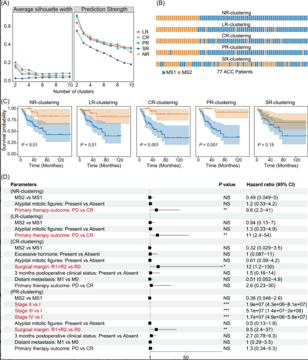

```{r setup, include=FALSE}
knitr::opts_chunk$set(
  collapse = T, echo=T, comment="#>", message=F, warning=F,
	fig.align="center", fig.width=5, fig.height=3, dpi=150)
```

如果你使用本代码，请引用：
Yuqing Li. 2023. Intratumoral microbiota is associated with prognosis in patients with adrenocortical carcinoma. iMeta 1: e79.  https://doi.org/10.1002/imt2.102

**翻译及注释：农心生信工作室**<br />

**生存曲线**用于在微生物组学研究中通常被用来评估微生物群落的生存或寿命，并且可以与一些重要的生物学事件联系起来。对微生物组的单样本或多样本进行生存分析可以：1.评估微生物群落的生存（生存分析可以评估微生物群落的生存或寿命，有助于研究微生物群落的稳定性和动态变化。2比较微生物组之间的生存差异：生存分析可以比较不同微生物组之间的生存差异，有助于识别可能导致微生物组差异的生物学因素。3.预测微生物群落生存：生存分析可以使用模型预测微生物群落的生存，这对于评估微生物组对环境变化的适应性和对特定疾病的风险等方面具有实际应用价值。4.寻找微生物组的生存标记：生存分析可以帮助寻找微生物组的生存标记，并为微生物组的临床诊断和治疗提供指导。

本期我们挑选2023年3月5日刊登在**iMeta**上的[Intratumoral microbiota is associated with prognosis in patients with adrenocortical carcinoma](https://onlinelibrary.wiley.com/doi/10.1002/imt2.102)，以文章中Figure 3C为例，讲解和探讨如何用生存曲线展示两个聚类之间的差异，先上原图：<br />

代码、数据和结果下载，请访问https://https://github.com/iMetaScience/iMetaPlot/tree/main/230429ggsurvplot

接下来，我们将通过详尽的代码逐步拆解原图，最终实现对原图的复现。

### R包检测和安装
1.安装核心R包survminer以及一些功能辅助性R包，并载入所有R包
```{r}
library(ggplot2)

if(!require("survminer"))
     install.packages("survminer")
if(!require("survival"))
     install.packages("survival")
library(survival)
if(!require("ggthemes"))
     install.packages("ggthemes")
library(ggthemes)
library(htmltools)
```

### 读取绘制所需数据，根据shannon多样性将患者分为两组
2.绘制生存曲线需要的数据。示例数据可在GitHub上获取。
```{r}
df_meta_alpha <- read.csv("Alpha_diversity_ACC_metadata.csv")
#根据shannon多样性将患者分为两组
#用median()用于计算作为参数传递的数字向量元素的中值，用ifelse()函数做判断，大于该值的作为高多样性组，否则为低多样性组
df_meta_alpha$Group_bac<-ifelse(df_meta_alpha$alpha_Bac>median(df_meta_alpha$alpha_Bac), "high", "low")
df_meta_alpha$Group_bac_fL<-ifelse(df_meta_alpha$alpha_Bac_f_Likely>median(df_meta_alpha$alpha_Bac_f_Likely), "high", "low")
df_meta_alpha$Group_bac_fPC<-ifelse(df_meta_alpha$alpha_Bac_f_PC>median(df_meta_alpha$alpha_Bac_f_PC), "high", "low")
df_meta_alpha$Group_bac_fP<-ifelse(df_meta_alpha$alpha_Bac_f_Putative>median(df_meta_alpha$alpha_Bac_f_Putative), "high", "low")
df_meta_alpha$Group_bac_fS<-ifelse(df_meta_alpha$alpha_Bac_f_Strigent>median(df_meta_alpha$alpha_Bac_f_Strigent), "high", "low")

```

### 生存分析及结果展示
3.用survfit()进行生存分析，用ggsurvplot绘制生存分析的结果
```{r}
#编写Function()进行生存分析
function_sur <- function(group, title){
  
  commands <- paste("fit <- survfit(Surv(OS_MONTHS, CENSOR) ~ ", group, ", data = df_meta_alpha)", sep = "")
  #这行代码是用来在R语言中拟合生存分析模型的。具体来说，它将数据集df_meta_alpha中的生存时间和事件信息(OS_MONTHS和CENSOR)与一个自变量(group)相关联，并生成一个生存曲线。生成的生存曲线将存储在一个名为“fit”的对象中，
  #使用了paste()函数，将fit,group,data连接起来就得到了完整的命令，将其存储在commands对象中，以便稍后运行
  #survfit()是一个生存分析函数，用于计算生存曲线和相关统计量;survfit()函数的第一个参数是一个公式，指定生存时间和状态变量的关系。在这里，Surv(OS_MONTHS,CENSOR)表示使用OS_MONTHS作为生存时间变量，CENSOR作为状态变量。第二个参数是数据集，用于对公式进行拟合。
  #group是自变量，即你希望将生存曲线分组的变量。在这里，它将插入到模型语法中
  #data=指定数据集，其中df_meta_alpha是包含生存时间、事件和自变量信息的数据框。
  
  eval(parse(text=commands))#eval()函数将这个代码字符串解析为可执行的R代码，并将其执行。这样就完成了生存分析的过程，并将生存曲线拟合对象fit保存在变量fit中，以供后续使用。


#ggsurvplot()是用于绘制生存分析结果的函数，它基于ggplot2图形库来实现,ggsurvplot()函数需要使用survival包中的生存分析函数例如 survfit()或oxph()的结果作为输入，以及一些可选的参数来指定图形的外观和布局
  p<-ggsurvplot(fit, #创建的拟合对象
                data = df_meta_alpha,  # 指定变量数据来源
                conf.int = TRUE, # 显示置信区间
                pval = TRUE, # 添加P值
                palette = c("#0072B5CC","#E18727CC"),
                title = title,
                xlab = "Time (Monthes)", #设置x的标签
                legend = "right",#图例位置
                legend.title = "",#图例标题为空
                ggtheme = theme_base(),#设置主题
                break.x.by = 40)
  return(p)
}
```

### 保存生存分析的结果
4.保存生存分析的结果
```{r}

pdf(file = "生存曲线展示两个聚类之间的差异.pdf", width = 7, height = 5)#预先创造PDF画布
function_sur("Group_bac", "Raw_bacteria")#对Group_bac应用上述function_sur()
function_sur("Group_bac_fL", "Raw_bacteria_filter_likely")#对Group_bac_fL应用上述function_sur()
function_sur("Group_bac_fPC", "Raw_bacteria_filter_Plate_Center")#对Group_bac应用上述function_sur()
function_sur("Group_bac_fP", "Raw_bacteria_filter_putative")#对Group_bac_fPC应用上述function_sur()
function_sur("Group_bac_fS", "Raw_bacteria_filter_strigent")#对Group_bac_fS应用上述function_sur()
dev.off()#关闭画布

###也可以将每个图单独展示出来，这里用一个图举例，其他图同理
a<-function_sur("Group_bac", "Raw_bacteria")#对Group_bac应用上述function_sur()
a

```

用生存曲线展示两个聚类之间的差异的绘图就完成了。这段代码先按照一定的规则进行分组，然后通过编写了一段function函数进行了两个聚类之间的生存差异，可以通过这段代码学习和加深对function()函数的编写。在R语言中使用“survival”包对微生物组的单样本或多样本进行生存分析可以提供有用的信息，帮助研究人员更好地了解微生物群落的生存和动态变化，以及可能影响微生物组差异的生物学因素。

### 附.完整代码

```{r}
# load libraries
library(ggplot2)
if(!require("survminer"))
     install.packages("survminer")
library(survminer)#用来
library(ggthemes)

df_meta_alpha <- read.csv("Alpha_diversity_ACC_metadata.csv")
#根据shannon多样性将患者分为两组
#用median()用于计算作为参数传递的数字向量元素的中值，用ifelse()函数做判断，大于该值的作为高多样性组，否则为低多样性组
df_meta_alpha$Group_bac<-ifelse(df_meta_alpha$alpha_Bac>median(df_meta_alpha$alpha_Bac), "high", "low")
df_meta_alpha$Group_bac_fL<-ifelse(df_meta_alpha$alpha_Bac_f_Likely>median(df_meta_alpha$alpha_Bac_f_Likely), "high", "low")
df_meta_alpha$Group_bac_fPC<-ifelse(df_meta_alpha$alpha_Bac_f_PC>median(df_meta_alpha$alpha_Bac_f_PC), "high", "low")
df_meta_alpha$Group_bac_fP<-ifelse(df_meta_alpha$alpha_Bac_f_Putative>median(df_meta_alpha$alpha_Bac_f_Putative), "high", "low")
df_meta_alpha$Group_bac_fS<-ifelse(df_meta_alpha$alpha_Bac_f_Strigent>median(df_meta_alpha$alpha_Bac_f_Strigent), "high", "low")

#编写Function()进行生存分析
function_sur <- function(group, title){
  commands <- paste("fit <- survfit(Surv(OS_MONTHS, CENSOR) ~ ", group, ", data = df_meta_alpha)", sep = "")
  #这行代码是用来在R语言中拟合生存分析模型的。具体来说，它将数据集df_meta_alpha中的生存时间和事件信息(OS_MONTHS和CENSOR)与一个自变量(group)相关联，并生成一个生存曲线。生成的生存曲线将存储在一个名为“fit”的对象中，
  #使用了paste()函数，将fit,group,data连接起来就得到了完整的命令，将其存储在commands对象中，以便稍后运行
  #survfit()是一个生存分析函数，用于计算生存曲线和相关统计量;survfit()函数的第一个参数是一个公式，指定生存时间和状态变量的关系。在这里，Surv(OS_MONTHS,CENSOR)表示使用OS_MONTHS作为生存时间变量，CENSOR作为状态变量。第二个参数是数据集，用于对公式进行拟合。
  #group是自变量，即你希望将生存曲线分组的变量。在这里，它将插入到模型语法中
  #data=指定数据集，其中df_meta_alpha是包含生存时间、事件和自变量信息的数据框。
  
  eval(parse(text=commands))#eval()函数将这个代码字符串解析为可执行的R代码，并将其执行。这样就完成了生存分析的过程，并将生存曲线拟合对象fit保存在变量fit中，以供后续使用。

#ggsurvplot()是用于绘制生存分析结果的函数，它基于ggplot2图形库来实现,ggsurvplot()函数需要使用survival包中的生存分析函数例如 survfit()或oxph()的结果作为输入，以及一些可选的参数来指定图形的外观和布局
  p<-ggsurvplot(fit, #创建的拟合对象
                data = df_meta_alpha,  # 指定变量数据来源
                conf.int = TRUE, # 显示置信区间
                pval = TRUE, # 添加P值
                palette = c("#0072B5CC","#E18727CC"),
                title = title,
                xlab = "Time (Monthes)", #设置x的标签
                legend = "right",#图例位置
                legend.title = "",#图例标题为空
                ggtheme = theme_base(),#设置主题
                break.x.by = 40)
  return(p)
}

### 保存生存分析的结果
pdf(file = "生存曲线展示两个聚类之间的差异.pdf", width = 7, height = 5)#预先创造PDF画布
function_sur("Group_bac", "Raw_bacteria")#对Group_bac应用上述function_sur()
function_sur("Group_bac_fL", "Raw_bacteria_filter_likely")#对Group_bac_fL应用上述function_sur()
function_sur("Group_bac_fPC", "Raw_bacteria_filter_Plate_Center")#对Group_bac应用上述function_sur()
function_sur("Group_bac_fP", "Raw_bacteria_filter_putative")#对Group_bac_fPC应用上述function_sur()
function_sur("Group_bac_fS", "Raw_bacteria_filter_strigent")#对Group_bac_fS应用上述function_sur()

dev.off()#关闭画布
```
